# WordPress High Availability Deployment on AWS using CloudFormation


## 🧑‍💼 Professional Details

- **Name:** Brij Mohan Singh  
- **Role:** DevOps & AWS Cloud Engineer  
- **GitHub:** [github.com/brijjadon](https://github.com/brijjadon)  
- **LinkedIn:** [Brij Mohan Singh](https://www.linkedin.com/in/brij-mohan-singh-731587a2/)  
- **Email:** 📧 brijjadin7566@gmail.com  

---

## Project Overview

This project demonstrates a production-ready WordPress deployment on AWS using CloudFormation for infrastructure-as-code. The deployment creates a highly available, auto-scaling WordPress environment with an RDS database, EFS storage, and load balancing.

## Architecture

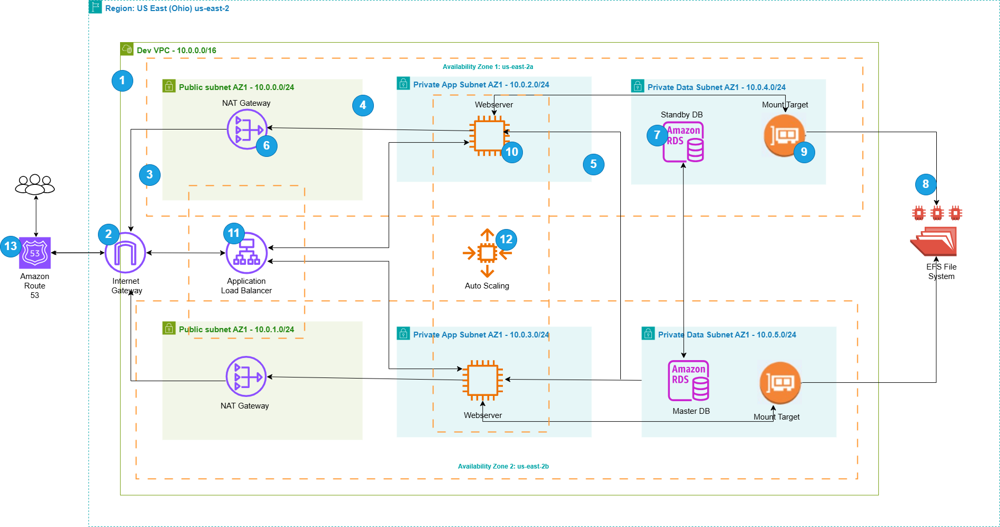

The architecture includes:
- **Auto Scaling Group** for WordPress EC2 instances
- **Application Load Balancer** for traffic distribution
- **Amazon RDS MySQL** database
- **Amazon EFS** for shared WordPress file storage
- **CloudFormation** for infrastructure management

## Deployment Steps

### 1. Initial Setup
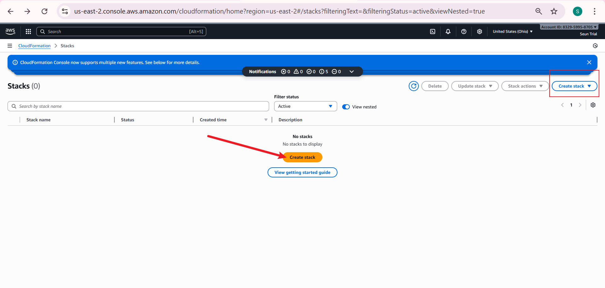
Start by navigating to the AWS CloudFormation dashboard and initiating stack creation.

### 2. Template Configuration
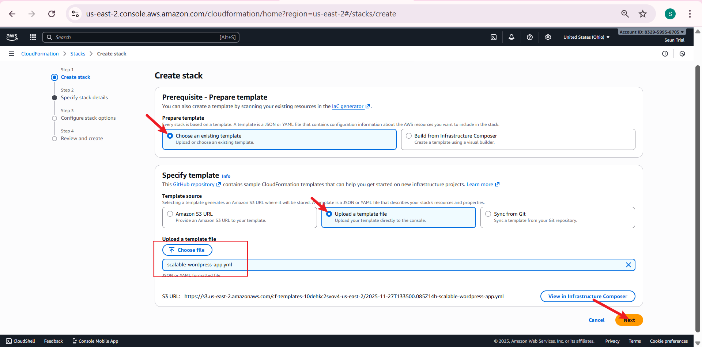
Select "Choose existing template" and upload the CloudFormation template file provided in this project. The template code is available in the last section of this README file.

### 3. Stack Configuration
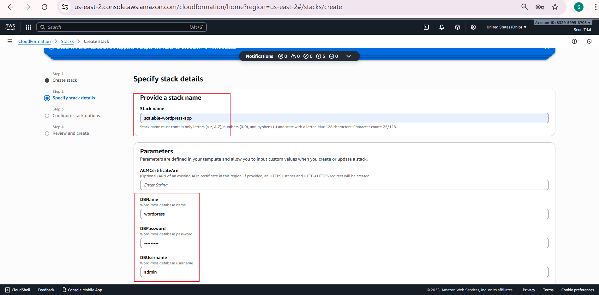
Name your stack and enter the required database credentials. Scroll down to configure additional parameters.

### 4. EC2 Configuration

Select your EC2 key pair and leave other settings at their defaults before proceeding.

### 5. IAM Acknowledgment
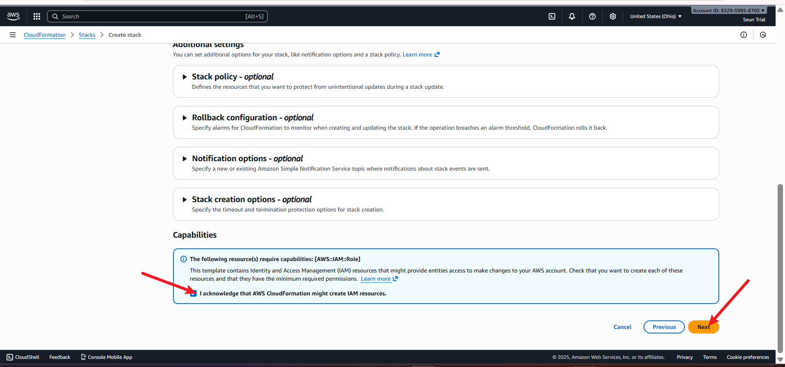
Acknowledge the IAM resources warning, as the template creates necessary IAM roles for the infrastructure.

### 6. Final Review
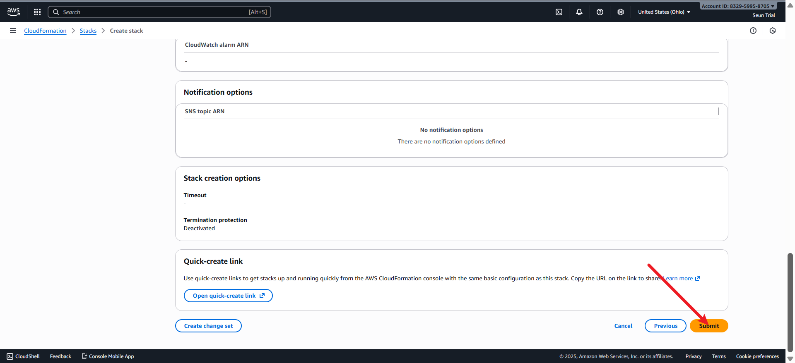
Review all configurations and submit to begin deployment.

### 7. Deployment Progress
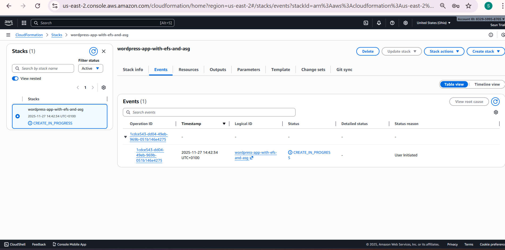
Monitor the stack creation progress in the CloudFormation console.

### 8. Deployment Completion
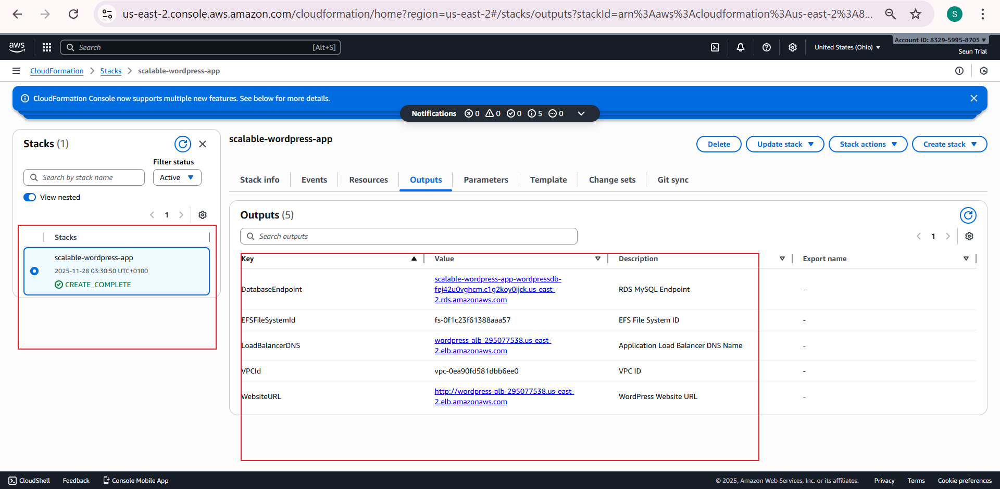
Once complete, click on the stack to view the Outputs tab containing important endpoints.

## Verification Steps

### 9. EC2 Instance Access
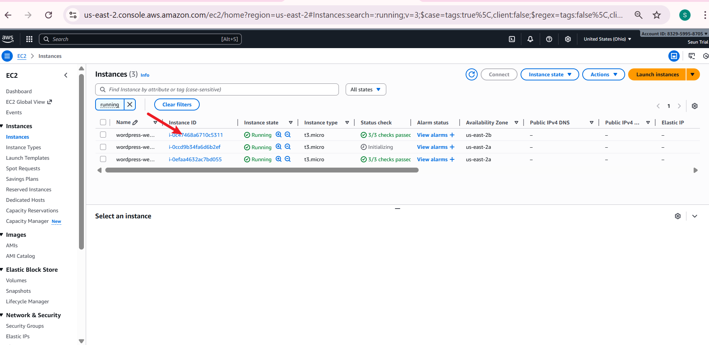
Navigate to the created EC2 instances and select a running instance.

### 10. Instance Connection
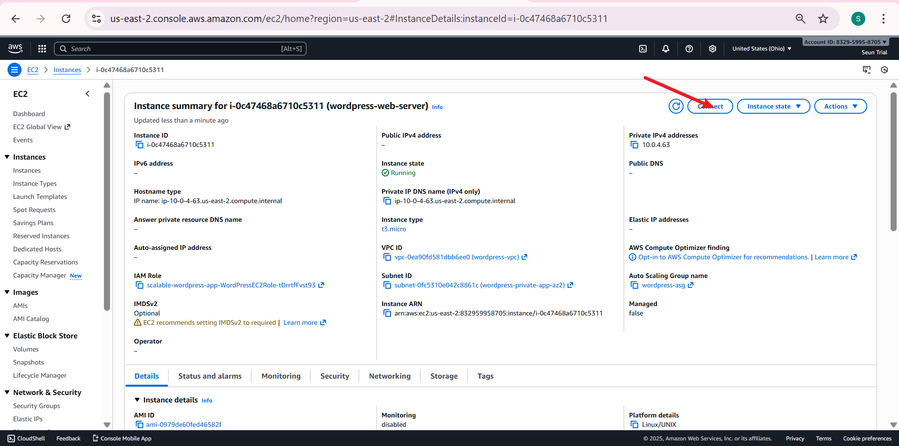
Click the Connect button to access the instance.

### 11. Session Manager Connection
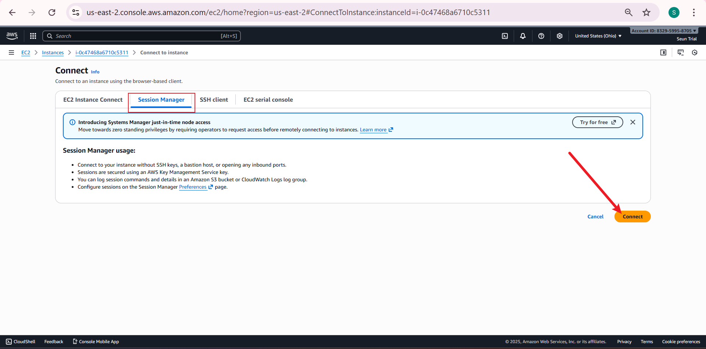
Use Session Manager for secure SSH-less connection to the EC2 instance.

### 12. WordPress Configuration Verification
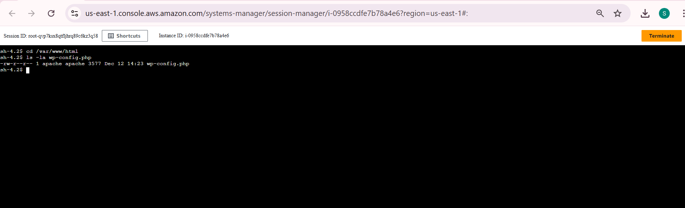
Navigate to the WordPress directory and verify the wp-config.php file exists.
```bash
# 1. Go to the WordPress directory
cd /var/www/html

# 2. Confirm wp-config.php exists
ls -la wp-config.php
```
### 13. Database and HTTPS Settings
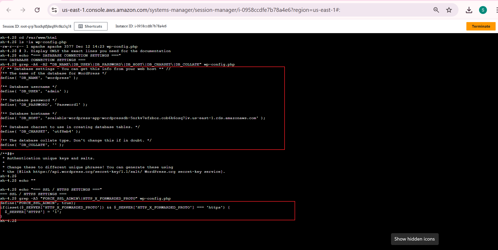
Verify database connectivity and HTTPS configuration settings.

```bash
# 3. Display ONLY the exact lines you need for the documentation
echo "=== DATABASE CONNECTION SETTINGS ==="
grep -A6 -B2 "DB_NAME\|DB_USER\|DB_PASSWORD\|DB_HOST\|DB_CHARSET\|DB_COLLATE" wp-config.php

echo ""
echo "=== SSL / HTTPS SETTINGS ==="
grep -A5 "FORCE_SSL_ADMIN\|HTTP_X_FORWARDED_PROTO" wp-config.php
```


### 14. EFS Mount Verification
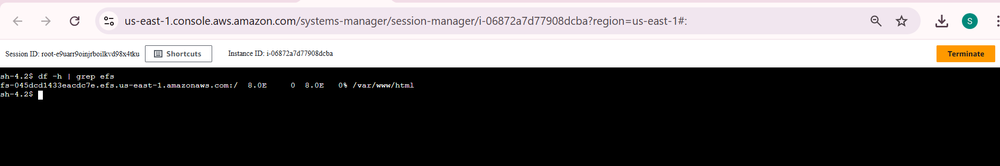
Confirm that the EFS file system is successfully mounted to the instance.
```bash
df -h | grep efs
```
### 15. Load Balancer Access
.png)
Copy the LoadBalancerDNS value from the CloudFormation Outputs tab.

### 16. WordPress Installation
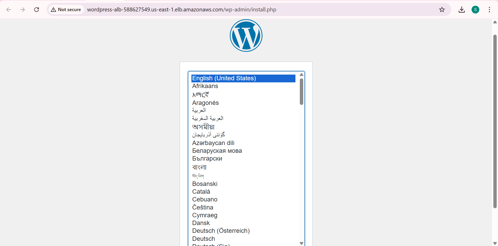
Access the Load Balancer URL in your browser to reach the WordPress installation page.

### 17. PHP Configuration
.png)
Confirm that the PHP configuration file is working correctly.

## High Availability Testing

### 18. Instance Termination Test
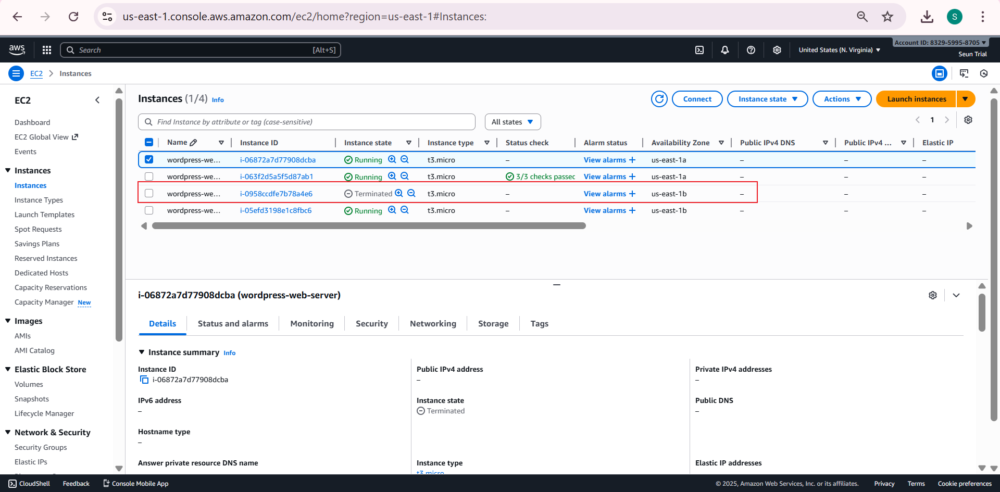
Terminate one EC2 instance to test high availability.

### 19. Website Availability

Reload the website to confirm it remains accessible despite instance termination.

### 20. Enable EPEL Repository
.png)
Enable the EPEL repository to install stress testing tools on Amazon Linux 2.
```bash
# Enable EPEL repository
sudo amazon-linux-extras install epel -y
```
### 21. Install Stress Package
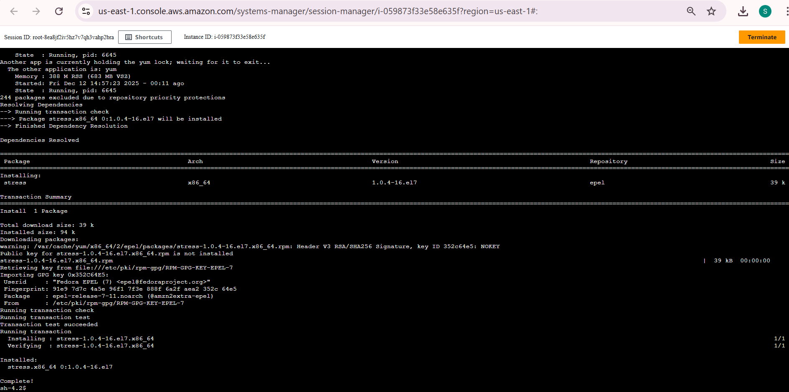
Install the stress package for load testing.
```bash
# Now install stress
sudo yum install -y stress
```

### 22. Generate CPU Load
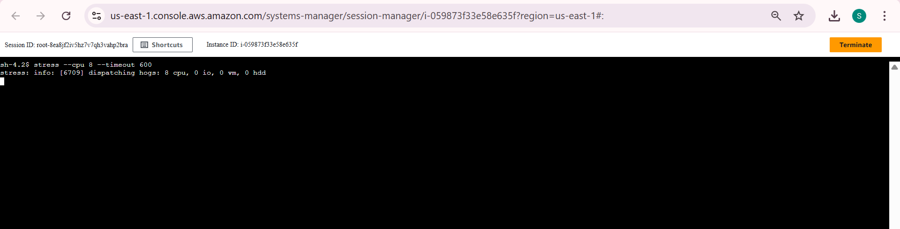
Generate high CPU load for 10 minutes to trigger auto-scaling.
```bash
# Generate high CPU load on all cores for 10 minutes
stress --cpu 8 --timeout 600
```
### 23. Auto-Scaling Verification
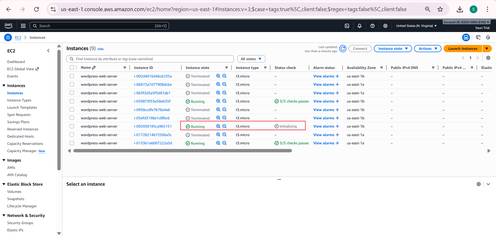
Verify that the auto-scaling group launches a new instance to handle increased load.

## Database Validation

### 24. Database Endpoint Retrieval
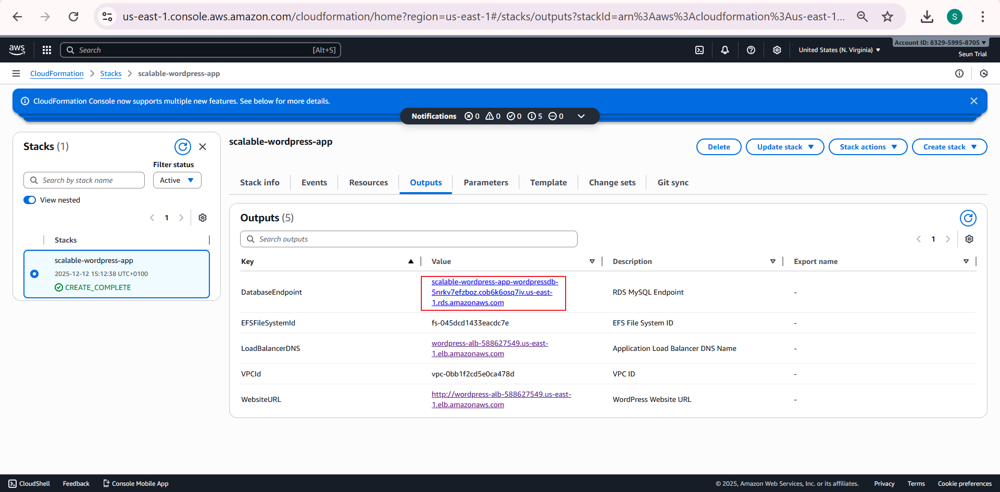
Retrieve the RDS database endpoint from CloudFormation outputs.

### 25. Database Connection Test
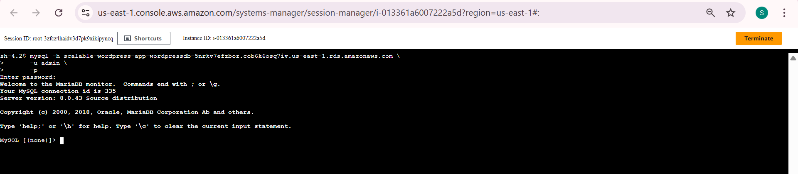
Test database connectivity and log in with the configured password.
```bash
    mysql -h scalable-wordpress-app-wordpressdb-5nrkv7efzboz.cob6k6osq7iv.us-east-1.rds.amazonaws.com \
      -u admin \
      -pYourActualPasswordHere \
      wordpress
```
## Security Verification

### 26. Security Group Configuration
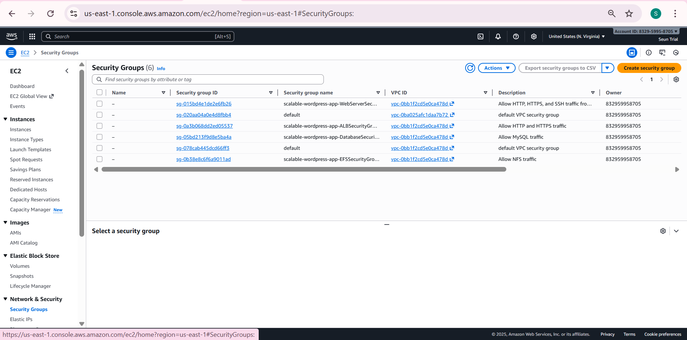
Verify that security groups are configured as specified in the CloudFormation template.

## Prerequisites

- AWS Account with appropriate permissions
- AWS CLI configured (optional)
- Basic understanding of AWS services (EC2, RDS, EFS, CloudFormation)

## Project Structure

```
├── img/                          # Screenshot documentation
├── templates/                    # CloudFormation templates
├── scripts/                      # Deployment and configuration scripts
└── README.md                     # This documentation
```

## Features

- **High Availability**: Auto-scaling group ensures WordPress remains available
- **Shared Storage**: EFS provides shared file storage for WordPress instances
- **Managed Database**: RDS MySQL for reliable database service
- **Load Balancing**: ALB distributes traffic across instances
- **Infrastructure as Code**: Complete deployment via CloudFormation
- **Security**: Properly configured security groups and IAM roles

## Usage

1. Upload the CloudFormation template to AWS
2. Follow the step-by-step deployment process shown in screenshots
3. Access WordPress via the Load Balancer DNS name
4. Test high availability by terminating instances and generating load

## Cleanup

To avoid ongoing charges, delete the CloudFormation stack when finished, which will remove all created resources.

## Notes

- Ensure you have appropriate AWS service limits for the resources created
- Database credentials should be stored securely
- Regular backups of RDS and EFS are recommended for production use

## Troubleshooting

Refer to the screenshots for each step if you encounter issues during deployment. Common issues include IAM permission errors, insufficient service limits, or region-specific resource availability.

## CloudFormation Template
```yml
AWSTemplateFormatVersion: "2010-09-09"
Description: Enhanced WordPress Site with VPC, ALB (HTTP->HTTPS optional), ASG, RDS, EFS, IAM, and AutoScaling policies + alarms

Parameters:
  KeyName:
    Type: AWS::EC2::KeyPair::KeyName
    Description: EC2 Key Pair for SSH access

  DBName:
    Type: String
    Default: wordpress
    Description: WordPress database name

  DBUsername:
    Type: String
    Default: admin
    Description: WordPress database username

  DBPassword:
    Type: String
    NoEcho: true
    Description: WordPress database password

  MinCapacity:
    Type: Number
    Default: 2
    Description: Minimum number of instances

  MaxCapacity:
    Type: Number
    Default: 4
    Description: Maximum number of instances

  DesiredCapacity:
    Type: Number
    Default: 2
    Description: Desired number of instances

  LatestAmiId:
    Type: "AWS::SSM::Parameter::Value<AWS::EC2::Image::Id>"
    Default: "/aws/service/ami-amazon-linux-latest/amzn2-ami-hvm-x86_64-gp2"
    Description: Use SSM parameter to resolve the latest Amazon Linux 2 AMI in the region

  ACMCertificateArn:
    Type: String
    Default: ""
    Description: (Optional) ARN of an existing ACM certificate in this region. If provided, an HTTPS listener and HTTP->HTTPS redirect will be created.

Conditions:
  UseACM: !Not [ !Equals [ !Ref ACMCertificateArn, "" ] ]

Resources:
  ###############################
  # VPC & Networking
  ###############################

  VPC:
    Type: AWS::EC2::VPC
    Properties:
      CidrBlock: 10.0.0.0/16
      EnableDnsHostnames: true
      EnableDnsSupport: true
      Tags:
        - Key: Name
          Value: wordpress-vpc

  InternetGateway:
    Type: AWS::EC2::InternetGateway
    Properties:
      Tags:
        - Key: Name
          Value: wordpress-igw

  VPCGatewayAttachment:
    Type: AWS::EC2::VPCGatewayAttachment
    Properties:
      VpcId: !Ref VPC
      InternetGatewayId: !Ref InternetGateway

  # Public Subnets
  PublicSubnetAZ1:
    Type: AWS::EC2::Subnet
    Properties:
      VpcId: !Ref VPC
      AvailabilityZone: !Select [0, !GetAZs ""]
      CidrBlock: 10.0.1.0/24
      MapPublicIpOnLaunch: true
      Tags:
        - Key: Name
          Value: wordpress-public-az1

  PublicSubnetAZ2:
    Type: AWS::EC2::Subnet
    Properties:
      VpcId: !Ref VPC
      AvailabilityZone: !Select [1, !GetAZs ""]
      CidrBlock: 10.0.2.0/24
      MapPublicIpOnLaunch: true
      Tags:
        - Key: Name
          Value: wordpress-public-az2

  # Private Subnets
  PrivateAppSubnetAZ1:
    Type: AWS::EC2::Subnet
    Properties:
      VpcId: !Ref VPC
      AvailabilityZone: !Select [0, !GetAZs ""]
      CidrBlock: 10.0.3.0/24
      Tags:
        - Key: Name
          Value: wordpress-private-app-az1

  PrivateAppSubnetAZ2:
    Type: AWS::EC2::Subnet
    Properties:
      VpcId: !Ref VPC
      AvailabilityZone: !Select [1, !GetAZs ""]
      CidrBlock: 10.0.4.0/24
      Tags:
        - Key: Name
          Value: wordpress-private-app-az2

  # NAT Gateway in Public Subnet
  NATGatewayEIP:
    Type: AWS::EC2::EIP
    Properties:
      Domain: vpc
      Tags:
        - Key: Name
          Value: wordpress-nat-eip

  NATGateway:
    Type: AWS::EC2::NatGateway
    Properties:
      AllocationId: !GetAtt NATGatewayEIP.AllocationId
      SubnetId: !Ref PublicSubnetAZ1
      Tags:
        - Key: Name
          Value: wordpress-nat-gateway

  # Route Tables
  PublicRouteTable:
    Type: AWS::EC2::RouteTable
    Properties:
      VpcId: !Ref VPC
      Tags:
        - Key: Name
          Value: wordpress-public-rt

  PrivateRouteTable:
    Type: AWS::EC2::RouteTable
    Properties:
      VpcId: !Ref VPC
      Tags:
        - Key: Name
          Value: wordpress-private-rt

  # Routes
  PublicRoute:
    Type: AWS::EC2::Route
    Properties:
      RouteTableId: !Ref PublicRouteTable
      DestinationCidrBlock: 0.0.0.0/0
      GatewayId: !Ref InternetGateway

  PrivateRoute:
    Type: AWS::EC2::Route
    Properties:
      RouteTableId: !Ref PrivateRouteTable
      DestinationCidrBlock: 0.0.0.0/0
      NatGatewayId: !Ref NATGateway

  # Route Table Associations
  PublicSubnet1RouteTableAssociation:
    Type: AWS::EC2::SubnetRouteTableAssociation
    Properties:
      SubnetId: !Ref PublicSubnetAZ1
      RouteTableId: !Ref PublicRouteTable

  PublicSubnet2RouteTableAssociation:
    Type: AWS::EC2::SubnetRouteTableAssociation
    Properties:
      SubnetId: !Ref PublicSubnetAZ2
      RouteTableId: !Ref PublicRouteTable

  PrivateSubnet1RouteTableAssociation:
    Type: AWS::EC2::SubnetRouteTableAssociation
    Properties:
      SubnetId: !Ref PrivateAppSubnetAZ1
      RouteTableId: !Ref PrivateRouteTable

  PrivateSubnet2RouteTableAssociation:
    Type: AWS::EC2::SubnetRouteTableAssociation
    Properties:
      SubnetId: !Ref PrivateAppSubnetAZ2
      RouteTableId: !Ref PrivateRouteTable

  ###############################
  # Security Groups
  ###############################

  ALBSecurityGroup:
    Type: AWS::EC2::SecurityGroup
    Properties:
      GroupDescription: Allow HTTP and HTTPS traffic
      VpcId: !Ref VPC
      SecurityGroupIngress:
        - IpProtocol: tcp
          FromPort: 80
          ToPort: 80
          CidrIp: 0.0.0.0/0
        - IpProtocol: tcp
          FromPort: 443
          ToPort: 443
          CidrIp: 0.0.0.0/0

  WebServerSecurityGroup:
    Type: AWS::EC2::SecurityGroup
    Properties:
      GroupDescription: Allow HTTP, HTTPS, and SSH traffic from ALB
      VpcId: !Ref VPC
      SecurityGroupIngress:
        - IpProtocol: tcp
          FromPort: 80
          ToPort: 80
          SourceSecurityGroupId: !Ref ALBSecurityGroup
        - IpProtocol: tcp
          FromPort: 443
          ToPort: 443
          SourceSecurityGroupId: !Ref ALBSecurityGroup
        - IpProtocol: tcp
          FromPort: 22
          ToPort: 22
          CidrIp: 0.0.0.0/0

  DatabaseSecurityGroup:
    Type: AWS::EC2::SecurityGroup
    Properties:
      GroupDescription: Allow MySQL traffic
      VpcId: !Ref VPC
      SecurityGroupIngress:
        - IpProtocol: tcp
          FromPort: 3306
          ToPort: 3306
          SourceSecurityGroupId: !Ref WebServerSecurityGroup

  EFSSecurityGroup:
    Type: AWS::EC2::SecurityGroup
    Properties:
      GroupDescription: Allow NFS traffic
      VpcId: !Ref VPC
      SecurityGroupIngress:
        - IpProtocol: tcp
          FromPort: 2049
          ToPort: 2049
          SourceSecurityGroupId: !Ref WebServerSecurityGroup

  ###############################
  # IAM Role for EC2
  ###############################

  WordPressEC2Role:
    Type: AWS::IAM::Role
    Properties:
      AssumeRolePolicyDocument:
        Version: "2012-10-17"
        Statement:
          - Effect: Allow
            Principal:
              Service: ec2.amazonaws.com
            Action: sts:AssumeRole
      ManagedPolicyArns:
        - arn:aws:iam::aws:policy/AmazonSSMManagedInstanceCore
      Tags:
        - Key: Name
          Value: wordpress-ec2-role

  WordPressEC2InstanceProfile:
    Type: AWS::IAM::InstanceProfile
    Properties:
      Roles:
        - !Ref WordPressEC2Role

  ###############################
  # RDS MySQL Database
  ###############################

  DBSubnetGroup:
    Type: AWS::RDS::DBSubnetGroup
    Properties:
      DBSubnetGroupDescription: Subnet group for WordPress RDS
      SubnetIds:
        - !Ref PrivateAppSubnetAZ1
        - !Ref PrivateAppSubnetAZ2

  WordPressDB:
    Type: AWS::RDS::DBInstance
    Properties:
      DBName: !Ref DBName
      AllocatedStorage: 20
      DBInstanceClass: db.t3.micro
      Engine: mysql
      EngineVersion: "8.0"
      MasterUsername: !Ref DBUsername
      MasterUserPassword: !Ref DBPassword
      VPCSecurityGroups:
        - !GetAtt DatabaseSecurityGroup.GroupId
      DBSubnetGroupName: !Ref DBSubnetGroup
      MultiAZ: false
      PubliclyAccessible: false
      StorageType: gp2
      Tags:
        - Key: Name
          Value: wordpress-db

  ###############################
  # EFS FileSystem
  ###############################

  WordPressEFS:
    Type: AWS::EFS::FileSystem
    Properties:
      Encrypted: true
      PerformanceMode: generalPurpose
      FileSystemTags:
        - Key: Name
          Value: wordpress-efs

  MountTargetAZ1:
    Type: AWS::EFS::MountTarget
    Properties:
      FileSystemId: !Ref WordPressEFS
      SubnetId: !Ref PrivateAppSubnetAZ1
      SecurityGroups:
        - !Ref EFSSecurityGroup

  MountTargetAZ2:
    Type: AWS::EFS::MountTarget
    Properties:
      FileSystemId: !Ref WordPressEFS
      SubnetId: !Ref PrivateAppSubnetAZ2
      SecurityGroups:
        - !Ref EFSSecurityGroup

  ###############################
  # Application Load Balancer
  ###############################

  AppLoadBalancer:
    Type: AWS::ElasticLoadBalancingV2::LoadBalancer
    Properties:
      Name: wordpress-alb
      Subnets:
        - !Ref PublicSubnetAZ1
        - !Ref PublicSubnetAZ2
      SecurityGroups:
        - !Ref ALBSecurityGroup
      Scheme: internet-facing

  TargetGroup:
    Type: AWS::ElasticLoadBalancingV2::TargetGroup
    Properties:
      Port: 80
      Protocol: HTTP
      VpcId: !Ref VPC
      TargetType: instance
      HealthCheckPath: /
      HealthCheckIntervalSeconds: 30
      HealthCheckTimeoutSeconds: 5
      HealthyThresholdCount: 2
      UnhealthyThresholdCount: 2

  HTTPListener:
    Type: AWS::ElasticLoadBalancingV2::Listener
    Properties:
      LoadBalancerArn: !Ref AppLoadBalancer
      Port: 80
      Protocol: HTTP
      DefaultActions: !If
        - UseACM
        -
          - Type: redirect
            RedirectConfig:
              Protocol: HTTPS
              Port: "443"
              StatusCode: HTTP_301
        -
          - Type: forward
            TargetGroupArn: !Ref TargetGroup

  HTTPSListener:
    Condition: UseACM
    Type: AWS::ElasticLoadBalancingV2::Listener
    Properties:
      LoadBalancerArn: !Ref AppLoadBalancer
      Port: 443
      Protocol: HTTPS
      Certificates:
        - CertificateArn: !Ref ACMCertificateArn
      DefaultActions:
        - Type: forward
          TargetGroupArn: !Ref TargetGroup

  ###############################
  # Launch Template & Auto Scaling
  ###############################

  WordPressLaunchTemplate:
    Type: AWS::EC2::LaunchTemplate
    Properties:
      LaunchTemplateName: wordpress-launch-template
      LaunchTemplateData:
        ImageId: !Ref LatestAmiId
        InstanceType: t3.micro
        KeyName: !Ref KeyName
        IamInstanceProfile:
          Name: !Ref WordPressEC2InstanceProfile
        SecurityGroupIds:
          - !Ref WebServerSecurityGroup
        UserData:
          Fn::Base64: !Sub |
            #!/bin/bash
            set -e
            exec > >(tee /var/log/user-data.log) 2>&1

            # Update system
            yum update -y

            # Install Apache
            yum install -y httpd httpd-tools mod_ssl
            systemctl enable httpd
            systemctl start httpd

            # Install PHP 7.4
            amazon-linux-extras enable php7.4
            yum clean metadata
            yum install -y php php-common php-pear
            yum install -y php-{cgi,curl,mbstring,gd,mysqlnd,gettext,json,xml,fpm,intl,zip,mysqli}

            # Install MySQL client
            yum install -y mysql

            # Create HTML directory and mount EFS
            mkdir -p /var/www/html
            mount -t nfs4 -o nfsvers=4.1,rsize=1048576,wsize=1048576,hard,timeo=600,retrans=2,noresvport ${WordPressEFS}.efs.${AWS::Region}.amazonaws.com:/ /var/www/html || true

            # Add to fstab for persistence
            echo "${WordPressEFS}.efs.${AWS::Region}.amazonaws.com:/ /var/www/html nfs4 nfsvers=4.1,rsize=1048576,wsize=1048576,hard,timeo=600,retrans=2,noresvport 0 0" >> /etc/fstab || true

            # Set permissions
            usermod -a -G apache ec2-user
            chown -R ec2-user:apache /var/www
            chmod 2775 /var/www
            find /var/www -type d -exec chmod 2775 {} \;
            find /var/www -type f -exec chmod 0664 {} \;
            chown apache:apache -R /var/www/html

            # Download and install WordPress only if not already installed
            cd /var/www/html
            if [ ! -f wp-config.php ]; then
              wget https://wordpress.org/latest.tar.gz
              tar -xzf latest.tar.gz
              cp -r wordpress/* /var/www/html/
              rm -rf wordpress latest.tar.gz

              # Create wp-config.php
              cp wp-config-sample.php wp-config.php

              # Configure database connection
              sed -i "s/database_name_here/${DBName}/g" wp-config.php
              sed -i "s/username_here/${DBUsername}/g" wp-config.php
              sed -i "s/password_here/${DBPassword}/g" wp-config.php
              sed -i "s/localhost/${WordPressDB.Endpoint.Address}/g" wp-config.php

              # Add SSL settings for ALB
              cat >> wp-config.php << 'EOF'

            /* SSL Settings */
            define('FORCE_SSL_ADMIN', true);
            if(isset($_SERVER['HTTP_X_FORWARDED_PROTO']) && $_SERVER['HTTP_X_FORWARDED_PROTO'] === 'https') {
              $_SERVER['HTTPS'] = '1';
            }
            EOF
            fi

            # Final permissions and restart
            chown apache:apache -R /var/www/html
            systemctl restart httpd

            echo "WordPress installation completed successfully"

  WordPressAutoScalingGroup:
    Type: AWS::AutoScaling::AutoScalingGroup
    Properties:
      AutoScalingGroupName: wordpress-asg
      VPCZoneIdentifier:
        - !Ref PrivateAppSubnetAZ1
        - !Ref PrivateAppSubnetAZ2
      LaunchTemplate:
        LaunchTemplateId: !Ref WordPressLaunchTemplate
        Version: !GetAtt WordPressLaunchTemplate.LatestVersionNumber
      MinSize: !Ref MinCapacity
      MaxSize: !Ref MaxCapacity
      DesiredCapacity: !Ref DesiredCapacity
      TargetGroupARNs:
        - !Ref TargetGroup
      HealthCheckType: ELB
      HealthCheckGracePeriod: 300
      Tags:
        - Key: Name
          Value: wordpress-web-server
          PropagateAtLaunch: true

  # Keep a TargetTracking scaling policy (CPU-based)
  ScaleCpuTargetTrackingPolicy:
    Type: AWS::AutoScaling::ScalingPolicy
    Properties:
      AutoScalingGroupName: !Ref WordPressAutoScalingGroup
      PolicyType: TargetTrackingScaling
      TargetTrackingConfiguration:
        PredefinedMetricSpecification:
          PredefinedMetricType: ASGAverageCPUUtilization
        TargetValue: 55.0

  # Additional CloudWatch alarms + StepScaling policies for more deterministic scaling
  CPUHighAlarm:
    Type: AWS::CloudWatch::Alarm
    Properties:
      AlarmName: WordPress-CPU-High
      MetricName: CPUUtilization
      Namespace: AWS/EC2
      Statistic: Average
      Period: 300
      EvaluationPeriods: 2
      Threshold: 70
      ComparisonOperator: GreaterThanThreshold
      Dimensions:
        - Name: AutoScalingGroupName
          Value: !Ref WordPressAutoScalingGroup
      AlarmActions: []

  CPULowAlarm:
    Type: AWS::CloudWatch::Alarm
    Properties:
      AlarmName: WordPress-CPU-Low
      MetricName: CPUUtilization
      Namespace: AWS/EC2
      Statistic: Average
      Period: 300
      EvaluationPeriods: 3
      Threshold: 20
      ComparisonOperator: LessThanThreshold
      Dimensions:
        - Name: AutoScalingGroupName
          Value: !Ref WordPressAutoScalingGroup
      AlarmActions: []

Outputs:
  LoadBalancerDNS:
    Description: Application Load Balancer DNS Name
    Value: !GetAtt AppLoadBalancer.DNSName

  DatabaseEndpoint:
    Description: RDS MySQL Endpoint
    Value: !GetAtt WordPressDB.Endpoint.Address

  EFSFileSystemId:
    Description: EFS File System ID
    Value: !Ref WordPressEFS

  WebsiteURL:
    Description: WordPress Website URL
    Value: !Sub http://${AppLoadBalancer.DNSName}

  VPCId:
    Description: VPC ID
    Value: !Ref VPC

```
