# Creating AWS Resources with Bash Functions and Introducing Arrays

**Author:** Oluwaseun Osunsola  
**Environment:** AWS, VSCode & Hyper Terminal   
**Project Link:** [GitHub Repository](https://github.com/Oluwaseunoa/DevOps-Projects/)

## Introduction

This report documents the mini project on automating AWS resource creation using Bash scripting. The goal is to create a shell script that provisions EC2 instances and S3 buckets through functions, while introducing arrays for handling multiple similar resources efficiently. We'll use the AWS CLI to interact with AWS services programmatically.

The project emphasizes modularity with functions, error handling, and basic data structures like arrays. By following this report, you'll build and run the script step by step on your local machine, deploying real EC2 instances and S3 buckets in your AWS account. This hands-on approach allows you to practice as you read—copy code blocks into a file (e.g., `aws-resources.sh`), make it executable with `chmod +x aws-resources.sh`, and test incrementally.

**Important Notes:**
- As of October 18, 2025, Amazon Linux 2 (AL2) is still supported until June 30, 2026. However, for best practices, we'll update the AMI to Amazon Linux 2023 (AL2023) using a dynamic SSM parameter (`resolve:ssm:/aws/service/ami-amazon-linux-latest/al2023-ami-kernel-default-x86_64`), which the AWS CLI can resolve automatically to the latest ID (e.g., ami-0b82cd78a35d421a2 for eu-west-2 as of recent checks).
- Use a free-tier eligible AWS account to minimize costs (t2.micro instances qualify for 750 hours/month). Always clean up resources afterward.
- Run commands in a terminal on Linux/macOS (or WSL on Windows).

## Prerequisites

Before starting, set up your environment. This ensures the script runs without errors.

1. **Sign Up for an AWS Account**: If you don't have one, create a free account at [aws.amazon.com](https://aws.amazon.com). Note your default region (we'll use `eu-west-2`—London—but change if needed).
 
    > **Note:** To learn how to create AWS account, checkout this my project: [AWS Account Creation](https://github.com/Oluwaseunoa/DevOps-Projects/tree/main/AWS%20Cloud%20Computing/AWS%20Account%20Creation)
       

2. **Install and Configure AWS CLI**:
   - Download from [AWS CLI documentation](https://aws.amazon.com/cli/) and install.
   - Run `aws configure` to set your Access Key ID, Secret Access Key, region (e.g., `eu-west-2`), and output format (json).
   - Test with `aws sts get-caller-identity`—it should show your account details.
   - Optionally, set `export AWS_PROFILE=default` if using profiles.    
  
      > **Note:** To learn how to install and configure AWS CLI, check out this my project: [AWS CLI Installation and Configuration](https://github.com/Oluwaseunoa/DevOps-Projects/tree/main/AWS%20Cloud%20Computing/Shell%20Script%20for%20AWS%20IAM%20Management)

 

3. **Create an EC2 Key Pair**:
   - Log in to the AWS Management Console.
   - Navigate to EC2 > Network & Security > Key Pairs.
   - Click "Create key pair", name it `MyKeyPair`, select PEM format, and download the `.pem` file (keep it secure for SSH access later).
   - Hands-on: Do this now in your browser. Here's what the console looks like:

| Step | Action | Screenshot |
|------|--------|------------|
| 1 | Search for EC2 and click on it | 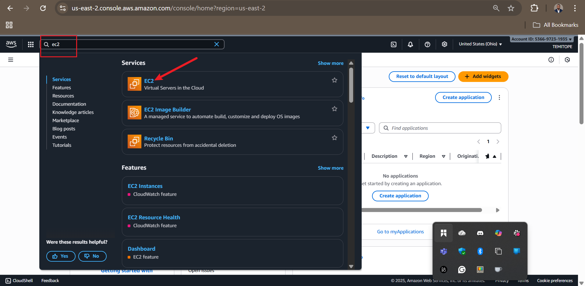 |
| 2 | Find "Key Pairs" under Network & Security on the left sidebar and click on it |  |
| 3 | On the Key Pairs page, click "Create key pair" |  |
| 4 | Name key pair `MyKeyPair`, select PEM type and format, then click "Create key pair" |  |
| 5 | Key pair created successfully - download the `.pem` file immediately | 
    


4. **Understand AWS CLI for EC2**:
   - Refer to the official docs: Search for "run-instances" in [AWS CLI EC2 Reference](https://docs.aws.amazon.com/cli/latest/reference/ec2/index.html).
   - Example command: `aws ec2 run-instances --image-id ami-0cd59ecaf368e5ccf --instance-type t2.micro --count 1 --key-name MyKeyPair --region eu-west-2`.
   - Hands-on: Open the docs in your browser and search for "run-instances" to explore options. Here's what the console looks like:

| Step | Action | Screenshot |
|------|--------|------------|
| 1 | Search for "AWS CLI command reference EC2" |  |
| 2 | Click on the first link showing "CLI latest reference EC2" | 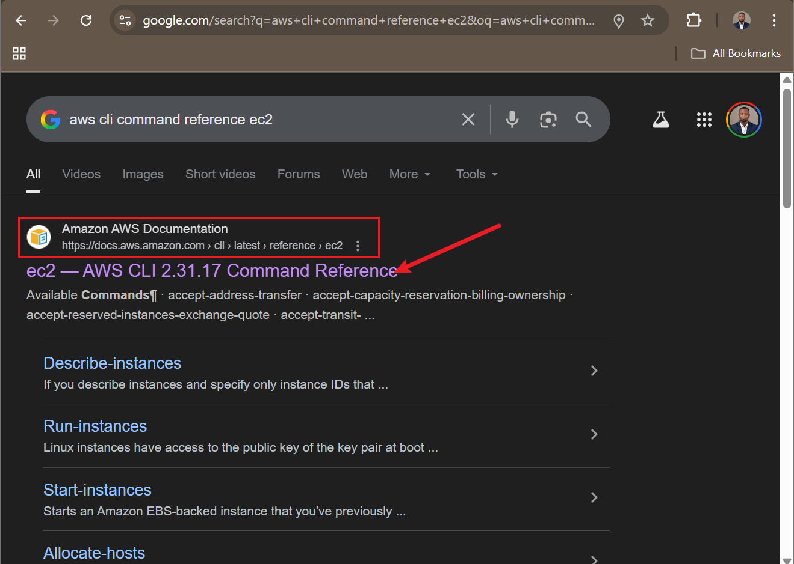 |
| 3 | Now on AWS CLI Commands official documentation webpage |  |
| 4 | Search for "run-instances" with Ctrl+F and click on it when found | 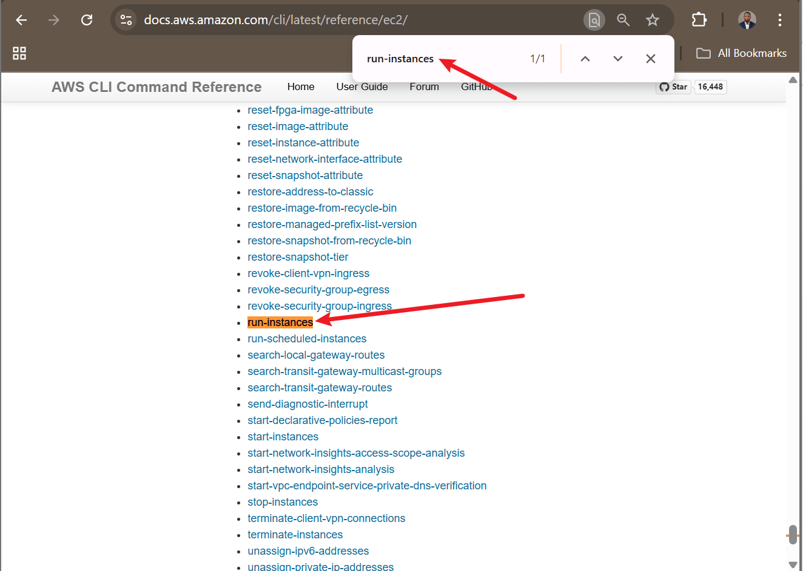


Now, create an empty file `aws-resources.sh` in your terminal: `touch aws-resources.sh`.

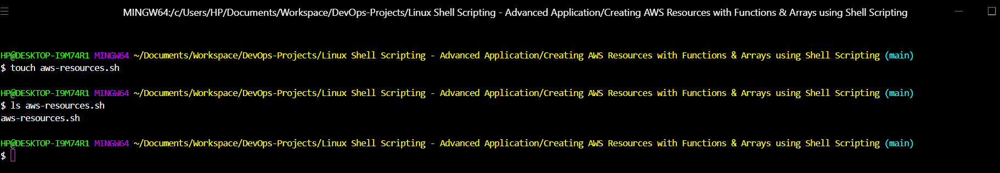

## The Script Breakdown

We'll build the script progressively. For each section, I'll show the code block, explain it line by line, and guide you to add and test it. The full script uses functions for modularity, checks for prerequisites, and handles different environments (local, testing, production).

### 1. Shebang and Environment Variable
Add this to the top of your file:

```bash
#!/bin/bash

# Environment variables
ENVIRONMENT=$1
```

- **Explanation**:
  - `#!/bin/bash`: Specifies the interpreter (Bash shell).
  - `ENVIRONMENT=$1`: Captures the first command-line argument (e.g., "local") as a variable. This allows running the script in different modes.
- **Hands-on**: Save the file. Run `./aws-resources.sh local`—it should do nothing yet, but no errors.


### 2. Check Number of Arguments
Add this function:

```bash
check_num_of_args() {
    # Checking the number of arguments
    if [ "$#" -ne 1 ]; then
        echo "Usage: $0 <environment>"
        exit 1
    fi
}
```

- **Explanation**:
  - This function checks if exactly one argument is provided.
  - `$#`: Number of arguments.
  - If not 1, print usage and exit with code 1 (error).
  <!-- - Note: The original project had a typo (-ne 0), which we've corrected to -ne 1 for proper validation. -->
- **Hands-on**: Add this, then call it at the bottom: `check_num_of_args "$@"`. Run `./aws-resources.sh` (no arg)—see usage message. Run with `./aws-resources.sh local`—no error.
_call_it_and_run_without_and_with_argument.png)
### 3. Activate Infrastructure Environment
Add:

```bash
activate_infra_environment() {
    # Acting based on the argument value
    if [ "$ENVIRONMENT" == "local" ]; then
      echo "Running script for Local Environment..."
    elif [ "$ENVIRONMENT" == "testing" ]; then
      echo "Running script for Testing Environment..."
    elif [ "$ENVIRONMENT" == "production" ]; then
      echo "Running script for Production Environment..."
    else
      echo "Invalid environment specified. Please use 'local', 'testing', or 'production'."
      exit 2
    fi
}
```

- **Explanation**:
  - Uses if-elif-else to print a message based on `$ENVIRONMENT`.
  - Exits with code 2 if invalid.
  - This could be extended to environment-specific logic (e.g., different regions).
- **Hands-on**: Add and call `activate_infra_environment` after the args check. Run `./aws-resources.sh local`—see "Running script for Local Environment...". Try `./aws-resources.sh invalid`—see error.
_and_call_it.png)
_with_invalid_and_local_env_passed.png)
### 4. Check AWS CLI Installation
Add:

```bash
# Function to check if AWS CLI is installed
check_aws_cli() {
    if ! command -v aws &> /dev/null; then
        echo "AWS CLI is not installed. Please install it before proceeding."
        return 1
    fi
}
```

- **Explanation**:
  - `command -v aws`: Checks if `aws` command exists.
  - `&> /dev/null`: Suppresses output.
  - If not installed, print message and return 1 (failure).
- **Hands-on**: Add and call `check_aws_cli || exit 1` (exits if fails). Run the script—if CLI is missing, it stops.
.png)
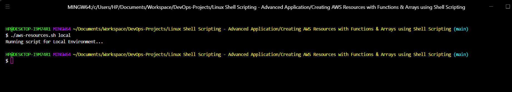
### 5. Check AWS Profile
Add:

```bash
# Function to check if AWS profile is set
check_aws_profile() {
    if [ -z "$AWS_PROFILE" ]; then
        echo "AWS profile environment variable is not set."
        return 1
    fi
}
```

- **Explanation**:
  - `-z "$AWS_PROFILE"`: Checks if the variable is empty.
  - Returns 1 if not set (assumes default profile if unset, but enforces it for safety).
- **Hands-on**: Add and call `check_aws_profile || exit 1`. Set `export AWS_PROFILE=default` if needed, then run.

.png)
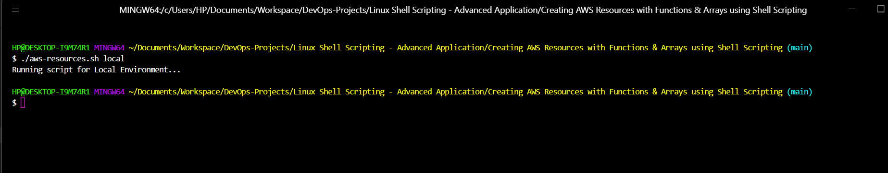

### 6. Create EC2 Instances Function
Add:

```bash
# Function to create EC2 Instances
create_ec2_instances() {

    # Specify the parameters for the EC2 instances
    instance_type="t2.micro"
    ami_id="resolve:ssm:/aws/service/ami-amazon-linux-latest/al2023-ami-kernel-default-x86_64"  # Latest AL2023 (dynamic)
    count=2  # Number of instances to create
    region="us-west-2" # Region to create cloud resources
    
    # Create the EC2 instances
    aws ec2 run-instances \
        --image-id "$ami_id" \
        --instance-type "$instance_type" \
        --count $count \
        --key-name my-new-key-pair \
        --region "$region"
        
    # Check if the EC2 instances were created successfully
    if [ $? -eq 0 ]; then
        echo "EC2 instances created successfully."
    else
        echo "Failed to create EC2 instances."
    fi
}
```

- **Explanation**:
  - Variables hold parameters (AMI, type, count, region) for reusability.
  - `aws ec2 run-instances`: Launches instances; backslashes (`\`) continue the command over lines.
  - `$?`: Exit status of last command (0 = success).
  - Updated AMI to AL2023 for modernity; original was AL2.
- **Hands-on**: Add and call `create_ec2_instances`. Run `./aws-resources.sh local`—watch it create 2 instances. Check AWS console > EC2 > Instances for them (may take a minute). Here's what the process looks like:

| Step | Action | Screenshot |
|------|--------|------------|
| 1 | Before execution: Note there are currently no EC2 instances | 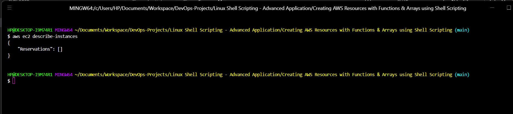 |
| 2 | Add and call `create_ec2_instances()` in your script | .png) |
| 3 | Run the script to create instances and S3 buckets |  |
| 4 | Successfully executed and resources created | 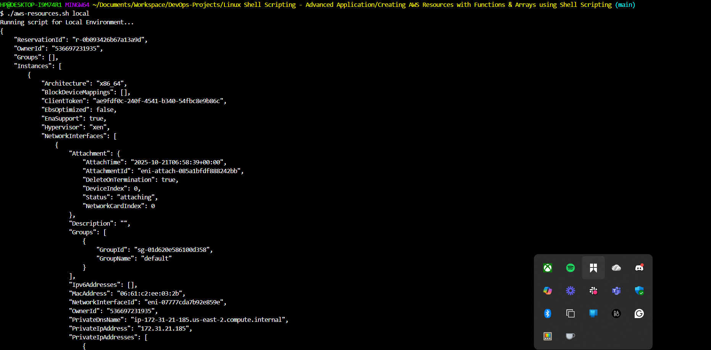 |
| 5 | Instances created successfully, visible in AWS console | 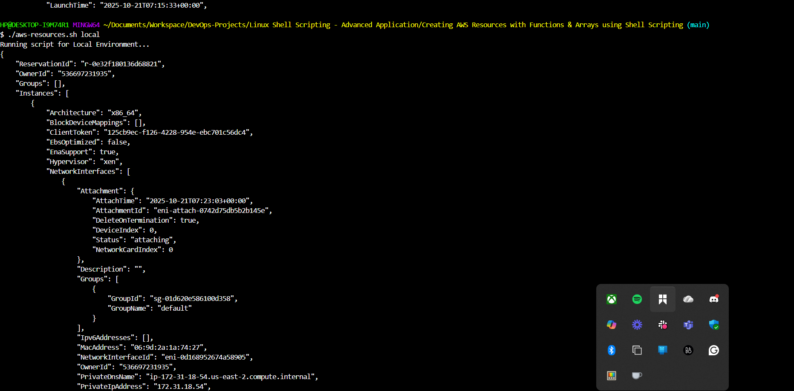 |


### 7. Create S3 Buckets Function
Add:

```bash
# Function to create S3 buckets for different departments
create_s3_buckets() {
    # Define a company name as prefix
    company="datawise"
    # Array of department names
    departments=("Marketing" "Sales" "HR" "Operations" "Media")
    
    # Loop through the array and create S3 buckets for each department
    for department in "${departments[@]}"; do
        bucket_name="${company}-${department}-Data-Bucket"
        # Create S3 bucket using AWS CLI
        aws s3api create-bucket --bucket "$bucket_name" --region eu-west-2
        if [ $? -eq 0 ]; then
            echo "S3 bucket '$bucket_name' created successfully."
        else
            echo "Failed to create S3 bucket '$bucket_name'."
        fi
    done
}
```

- **Explanation**:
  - `company`: Prefix for unique bucket names (S3 names must be global).
  - `departments=()`: Array holding multiple values.
  - `for ... in "${departments[@]}"`: Loops over all elements (`[@]` expands to all).
  - Constructs `bucket_name` dynamically (e.g., datawise-Marketing-Data-Bucket).
  - `aws s3api create-bucket`: Creates bucket; checks $? for success.
  - Arrays allow efficient handling of lists—access single elements like `${departments[0]}` (zero-indexed).
- **Hands-on**: Add and call `create_s3_buckets`. Run the script again—see 5 buckets created. Check AWS console > S3 > Buckets. Change `company` if names conflict. Here's what the process looks like:

| Step | Action | Screenshot |
|------|--------|------------|
| 1 | Before execution: Note there are currently no S3 buckets | 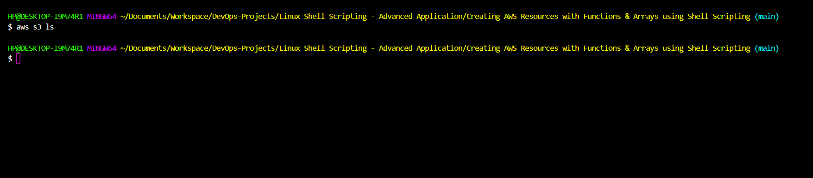 |
| 2 | Add and call `create_s3_buckets()` in your script | .png) |
| 3 | Run the script to create instances and S3 buckets |  |
| 4 | Successfully executed and resources created |  |
| 5 | Buckets created successfully, visible in AWS console | 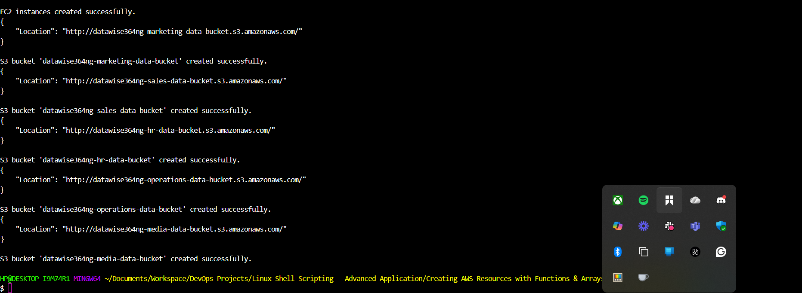 |


### 8. Calling All Functions
At the bottom, ensure these calls:

```bash
check_num_of_args "$@"
activate_infra_environment
check_aws_cli || exit 1
check_aws_profile || exit 1
create_ec2_instances
create_s3_buckets
```

- **Explanation**: Executes functions in order; `|| exit 1` stops on failure.
- **Hands-on**: Full run now deploys everything.

## Running the Script

Save the complete script, then `./aws-resources.sh local`. Output shows success/failure. Monitor costs in AWS Billing.

## Verification and Cleanup

- **Verify**: Use console as above, or CLI: `aws ec2 describe-instances --region eu-west-2`, `aws s3 ls`.
- **Cleanup** (important to avoid charges):
  - EC2: `aws ec2 terminate-instances --instance-ids <id1> <id2> --region eu-west-2` (get IDs from describe-instances).
  - S3: `aws s3api delete-bucket --bucket <name> --region eu-west-2` for each.
- Hands-on: Run cleanup after testing.


## Summary

In this mini project on creating AWS resources with functions and introducing arrays, I learned how to automate infrastructure provisioning using **Bash scripting** and the **AWS CLI**, beginning with setting up prerequisites like installing the AWS CLI, configuring profiles, and creating EC2 key pairs in the console.

I explored the AWS documentation to understand commands such as `aws ec2 run-instances` for launching `t2.micro` instances with parameters like **AMI ID** (updated to dynamic SSM for the latest Amazon Linux 2023 in `eu-west-2`), **instance type**, **count**, **key name**, and **region**, while using exit status (`$?`) for success checks and environment variables for flexibility.

Additionally, I defined functions to modularize code, including one for EC2 creation and another for S3 buckets, where I introduced **arrays** to store department names (`Marketing`, `Sales`, `HR`, `Operations`, `Media`) and looped through them with `"${departments[@]}"` to generate globally unique bucket names via a prefix like `datawise` and suffix `-Data-Bucket`, creating them with `aws s3api create-bucket` and handling errors.

The script also incorporates argument validation for environments (`local`, `testing`, `production`), checks for AWS CLI and profile setup, and demonstrates key Bash concepts like **special variables**, **loops**, and **conditional statements**, ultimately enabling efficient, repeatable automation of cloud resources while emphasizing **global uniqueness for S3** and **best practices for secure, up-to-date AMIs**.
