# E-Commerce Platform Deployment with Git, Linux, and AWS


## 🧑‍💼 Professional Details

- **Name:** Brij Mohan Singh  
- **Role:** DevOps & AWS Cloud Engineer  
- **GitHub:** [github.com/brijjadon](https://github.com/brijjadon)  
- **LinkedIn:** [Brij Mohan Singh](https://www.linkedin.com/in/brij-mohan-singh-731587a2/)  
- **Email:** 📧 brijjadin7566@gmail.com  

---


---


## **Project Introduction**
This capstone project focuses on building and deploying an **e-commerce platform** named **MarketPeak**. The platform will provide core online shopping functionalities such as product listings, a shopping cart, and user authentication. The project demonstrates end-to-end web development and deployment practices, starting from selecting and customizing a suitable HTML/CSS template to hosting the website on an AWS EC2 instance.

The entire development process is tracked with **Git** for version control, ensuring proper management of changes, collaboration, and rollback capabilities. The implementation takes place in a **Linux environment**, reinforcing industry-standard deployment workflows. Finally, the live platform is made accessible via an **Apache web server** running on a cloud-based infrastructure.

---

## **Project Background**

MarketPeak is envisioned as a scalable online marketplace that can grow with the needs of vendors and customers. The project’s foundation lies in leveraging **ready-made HTML/CSS templates** from sources such as Tooplate, which allows rapid prototyping and customization without building the interface from scratch.

This project bridges three crucial aspects of modern web development:

1. **Version Control (Git & GitHub)** – Ensuring the codebase is organized, backed up, and collaboration-ready.
2. **Linux Server Administration** – Managing file systems, permissions, and service configuration for reliable deployment.
3. **Cloud Hosting (AWS EC2)** – Utilizing elastic, on-demand infrastructure to host and scale the application.

By integrating these components, MarketPeak serves as a comprehensive demonstration of **full-stack deployment** in a real-world setting.

---

## **Project Objectives**

The objectives of this project are to:

1. **Select and Customize a Web Template**
   Adapt a Tooplate template to match the MarketPeak brand identity.

2. **Implement Git-based Version Control**
   Track all changes, manage branches, and push updates to a remote GitHub repository.

3. **Set Up a Linux Development and Hosting Environment**
   Use Ubuntu Server for local development and AWS EC2 for production hosting.

4. **Deploy the E-Commerce Platform to AWS EC2**
   Configure Apache to serve the website publicly over HTTP/HTTPS.

5. **Demonstrate a Live Update Workflow**
   Make code changes in a development branch, merge via GitHub pull requests, and push updates to the live server.

6. **Document the Process in Detail**
   Provide a step-by-step report, supported with 58 screenshots, to ensure the workflow can be replicated by others.

---

### Step 1: Create Project Folder and Initialize Git

Open your terminal, navigate to the desired parent directory, and create the project folder. Git will initialize the empty repository.

* **Command:**
```bash
mkdir MarketPeak_Ecommerce
cd MarketPeak_Ecommerce
git init
```
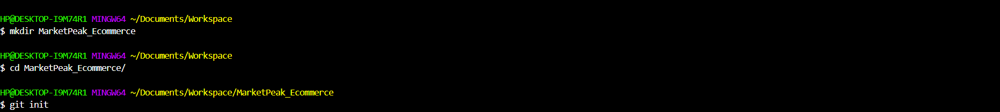


### Step 2: Pick a Tooplate Website Template

Visit [Tooplate.com](https://www.tooplate.com/) and select a suitable e-commerce template. This saves development time and provides a professional design base.
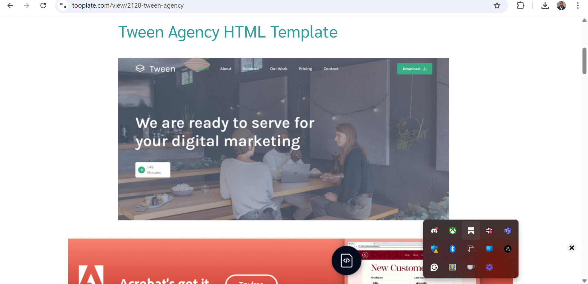

### Step 3: Download the Website Template

Click the download button in order to download a copy of the selected template.
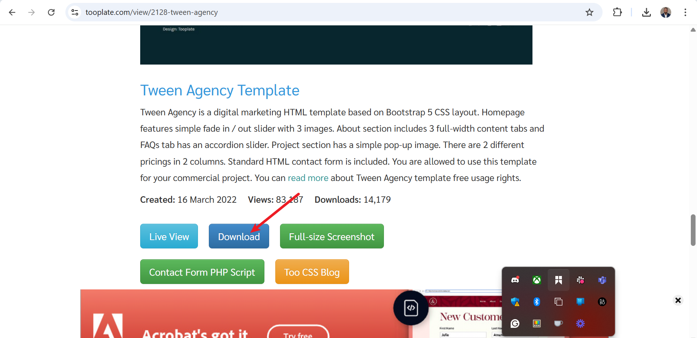

### Step 4: Extract the Downloaded Template

Locate the ZIP file of the downloaded website in your chosen download folder and extract it.
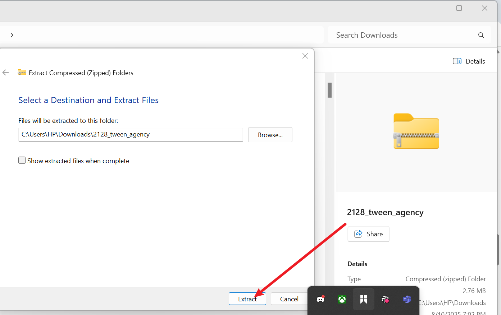

### Step 5: Copy/Cut Template Files and Assets

Open the extracted folder, select all the files in there, and copy or cut them.
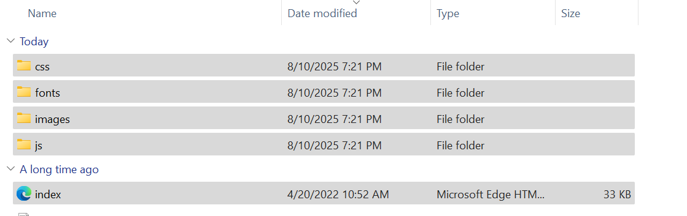

### Step 6: Paste Files into the Project Folder

 Navigate to the initialized project folder, `MarketPeak_Ecommerce/` and paste the copied files into it.


### Step 7: Customize Website Name

Open `index.html` in a code editor (VS Code, Sublime Text, etc.) and change the `<title>` tag and any visible branding to “MarketPeak_Ecommerce”.
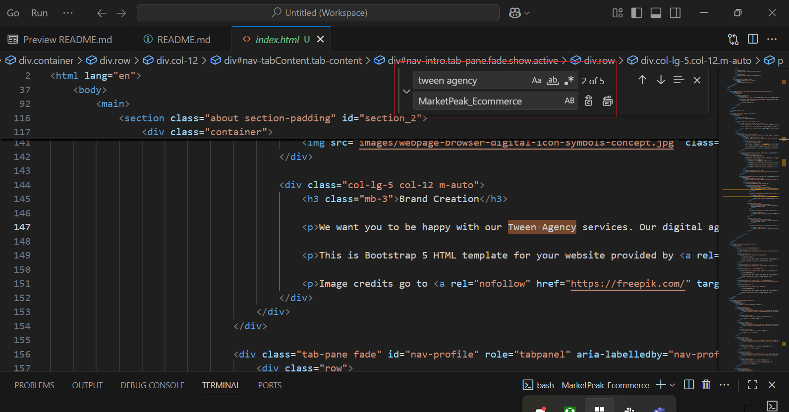

---
### Step 8 — Preview site locally after customization

Open `index.html` in your browser (file://) to confirm branding changes.


---

### Step 9 — Stage the website files for Git

 Initialize the project folder and add all project files to Git staging area.

* **Command:**

```bash
git add .
```
`git status` shows files in "Changes to be committed".

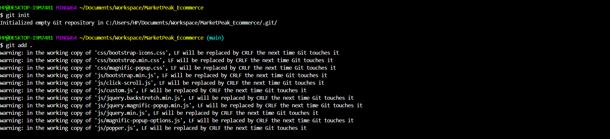

---

### Step 10 — Set git global configuration (name & email)

Configure Git identity so commits are properly attributed.

* **Commands:**

```bash
git config --global user.name "Osunsola Oluwaseun"
git config --global user.email "oluwaseun.beicks@gmail.com"
```


---

### Step 11 — Commit changes with descriptive message

Create the first (initial) commit with a helpful message.
* **Command:**

```bash
git commit -m "Initial commit of basic ecommerce structure"
```
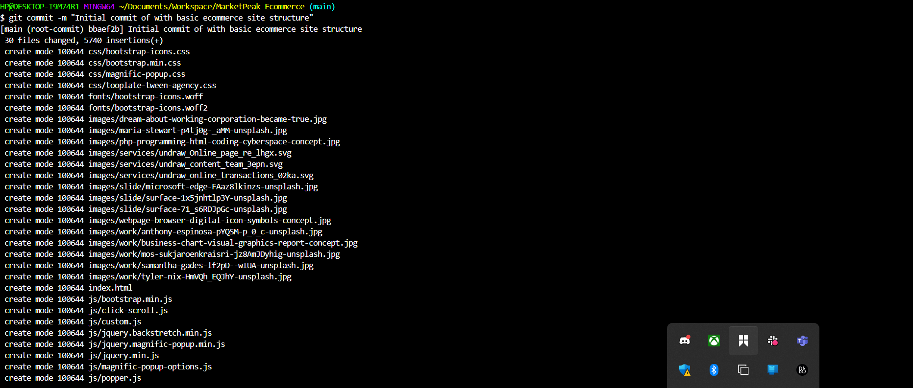

---

### Step 12 — Create GitHub remote repository

In GitHub UI create a new repo named `MarketPeak_Ecommerce` (leave it empty — no README). This way we avoid merge conflicts when pushing an existing local repo.
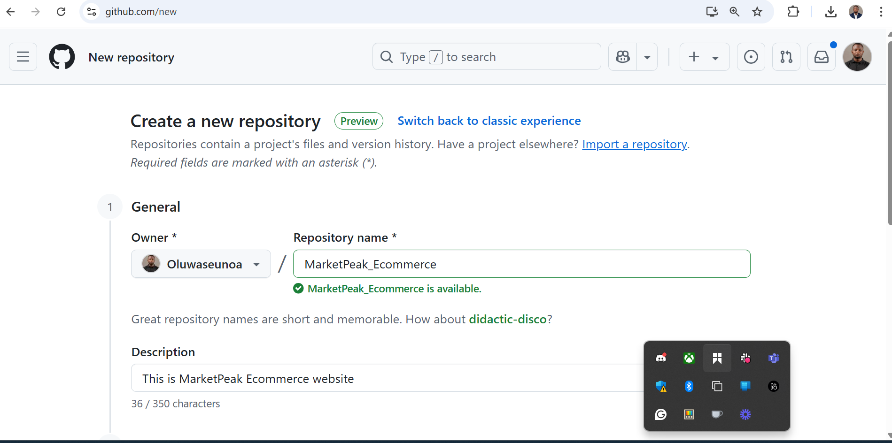

---

### Step 13 — Copy repository link (HTTPS recommended)

In the `Quick setup` section, copy the HTTPS clone URL. My own looks like:
https://github.com/your-username/MarketPeak_Ecommerce.git

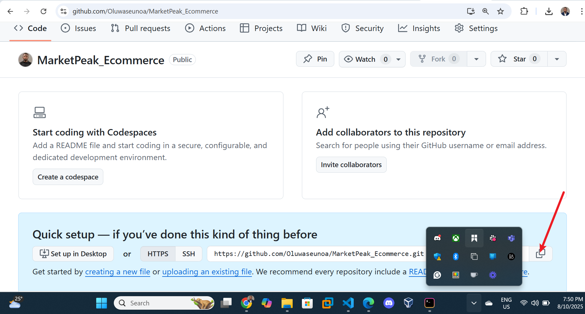

---

### Step 14 — Add remote origin locally
In the local project repository, add the GitHub link copied to your project so that you can make the repository house your project on GitHub.

* **Command:**

```bash
git remote add origin https://github.com/your-username/MarketPeak_Ecommerce.git
```
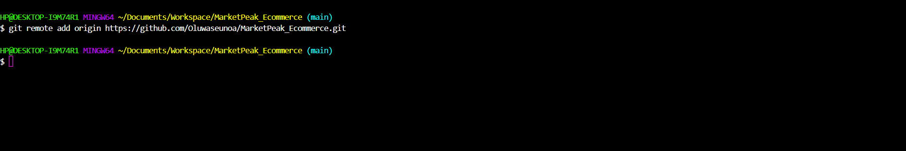


---

### Step 15 — Push main branch to GitHub

* **Commands:**

```bash
git push -u origin main
```
You will see something like 
```
Progress bars and `To https://github.com/.../MarketPeak_Ecommerce.git` then `branch 'main' set up to track 'origin/main'`.
```
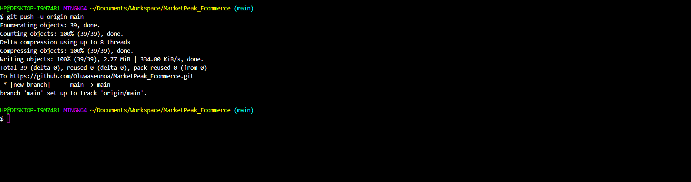

---

### Step 16 — Verify files on GitHub
 Open your GitHub repo in a browser to confirm files and commit history are present.


---

### Step 17 — Log in to your AWS Management Console
If you don't have an account, you will have to create one. By gaining access to the AWS Console, we can create resources.

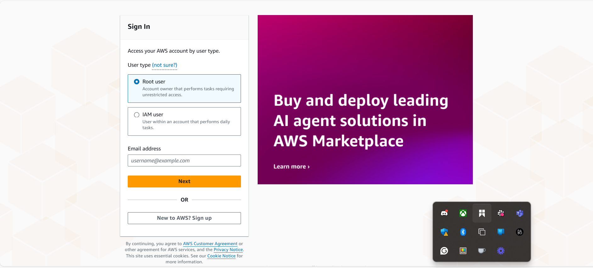

---

### Step 18 — Open EC2 service
Use the console search to locate EC2 and open the EC2 Dashboard.

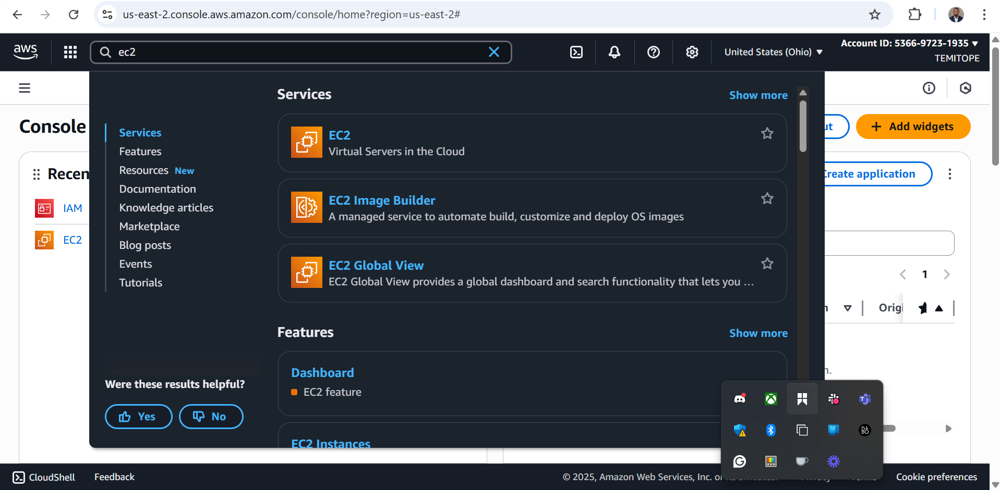

---

### Step 19 — Launch a new EC2 instance
Click "Launch instance" to start the instance wizard.

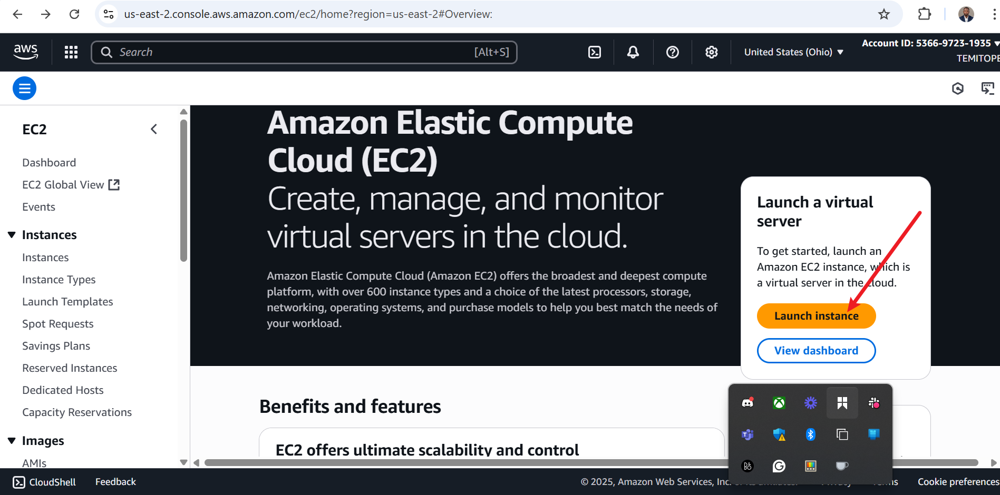

---

### Step 20 — Name your instance `MarketPeak_Ecommerce_Server`
Use a clear resource tag for easy identification.

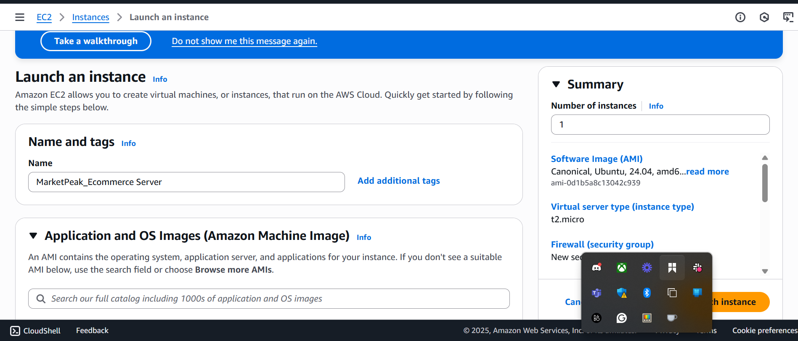

---

### Step 21 — Choose Ubuntu Server 24.04 LTS AMI
A current, stable Ubuntu LTS provides security patches and compatibility with Ubuntu packages.

_SSD_Volume_Type_64bits.png)

---

### Step 22 — Choose instance type (t2.micro for free-tier)
t2.micro is free-tier eligible and sufficient for demo deployments.

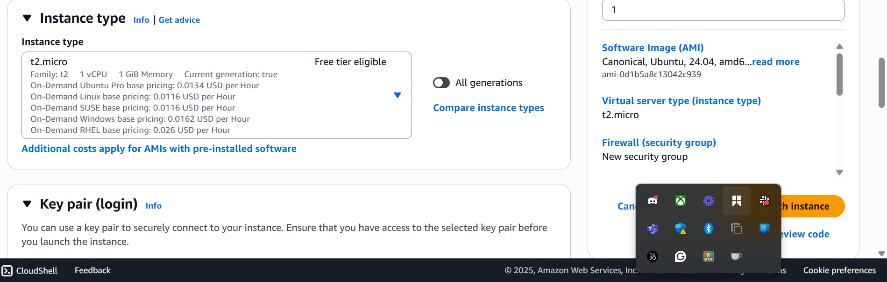

---

### Step 23 — Create and download an SSH key pair
Create a new key pair, download the `.pem` private key and keep it secure. Save it in a path you will use to SSH (e.g., `~/.ssh/marketpeak.pem`).

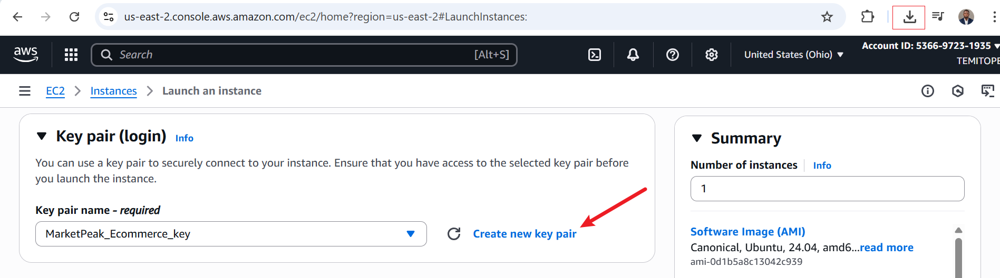

---

### Step 24 — Configure security group: allow SSH, HTTP, HTTPS
Add inbound rules for (allow for all): 

  * SSH (TCP 22) — Source: your IP (or 0.0.0.0/0 for testing, not recommended)
  * HTTP (TCP 80) — Source: 0.0.0.0/0
  * HTTPS (TCP 443) — Source: 0.0.0.0/0

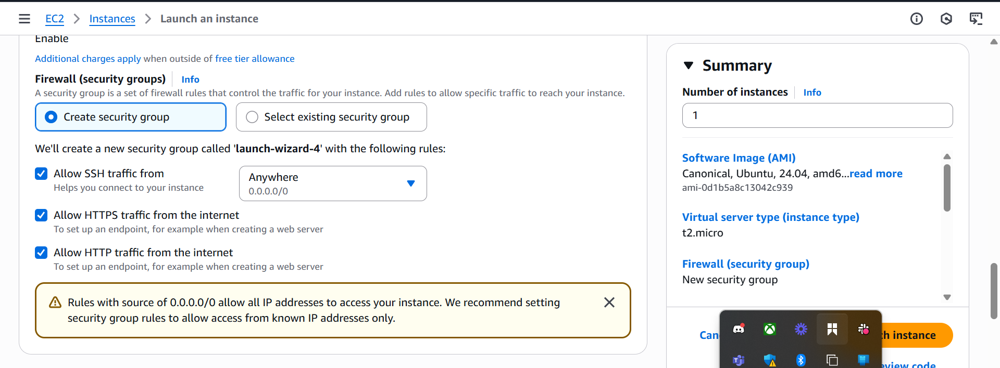

---

### Step 25 — Launch the EC2 instance
Review settings and click Launch. Instance enters `pending` then `running` state.

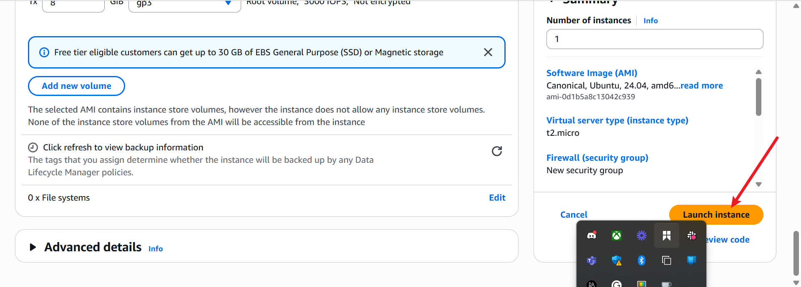

---

### Step 26 — Click the instance ID in the success message
Use the link in the launch-success banner to open the instance details page.

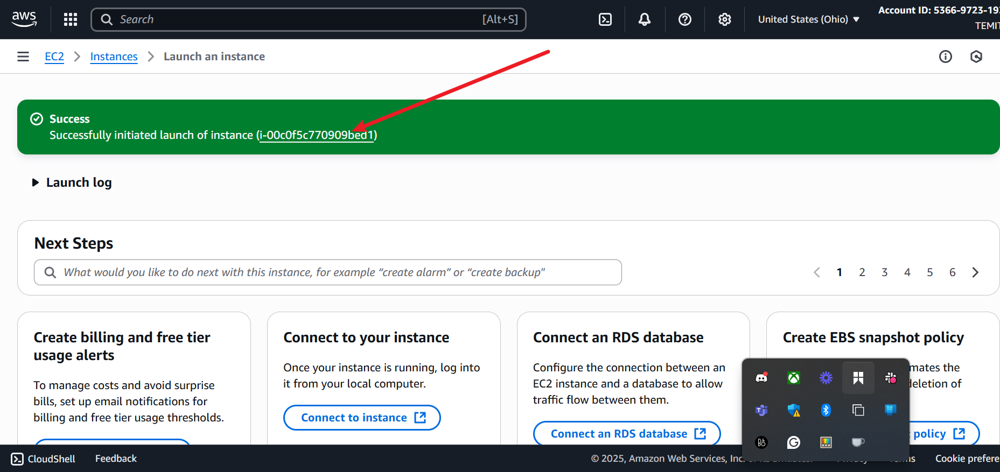

---

### Step 27 — Note the public IPv4 address & click Connect
Copy the public IP (or public DNS) for SSH access.

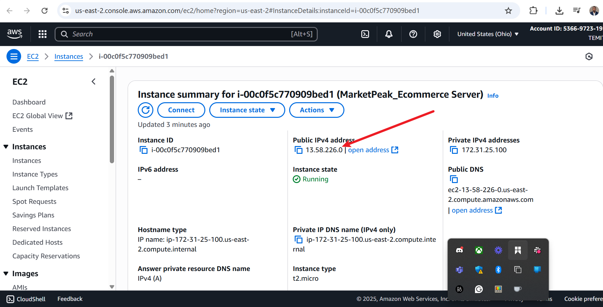

---

### Step 28 — Copy the example SSH command from the Connect page

* **Example provided by AWS:**

```bash
ssh -i "your-key-pair.pem" ubuntu@<PUBLIC_IP>
```

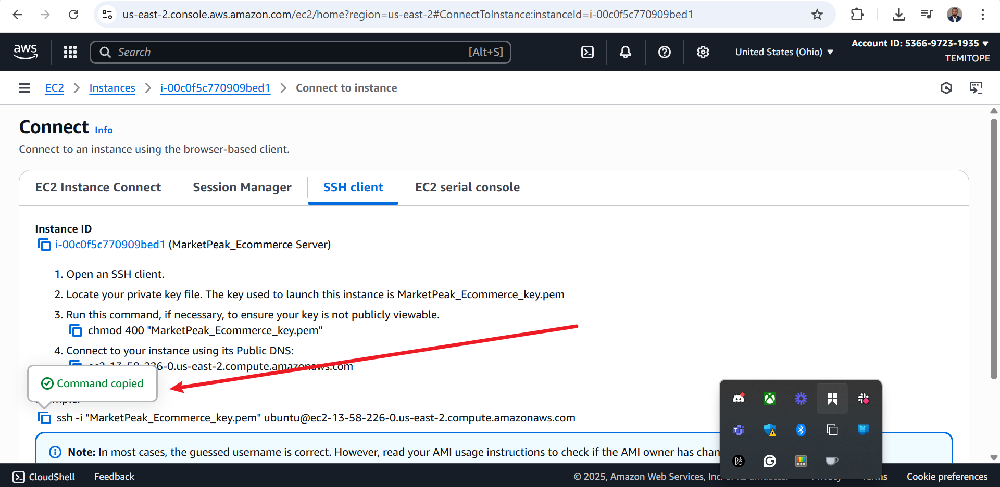

---

### Step 29 — Locate downloaded `.pem` on your machine
Confirm the path where the key was saved (Downloads, \~/.ssh, etc.).


---

### Step 30 — Set proper permissions on the key

* **Command:**

```bash
chmod 400 /path/to/your-key-pair.pem
```

SSH requires private key permissions to be restricted.

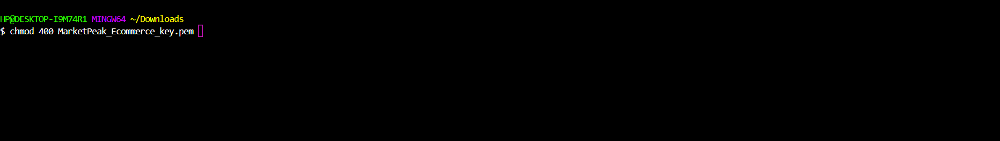

---

### Step 31 — Connect to the instance via SSH

* **Command (example):**

```bash
ssh -i "~/Downloads/your-key-pair.pem" ubuntu@<PUBLIC_IP>
```

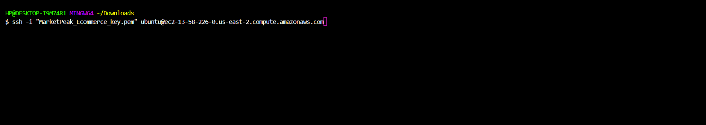

---

### Step 32 — Accept SSH fingerprint (type `yes`)
First-time connection will show the host fingerprint; type `yes` to store it.

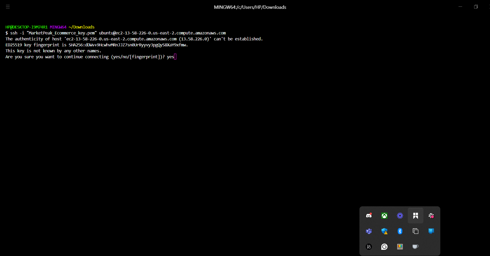

---

### Step 33 — Confirm you are connected to the EC2 instance
You'll see something like `ubuntu@ip-...:~$`


You can also confirm by running `uname -a` or `lsb_release -a` to confirm Ubuntu OS.
---

### Step 34 — On GitHub, open repo and click "Code" to get clone options
Navigate to your repo and reveal HTTPS/SSH options.

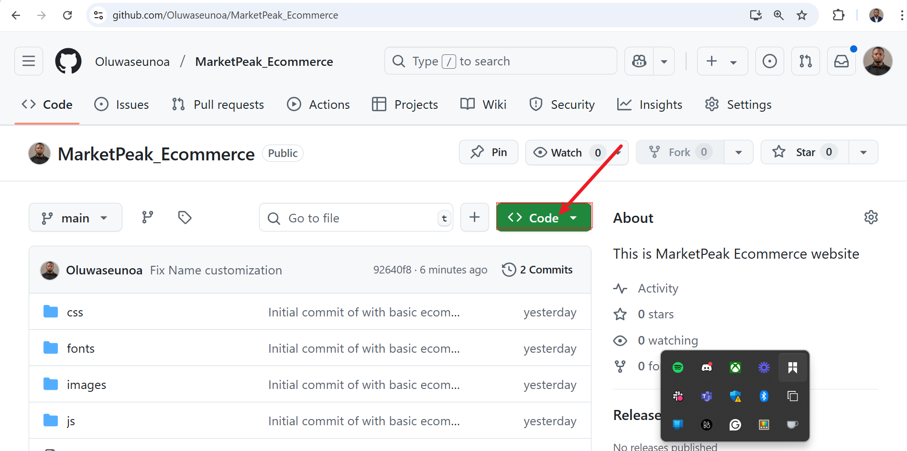

---

### Step 35 — Choose HTTPS (or SSH if configured)
Going for HTTPS because it requires no additional server-side key configuration; SSH requires adding public key to GitHub account.

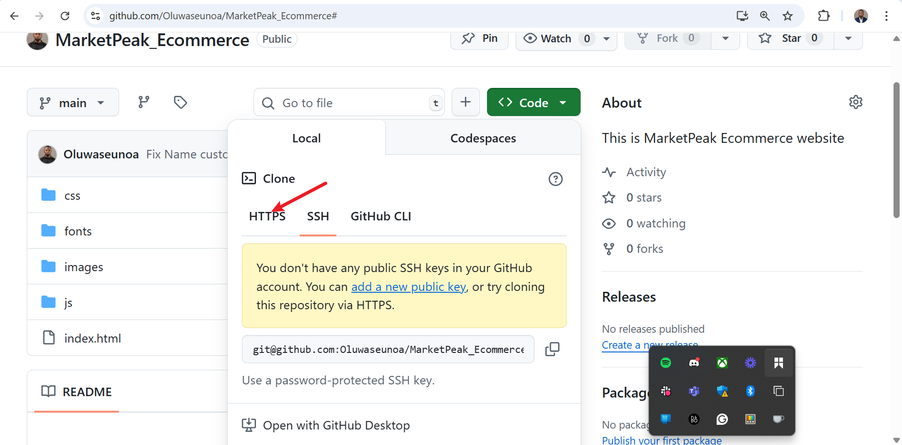

---

### Step 36 — Copy the HTTPS clone URL

Mine is `https://github.com/Oluwaseunoa/MarketPeak_Ecommerce.git`
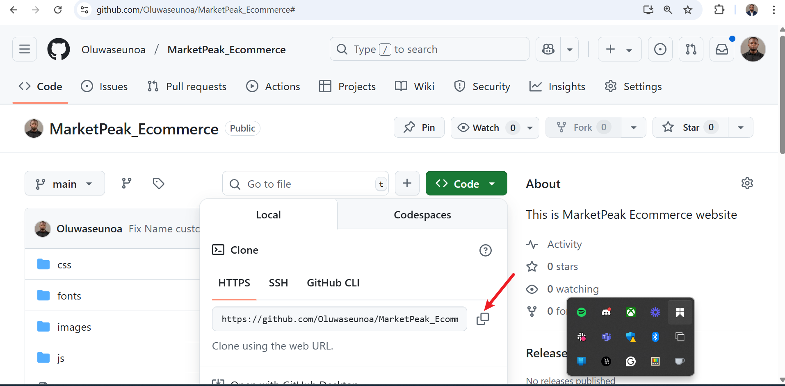

---

### Step 37 — Clone the repository on the EC2 instance and confirm the download

* **Commands:**

```bash
git clone https://github.com/Oluwaseunoa/MarketPeak_Ecommerce.git
ls
```
The repo appears as a folder in your home directory.
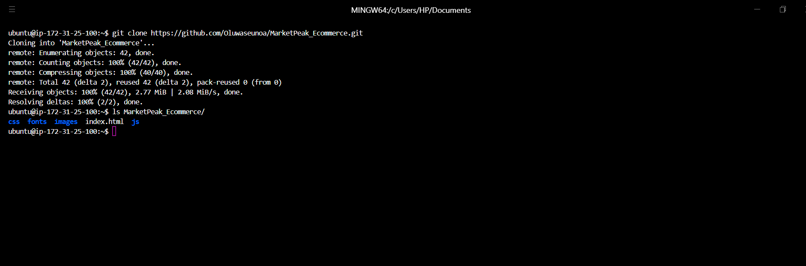

---

### Step 38 — Update and upgrade Ubuntu packages

* **Commands:**

```bash
sudo apt update && sudo apt upgrade -y
```
This keep packages up-to-date for security and compatibility.
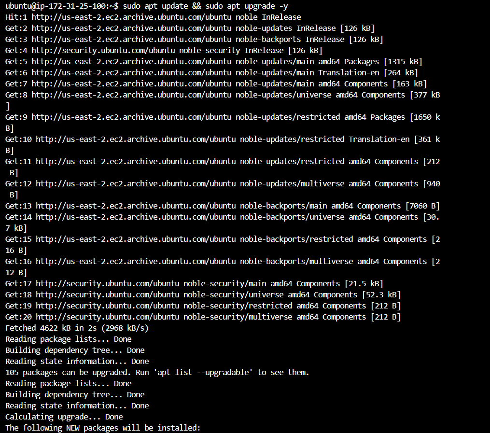

---

### Step 39 — Install Apache2 web server

* **Command:**

```bash
sudo apt install apache2 -y
```

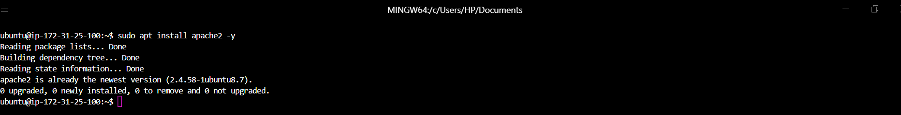

---

### Step 40 — Start and enable Apache2

* **Commands:**

```bash
sudo systemctl start apache2
sudo systemctl enable apache2
```
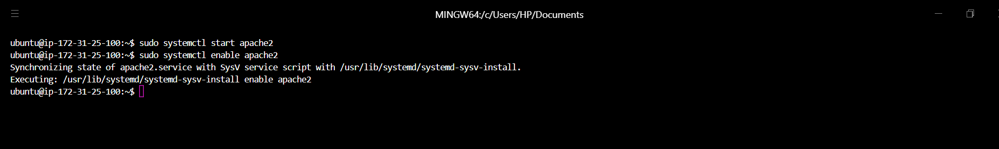

---

### Step 41 — Prepare web directory: move or link repo to `/var/www/html`

* **Options:**

  * **Copy (recommended for static sites):**


```bash
  sudo rm -rf /var/www/html/*
  sudo cp -r ~/MarketPeak_Ecommerce/* /var/www/html/
```

  * **Alternative — symlink (easier for development):**

```bash
  sudo rm -rf /var/www/html
  sudo mv ~/MarketPeak_Ecommerce /var/www/
  sudo ln -s /var/www/MarketPeak_Ecommerce /var/www/html
  sudo chown -R www-data:www-data /var/www/MarketPeak_Ecommerce
```


---

### Step 42 — Reload Apache to pick up changes
Reload picks up file changes without restarting the server.
* **Command:**

```bash
  sudo systemctl reload apache2
```
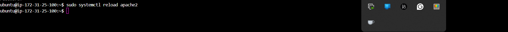

---

### Step 43 — Open the site in a browser using the public IP

* **URL:** `http://<PUBLIC_IP>/` (or the server domain if you configured DNS)
The MarketPeak site should load and show the customized branding.
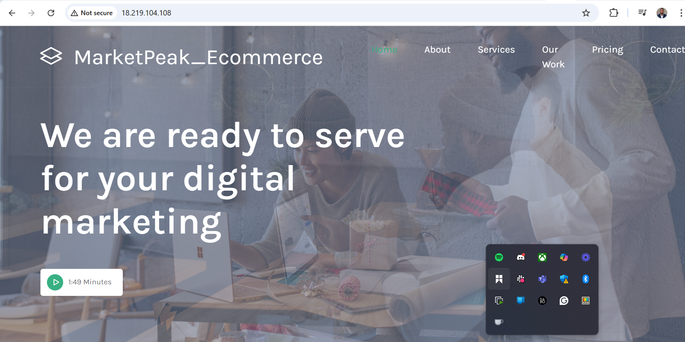

---

### (Steps 44–58 — development workflow, PRs, merge & deploy)

The document continues with the development branch workflow, making a change on a `development` branch, pushing, opening a pull request, merging into `main`, pulling changes on the server, and verifying updates live on the site. Steps 44–58 include creating a `development` branch, changing the site title to `MarketPeak_4.0`, staging, committing, pushing, creating PR, merging, pulling on server, reloading Apache, and confirming the change in the browser. For completeness these steps are fully documented below (with commands and checks):

### Step 44 — Create development branch for changes
 This isolate feature work from `main`.
* **Commands:**
```bash
git checkout -b development
```

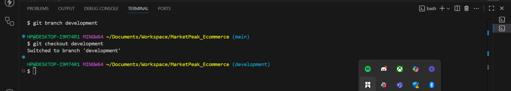

---

### Step 45 — Make a change (example: update site title)
Edit `index.html`. I am changing the website `<title>` from MarketPeak_Ecommerce  to `MarketPeak_4.0`.

* **Command (editor):** `code index.html` then save changes.
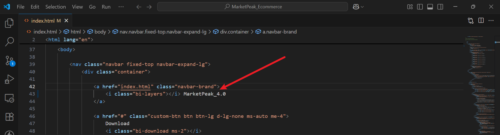

---

### Step 46 — Stage the change

* **Command:**

```bash
 git add .
```

* **Verification:** `git status` shows staged files.
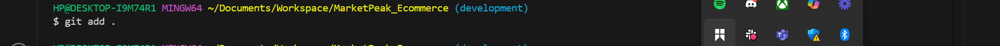

---

### Step 47 — Commit change with a clear message

* **Command:**

```bash
  git commit -m "Changed the site title from MarketPeak_Ecommerce to MarketPeak_4.0"
```

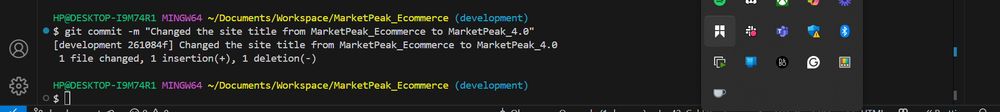

---

### Step 48 — Push development branch to origin

* **Command:**

```bash
git push origin development
```

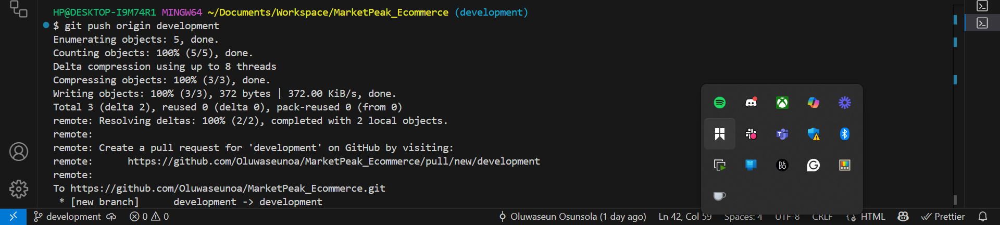

---

### Step 49 — Create a Pull Request (Development → Main) on GitHub

In GitHub UI click "Compare & pull request" and open a PR with a descriptive title and summary.
* **Checklists:** Ensure diffs only include intended changes.
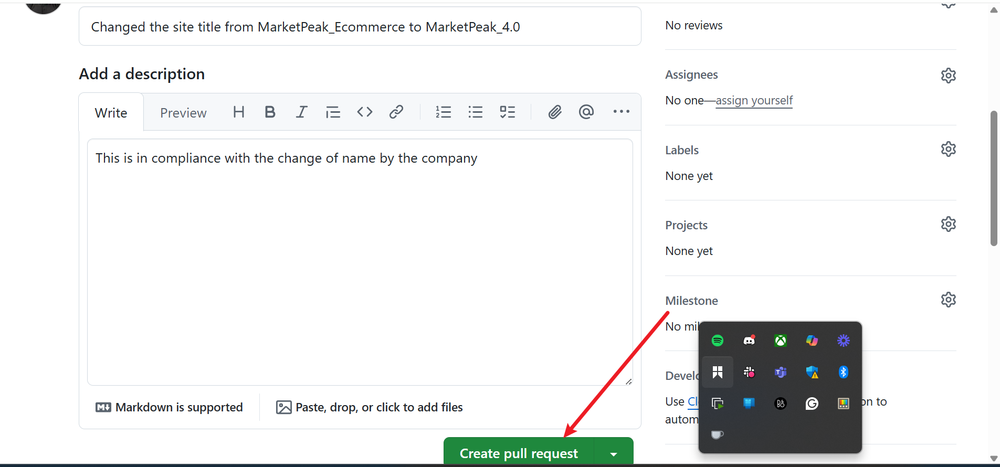

---

### Step 50 — Review changes and run checks before merging

Review the diff, run any CI checks (if configured), and confirm changes are safe to merge.
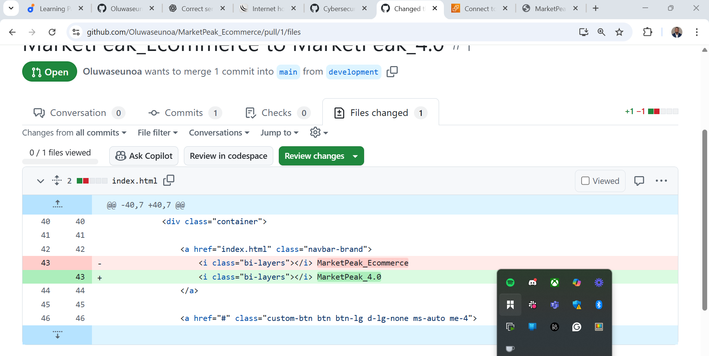

---

### Step 51 — Merge the Pull Request to `main`

Use GitHub UI to "Merge pull request" and optionally delete the development branch.


---

### Step 52 — Confirm successful merge

* **Verification:** GitHub displays a successful merge banner; `main` now contains your changes.
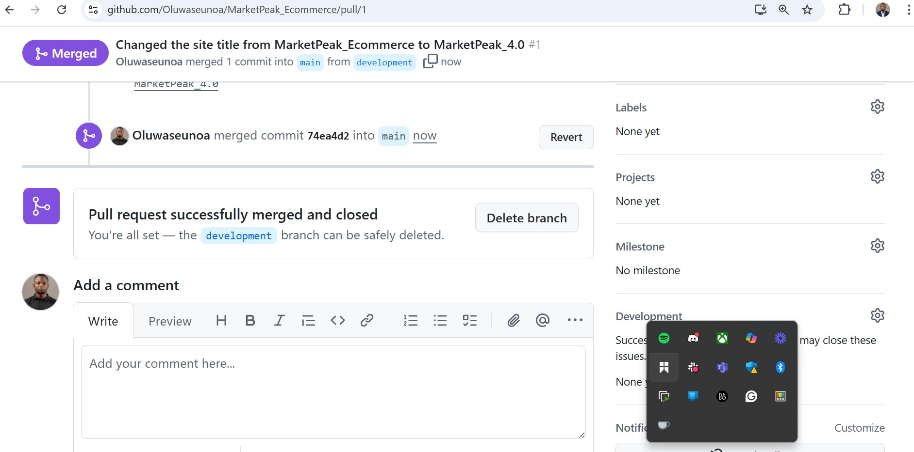

---

### Step 53 — Pull the updated `main` on any environment that serves production
This will keep production files in sync with repo.
* **Commands (on server or local):**

```bash
git checkout main
git merge development
``` 


---

### Step 54 — Push main (if you merged locally)

* **Command (if merging locally):**

```bash
git push origin main
```
This will say 'Everything up-to-date'

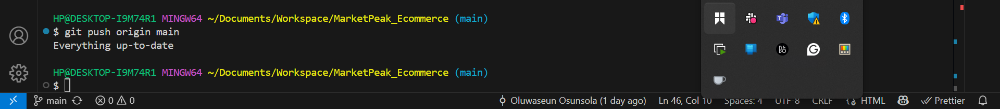

---

### Step 55 — Update production server files (if using clone in `/var/www`)

* **If you copied files to `/var/www/html` earlier:** re-copy or pull changes into that directory. Example using a git-backed setup:

```bash
cd /var/www/html
sudo git pull origin main
```

* **Alternative (if using symlink):** Changes in the home clone are visible immediately.
* **Check:** `cat /var/www/html/index.html | grep "MarketPeak_4.0"` to confirm the updated title exists.

---

### Step 56 — Fix permissions & ownership for Apache

* **Commands:**

```bash
sudo chown -R www-data:www-data /var/www/html
sudo find /var/www/html -type d -exec chmod 755 {} \;
sudo find /var/www/html -type f -exec chmod 644 {} \;
```

Ensures Apache can read files and provides secure permissions.

---

### Step 57 — Reload Apache to apply updates

* **Command:**

```bash
sudo systemctl reload apache2
```

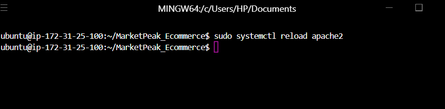

---

### Step 58 — Verify changes on live website

**Action:** Open `http://<PUBLIC_IP>/` in a browser and confirm the `MarketPeak_4.0` title (or other changes) appears.


---

## Troubleshooting (common issues & fixes)

* **`fatal: detected dubious ownership in repository`** — run `git config --global --add safe.directory /path/to/repo` on the server if you trust the repo owner. See screenshot examples in other tasks.
* **Permission denied (publickey)** — ensure you used the correct user (`ubuntu` for Ubuntu AMIs), correct `.pem` and `chmod 400` was applied.
* **403 Forbidden on Apache** — missing `index.html` in `/var/www/html`, wrong permissions, or Apache `Require all denied` in config. Check `/var/log/apache2/error.log`.

---

## Deliverables & Submission

* `README.md` (this document) committed to GitHub.
* `img/` folder containing the 58 screenshots.
* Live site URL: `http://<EC2_PUBLIC_IP>/` (replace with your IP or domain).

