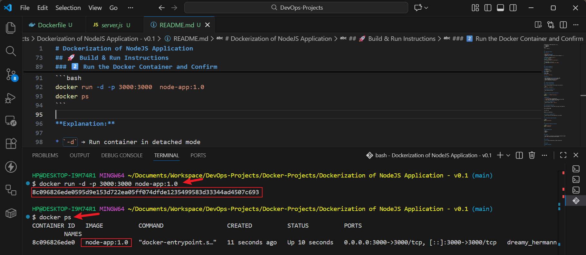
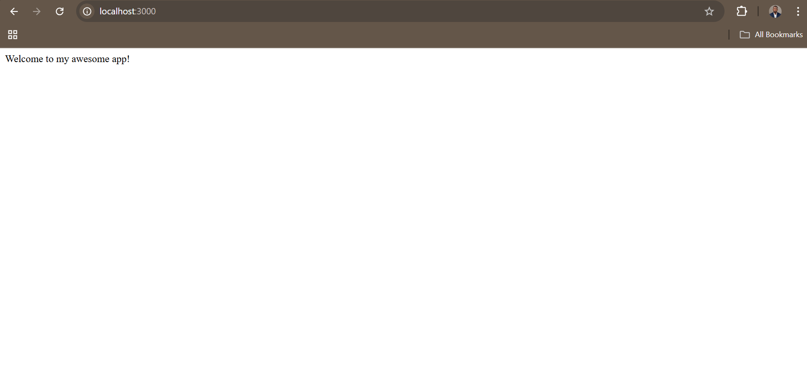
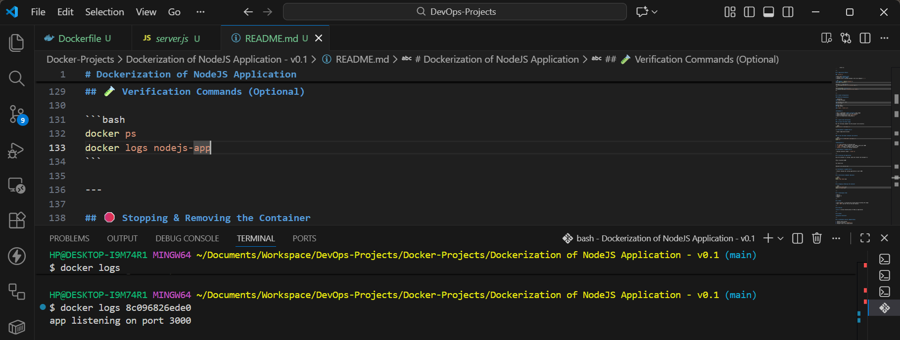
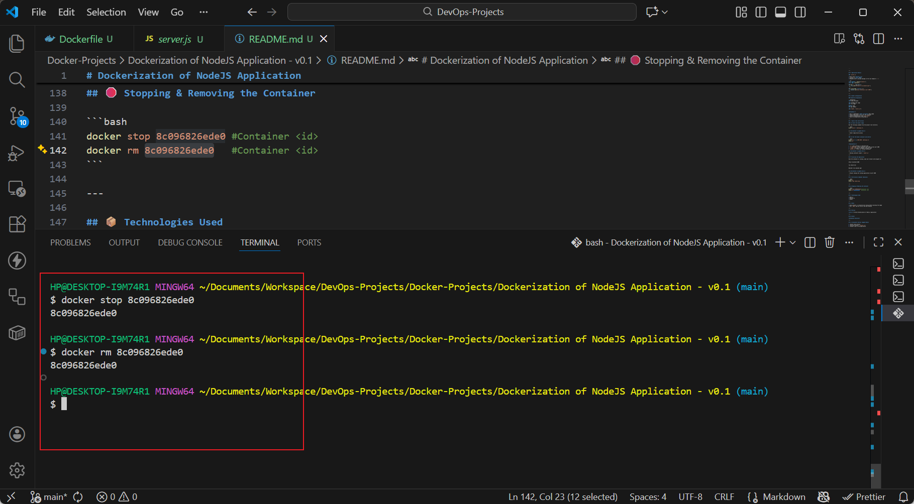

# Dockerization of NodeJS Application

**Author:** Oluwaseun Osunsola  
**Environment & Tools:** Windows, Docker Desktop, VSCode    
**Project Link:** https://github.com/Oluwaseunoa/DevOps-Projects/tree/main/Docker-Projects/Dockerization%20of%20NodeJS%20Application%20-%20v0.1   

## 📌 Project Overview

This project demonstrates how to **containerize a simple Node.js (Express) application using Docker**. The goal is to show a standard workflow for building, running, and accessing a Node.js application inside a Docker container.

The application exposes a single HTTP endpoint (`/`) that returns a welcome message.

---

## 📁 Project Structure

```
Dockerization of NodeJS Application - v0.1
│   Dockerfile
│   package.json
│   README.md
│
└───src
        server.js
```

---

## ⚙️ Application Details

### `server.js`

* Built with **Express.js**
* Listens on **port 3000**
* Responds with a welcome message on the root endpoint (`/`)

```js
const express = require('express');
const app = express();

app.get('/', (req,res)=>{
     res.send("Welcome to my awesome app!"); 
 });

app.listen(3000, function () {
    console.log("app listening on port 3000");
});
```

---

## 🐳 Docker Configuration

### Dockerfile Explanation

```dockerfile
FROM node:19-alpine

COPY package.json /app/
COPY src /app/

WORKDIR /app
RUN npm install

CMD ["node", "server.js"]
```

**Breakdown:**

* Uses a lightweight **Node 19 Alpine** base image
* Copies application files into the container
* Installs dependencies using `npm install`
* Starts the application using Node.js

---

## 🚀 Build & Run Instructions

### 1️⃣ Build the Docker Image

Run the following command from the project root directory:

```bash
docker build -t node-app:1.0 .
```

📸 ****

> Docker image build process

---

### 2️⃣ Run the Docker Container and Confirm

```bash
docker run -d -p 3000:3000  node-app:1.0
docker ps
```

**Explanation:**

* `-d` → Run container in detached mode
* `-p 3000:3000` → Bind container port 3000 to host port 3000
* `--name` → Assigns a readable container name
* `docker ps` → Lists all running containers

📸 ****

> Running container output / `docker ps`

---

## 🌐 Accessing the Application

Once the container is running, open your browser and navigate to:

```
http://localhost:3000
```

You should see:

```
Welcome to my awesome app!
```

📸 ****

> Browser showing the running application on port 3000

---

## 🧪 Verification Commands (Optional)

```bash
docker ps
docker logs nodejs-app
```
📸 ****

> Checking container logs
---

## 🛑 Stopping & Removing the Container

```bash
docker stop 8c096826ede0 #Container <id>
docker rm 8c096826ede0   #Container <id>
```
📸 ****

> Stopping and removing container
---

## 📦 Technologies Used

* Node.js
* Express.js
* Docker

---

## 📝 Notes

* Ensure Docker is installed and running before building the image
* Port `3000` must be free on the host machine

---

## 📄 Version

**v0.1** – Initial Dockerization of Node.js application

---

## 👤 Author

**Oluwaseun Osunsola**

