# Getting Started with Docker and Node.js: A Comprehensive Hands-On Project

  
**Author:** Oluwaseun Osunsola  
**LinkedIn:** https://www.linkedin.com/in/oluwaseun-osunsola-95539b175/      
**Environment & Tool:** AWS, Docker, Docker Compose, Dockerfile   
**Project Link:** https://github.com/Oluwaseunoa/DevOps-Projects/tree/main/Docker-Projects  

**Project Overview**   
This comprehensive guide walks you through installing Docker on an AWS EC2 Ubuntu instance, mastering fundamental Docker commands, building a custom Docker image for a Node.js application, and orchestrating a multi-container setup using Docker Compose. The application is a full-stack user profile editor built with Express.js, connected to MongoDB for persistent storage, and includes Mongo Express as a web-based admin interface.

By the end of this tutorial, you will have:
- A running Dockerized Node.js web application accessible publicly.
- Persistent data storage in MongoDB.
- Hands-on experience with Docker fundamentals, image building, and container orchestration.
- Understanding of networking, security groups, and environment variable management in containerized environments.

**Target Audience:** Beginners to intermediate learners in DevOps, Docker, Node.js, and cloud deployment (AWS EC2).

## Prerequisites

Before starting:
- An active AWS account.
- Basic familiarity with the Linux terminal, SSH, and AWS EC2.
- A local machine with SSH client and SCP support.
- A profile picture (JPG format) to upload for the application demo.

## Detailed Step-by-Step Guide

The following steps are executed in sequence on the Ubuntu EC2 instance (except where noted). Each step includes a brief explanation, the commands used (where applicable), and a screenshot reference.

1. **Launch Ubuntu Server**  
   Launch a new EC2 instance running Ubuntu Server (e.g., 22.04 LTS). Select an appropriate instance type (t2.micro is sufficient for this demo), configure a key pair for SSH access, and ensure the security group allows inbound SSH (port 22).

   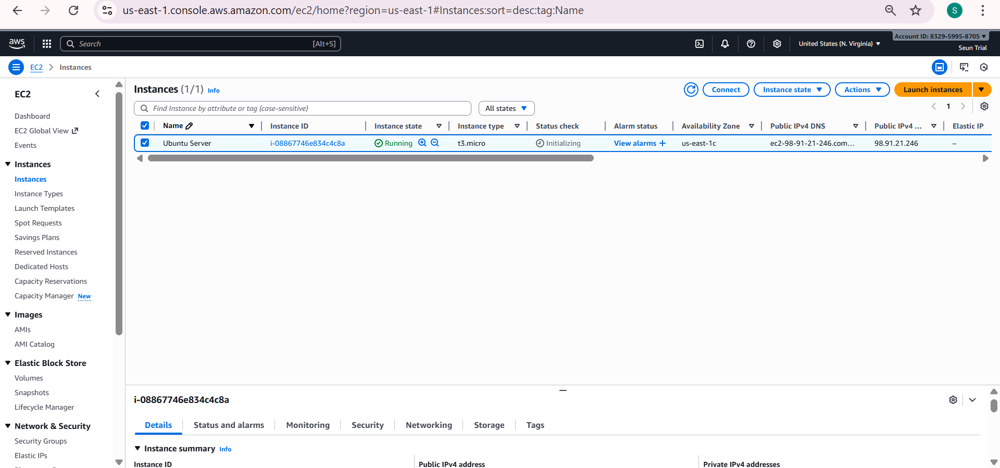

2. **Connect to the Ubuntu Server via SSH**  
   From your local machine, connect using:  
   `ssh -i /path/to/your-key.pem ubuntu@ec2-public-ip`

   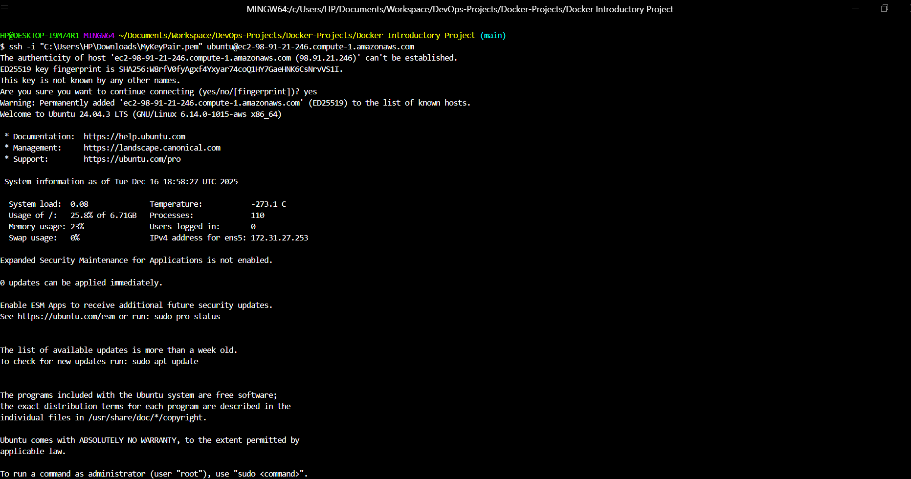

3. **Update the Server**  
   Update package lists and upgrade installed packages:  
   `sudo apt update && sudo apt upgrade -y`

   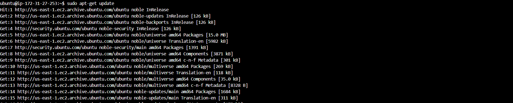

4. **Install Required Packages**  
   Install prerequisites for adding the Docker repository:  
   `sudo apt install ca-certificates curl gnupg lsb-release -y`

   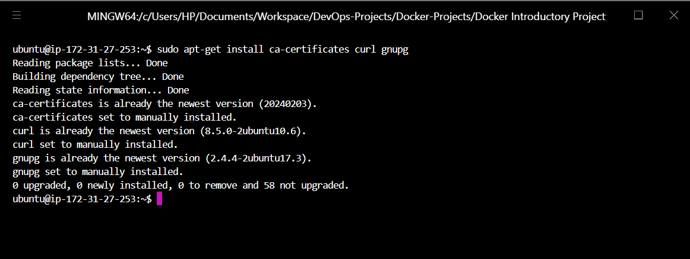

5. **Create Docker Keyring**  
   Create directory for Docker's GPG key:  
   `sudo mkdir -p /etc/apt/keyrings`

   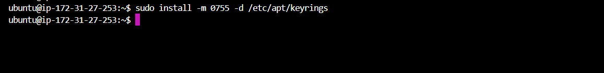

6. **Add Official Docker GPG Key**  
   Download and add Docker's official GPG key:  
   `curl -fsSL https://download.docker.com/linux/ubuntu/gpg | sudo gpg --dearmor -o /etc/apt/keyrings/docker.gpg`

   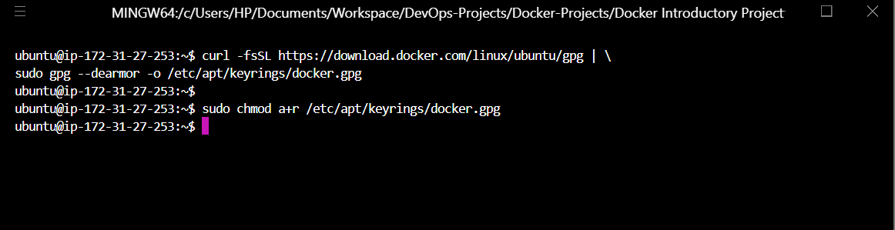

7. **Add Official Docker Repository**  
   Add the Docker APT repository:  
   `echo "deb [arch=$(dpkg --print-architecture) signed-by=/etc/apt/keyrings/docker.gpg] https://download.docker.com/linux/ubuntu $(lsb_release -cs) stable" | sudo tee /etc/apt/sources.list.d/docker.list > /dev/null`

   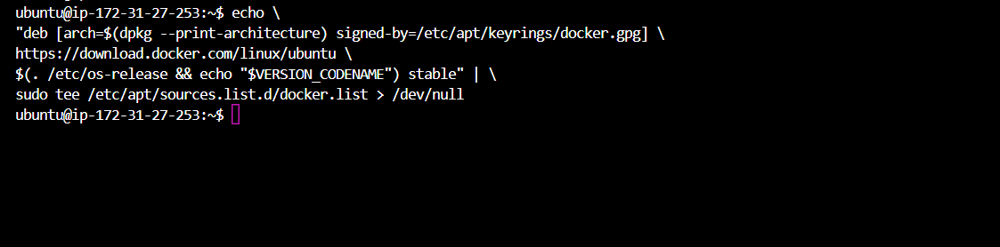

8. **Install Docker Engine**  
   Update packages and install Docker Engine and Compose plugin:  
   `sudo apt update && sudo apt install docker-ce docker-ce-cli containerd.io docker-compose-plugin -y`

   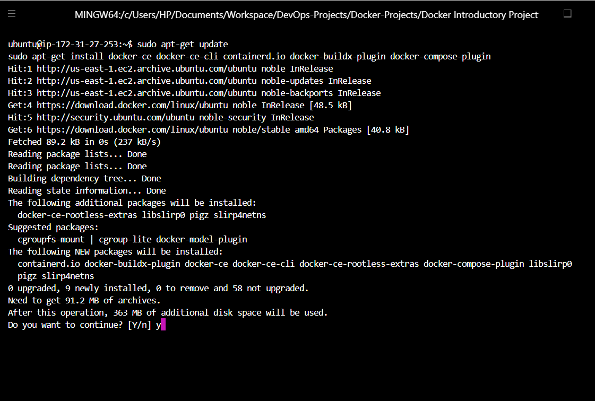

9. **Verify Docker Installation**  
   Check Docker version:  
   `docker --version`

   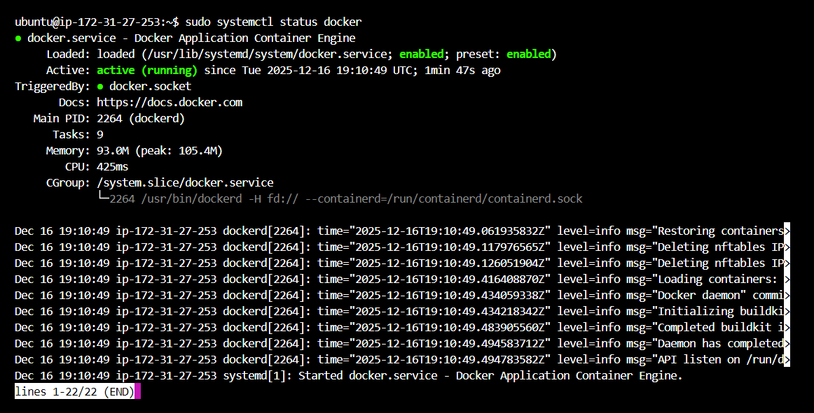

10. **Run Docker Without Sudo**  
    Add current user to Docker group:  
    `sudo usermod -aG docker $USER`  
    Log out and back in for changes to take effect.

    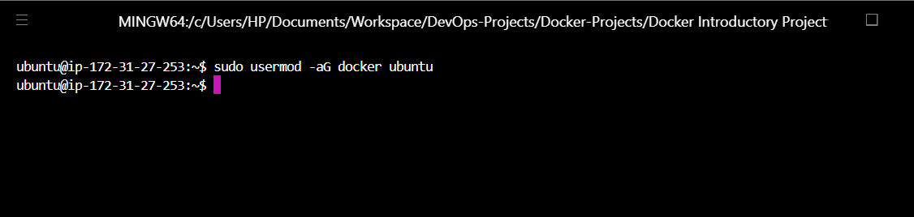

11. **Running the First Container (Hello World)**  
    Test Docker with a simple container:  
    `docker run hello-world`

    .png)

12. **Verify Images (docker images)**  
    List locally available images:  
    `docker images`

    .png)

13. **List Running Containers (docker ps)**  
    Show currently running containers:  
    `docker ps`

    .png)

14. **List Both Running and Stopped Containers (docker ps -a)**  
    Show all containers (running and stopped):  
    `docker ps -a`

    .png)

15. **Stop a Container Using Its Container ID**  
    Stop a running container:  
    `docker stop <container_id>`

    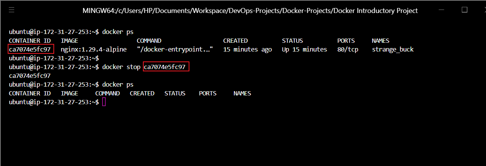

16. **Pull an Ubuntu Image**  
    Download the official Ubuntu image:  
    `docker pull ubuntu`

    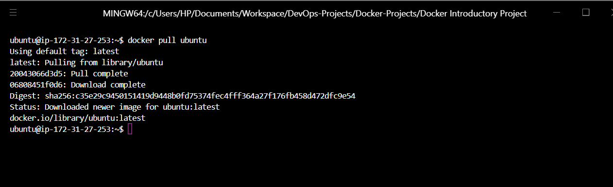

17. **Delete Image Using Its Image ID**  
    Remove an image:  
    `docker rmi <image_id>`

    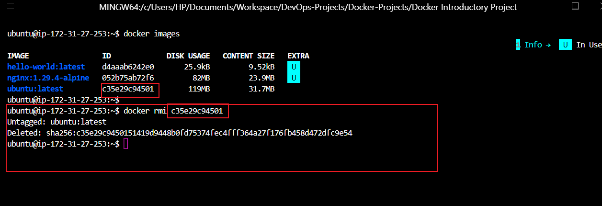

18. **Create Project Folder (NodeJS_Demo_Application_-_Custom_Image) and LS It to Confirm**  
    Create project directory:  
    `mkdir "NodeJS Demo Application - Custom Image" && ls`

    _and_ls_it_to_confirm.png)

19. **Navigate into the Project Folder (NodeJS_Demo_Application_-_Custom_Image)**  
    `cd "NodeJS Demo Application - Custom Image"`

    .png)

20. **MKDIR App to Create App Folder Then CD into App Folder**  
    `mkdir app && cd app`

    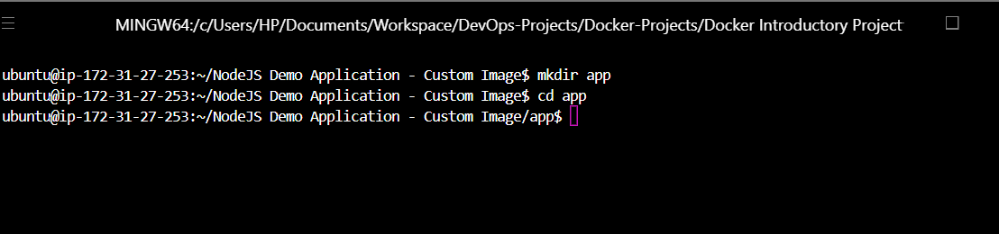

21. **In App Create Images Folder and CD into It**  
    `mkdir images && cd images`

    

22. **On the Host System Upload an Image to Project Images Folder Using SCP**  
    From local machine:  
    `scp -i your-key.pem profile-1.jpg ubuntu@ec2-ip:~/NodeJS\ Demo\ Application\ -\ Custom\ Image/app/images/`

    

23. **In Image Folder LS to Confirm That Image Is Successfully Uploaded**  
    `ls`

    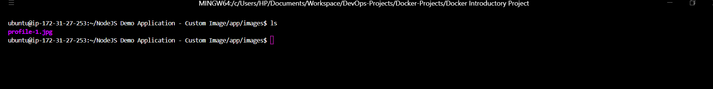

24. **From Image Folder CD Back One Step to App Folder**  
    `cd ..`

    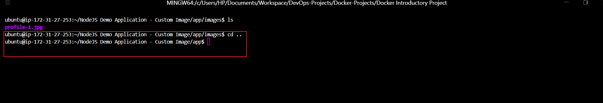

25. **Nano index.html Then Add Code Save and Exit**  
    Create and populate the frontend HTML file.

    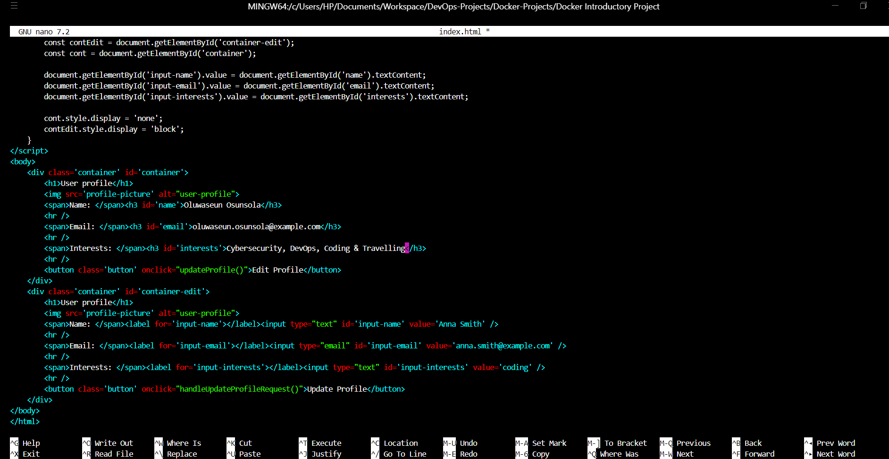

26. **Nano server.js Then Add Code Save and Exit**  
    Create the Express backend server code.

    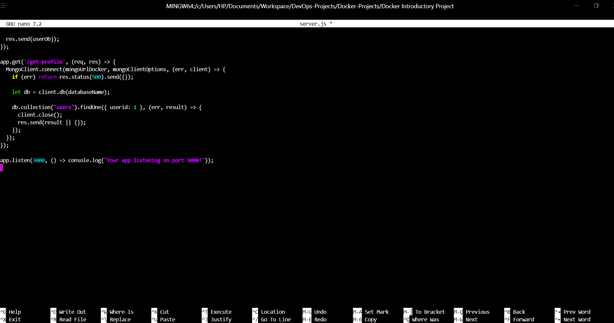

27. **Initialize the Project Folder (Install Node and NPM If You Don't Have and Then Initialize)**  
    Install Node.js if needed, then:  
    `npm init -y`

    .png)

28. **Install the Packages (express, body-parser, mongodb)**  
    `npm install express body-parser mongodb`

    

29. **LS App Folder Cat package.json to Confirm Packages**  
    Verify installed dependencies:  
    `ls && cat package.json`

    

30. **Navigate Back to the Project Folder**  
    `cd ..`

    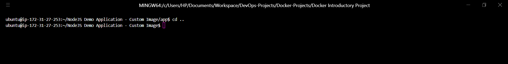

31. **Nano .env Then Add Environment Variables Save and Exit**  
    Create `.env` with MongoDB credentials (e.g., `MONGO_USER=admin`, `MONGO_PASSWORD=password`).

    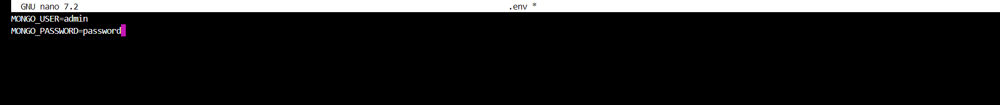

32. **Nano .gitignore Then Add What to Ignore Save and Exit**  
    Add `node_modules/`, `.env`, etc., to `.gitignore`.

    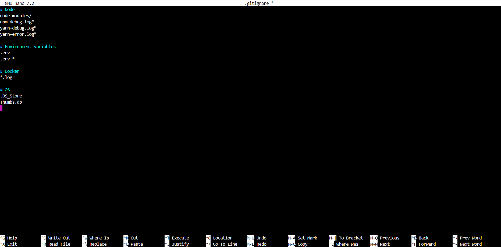

33. **Nano Dockerfile and Add Commands**  
    Write the Dockerfile to build the Node.js image.

    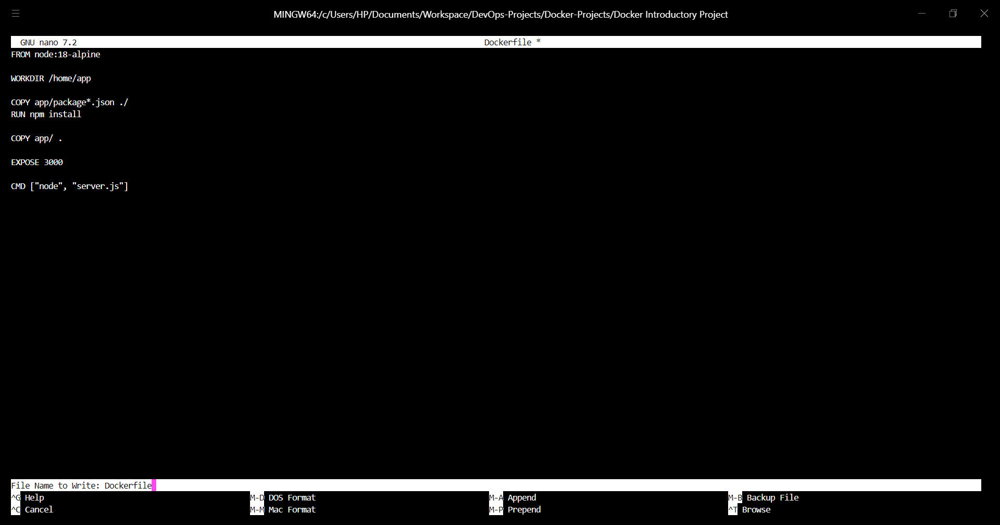

34. **Build Image Using Docker Build -t node-app:1.0**  
    `docker build -t node-app:1.0 .`

    

35. **List Images to See the Created node-app:1.0**  
    `docker images`

    

36. **Nano docker-compose.yaml and Add Services and Their Data Save and Exit**  
    Define services: `my-app`, `mongodb`, `mongo-express`.

    

37. **Run Docker Compose --env-file .env Up -d**  
    `docker compose up -d`

    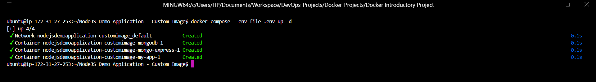

38. **Docker PS to Check Containers Running**  
    `docker ps`

    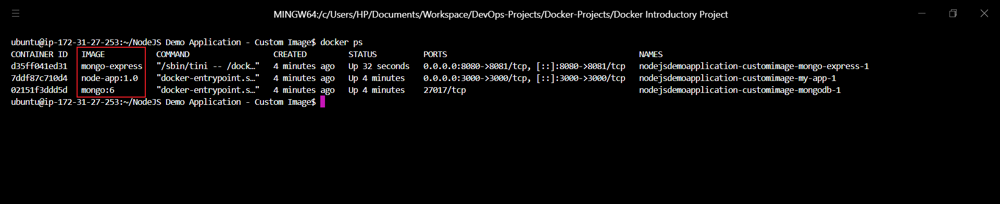

39. **Docker Logs to Check Node.js Application Logs**  
    `docker logs <my-app-container-name>`

    

40. **Navigate to Server EC2 Instance Security Group to Edit Inbound Rule**  
    In AWS Console, open the instance's security group.

    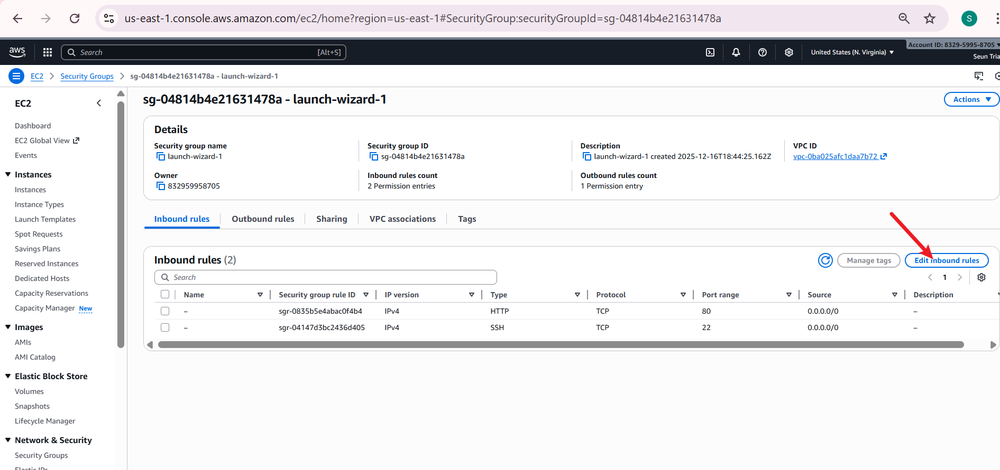

41. **Add Two Rules to Accept Custom TCP Connections from Anywhere on Port 3000 and 8080 Then Save Rules**  
    Add rules: Type=Custom TCP, Port=3000 & 8080, Source=0.0.0.0/0.

    

42. **Visit the Public IP on Port 8080 to See Mongo Express**  
    http://ec2-public-ip:8080 → Login with credentials from `.env`.

    

43. **Create my-db Database**  
    In Mongo Express, create database `my-db`.

    

44. **Click on my-db and Create Users Collection**  
    Create collection `users`.

    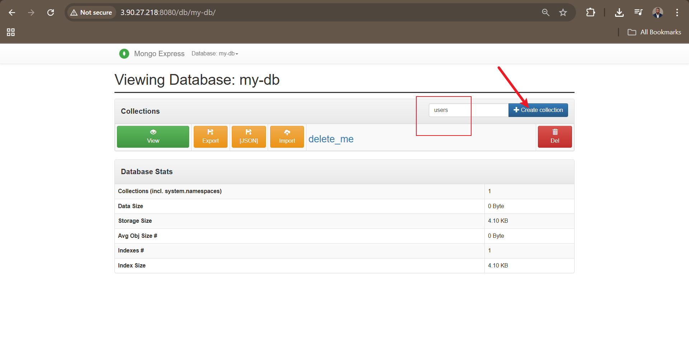

45. **Visit the Public IP on Port 3000 to See the Application**  
    http://ec2-public-ip:3000 → Profile editor loads.

    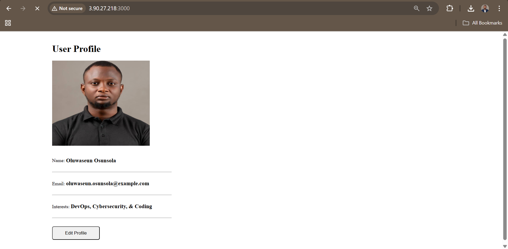

46. **Edit and Update Profile Then Reload to See If Change Is Persistent Across Reload**  
    Edit fields, save, reload page → Data persists (stored in MongoDB).

    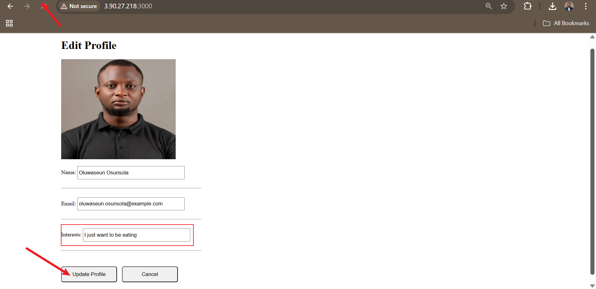

## Key Learnings & Best Practices

- **Docker Fundamentals:** Images, containers, volumes, networking.
- **Custom Image Building:** Multi-stage or simple builds for Node.js apps.
- **Docker Compose:** Orchestrating multiple services with dependencies.
- **Environment Variables:** Secure handling via `.env` files.
- **Persistence:** MongoDB volume ensures data survives container restarts.
- **Security Considerations:** Restrict security group rules in production (avoid 0.0.0.0/0).

## Troubleshooting Tips

- Container restarting? Check logs: `docker compose logs my-app`.
- Connection refused? Verify security group ports and `docker ps`.
- DB not connecting? Ensure env vars are passed and MongoDB is healthy.
- Image build issues? Use `--no-cache` flag.

## Conclusion

This project provides a complete, real-world introduction to containerization with Docker. You now have a deployable full-stack application running on cloud infrastructure. Extend this further by adding authentication, CI/CD pipelines, or deploying to Kubernetes.

Congratulations on completing the tutorial! Your Dockerized Node.js + MongoDB application is live and production-ready for demo purposes.