# 🐳 Docker Mastery Project: From Containers to Custom Images & Multi-Container Applications

**Author:** Oluwaseun Osunsola  
**LinkedIn:** https://www.linkedin.com/in/oluwaseun-osunsola-95539b175/      
**Environment & Tool:** AWS, Docker, Docker Compose, Dockerfile   
**Project Link:** https://github.com/Oluwaseunoa/DevOps-Projects/tree/main/Docker-Projects  


## 1. Introduction

Containerization is a cornerstone technology in modern DevOps and DevSecOps practices. This comprehensive hands-on project provides a complete progression from foundational Docker concepts to advanced real-world application deployment.

The project is structured into **two distinct sessions**:

- **Session 1:** Core Docker Container Operations – Mastering lifecycle management, interactivity, data persistence, and cleanup using the official Ubuntu image.
- **Session 2:** Advanced Docker Application Development – Building a custom Node.js web application image with Dockerfile and orchestrating a full multi-container stack (Node.js app + MongoDB + Mongo Express) using Docker Compose.

This structured approach demonstrates end-to-end containerized application development, deployment, and verification.

---

## 2. Project Objectives

- Master the Docker container lifecycle and essential management commands
- Build and version custom Docker images from scratch
- Orchestrate complex multi-container applications with Docker Compose
- Implement secure environment variable management and secret handling
- Achieve true data persistence using volumes and MongoDB
- Expose services securely and verify full-stack functionality in a cloud environment

---

## 3. Prerequisites

- Docker Engine or Docker Desktop installed
- Basic knowledge of Linux commands and Node.js fundamentals
- Text editor (nano or VS Code)
- AWS EC2 Ubuntu instance with Docker and Docker Compose installed (for Session 2 deployment)
- Internet access for pulling images and package installation

---

# Session 1: Core Container Operations

This session covers 23 foundational steps focused on Ubuntu container management.

### Step 1: View Existing Containers  
**Command:** `docker ps -a`  
.png)

### Step 2: Start a Stopped Container  
**Command:** `docker start <container_id>`  
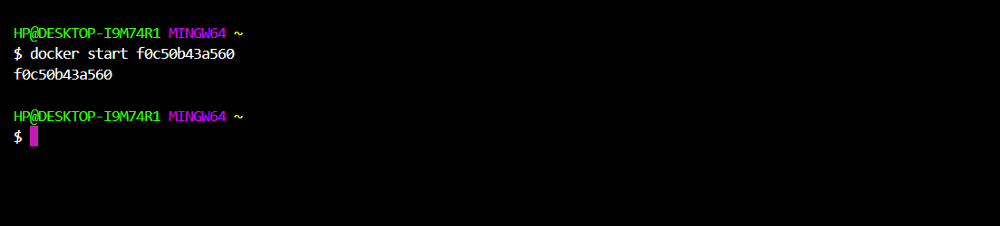

### Step 3: Run Container with Advanced Options (-e, -v, -p)  
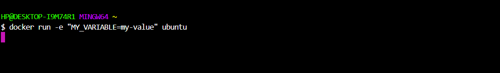

### Step 4: Run Container in Detached Mode  
**Command:** `docker run -d ubuntu` 
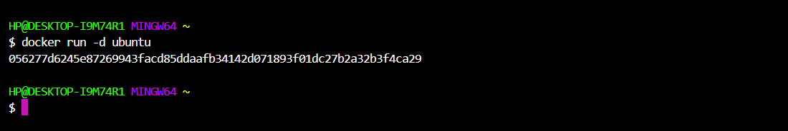

### Step 5: Start Container by Name  
**Command:** 
```bash 
docker ps -a
docker start <container_name>
```  
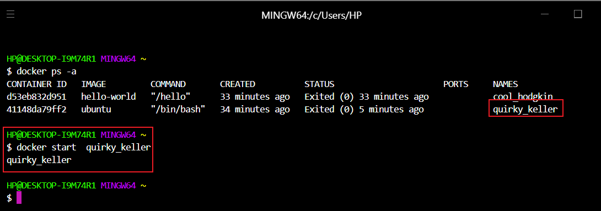

### Step 6: Stop Container by Name  
**Command:** `docker stop <container_name>`  
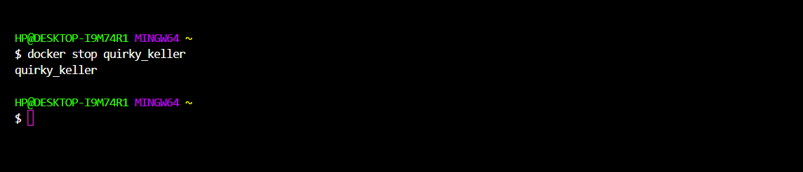

### Step 7: Restart Container by Name  
**Command:** `docker restart <container_name>`  
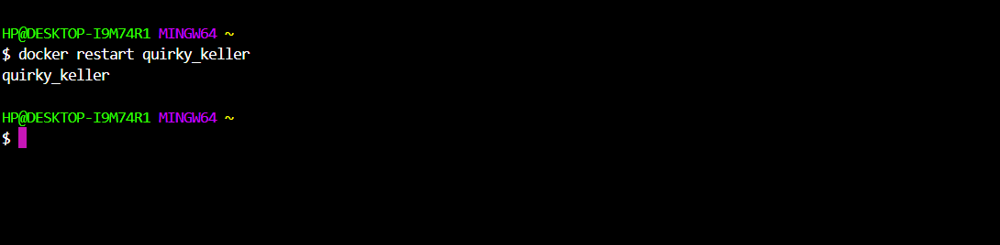

### Step 8: Remove a Container  
**Commands:** 
```bash
docker rm <container_name> 
docker ps -a
```  
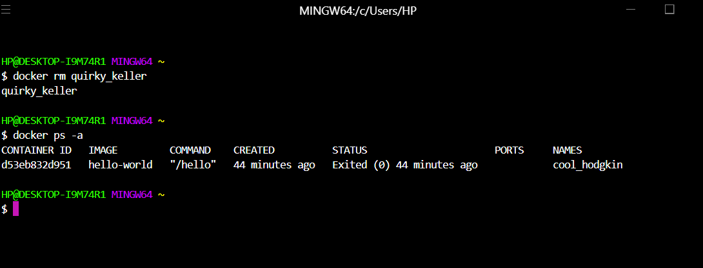

### Step 9: Pull the Ubuntu Image  
**Command:** `docker pull ubuntu`  
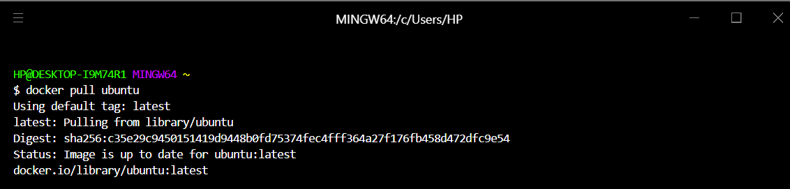

### Step 10: Run Ubuntu in Interactive Mode  
**Command:** `docker run -it --name my-ubuntu ubuntu bash`  
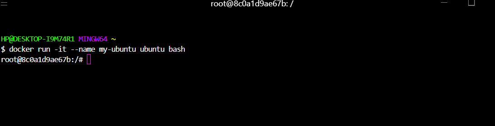

### Step 11: Verify OS Information  
**Command:** `cat /etc/os-release`  
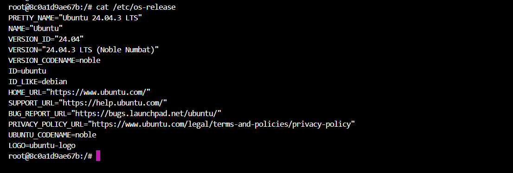

### Step 12: Navigate File System  
**Commands:** 
```bash
pwd  
ls 
```  
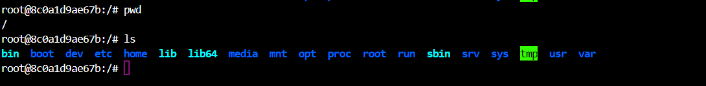

### Step 13: Create and Enter Directory  
**Commands:** 
```bash
mkdir my-folder 
cd my-folder && pwd
```  
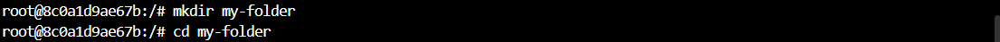

### Step 14: Create and View File  
**Commands:** 
```bash
echo "This is Ubuntu in docker" > file1.txt && cat file1.txt
```  
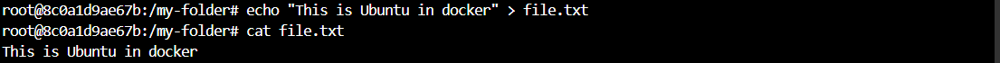

### Step 15: Delete Directory  
**Commands:** 
```bash
cd .. 
rm -rf my-folder
 ```  


### Step 16: Create Persistence Test File  
**Commands:** 
```bash
echo "Check after restart" > file2.txt 
cat file2.txt
```  
.png)

### Step 17: Exit the Container  
**Command:** `exit`  
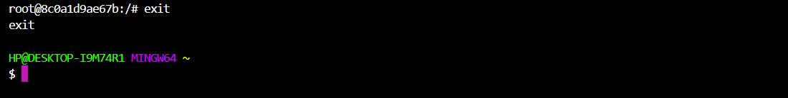

### Step 18: Confirm Container Stopped  
**Command:** `docker ps`  
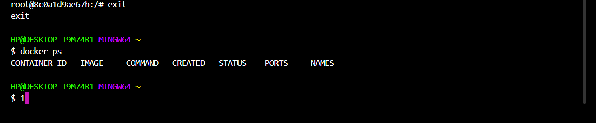

### Step 19: Restart and Reattach  
**Commands:** 
```bash 
docker start my-ubuntu 
docker attach my-ubuntu
```  
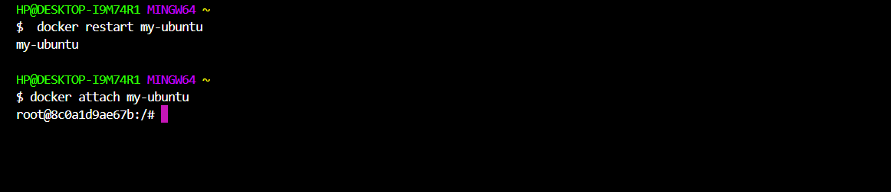

### Step 20: Verify File Persistence  
**Commands:** `ls -ltr file2.txt`
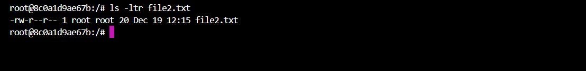

### Step 21: Exit Again and Confirm Stopped  
**Commands:** 
```bash
exit 
docker ps
```  
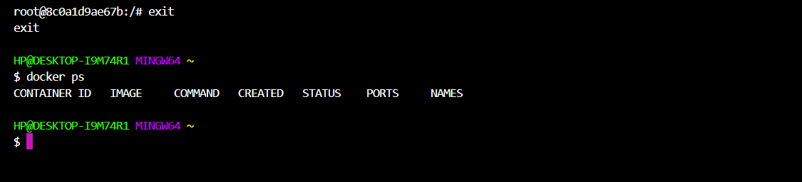

### Step 22: List All Containers Before Cleanup  
**Command:** `docker ps -a`  
.png)

### Step 23: Remove the Container  
**Commands:** 
```bash 
docker rm my-ubuntu && docker ps -a
```  
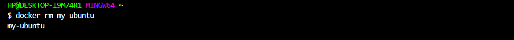

---

# Session 2: Building & Orchestrating a Custom Node.js Profile Editor Application

This session demonstrates building a full-stack web application with persistent data storage, deployed on an AWS EC2 instance.

### Step 24: Create Project Directory  
**Command:** 
```bash
mkdir "NodeJS Demo Application - Custom Image"  
ls
```  
_and_ls_it_to_confirm.png)

### Step 25: Navigate into Project Folder  
**Command:** 
```bash
cd "NodeJS Demo Application - Custom Image"
```  
.png)

### Step 26: Create and Enter `app` Directory  
**Commands:** 
```bash
mkdir app 
cd app
```  


### Step 27: Create `images` Directory  
**Commands:** 
```bash
mkdir images ; cd images
```  
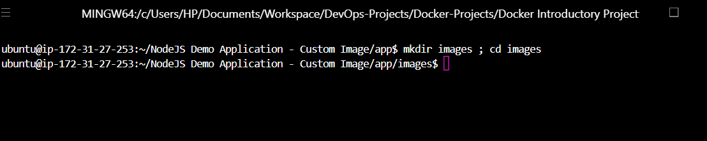

### Step 28: Upload Profile Image via SCP  
**Command (from local machine):** 
```bash
scp -i your-key.pem profile-1.jpg ubuntu@<ec2-ip>:~/NodeJS\ Demo\ Application\ -\ Custom\ Image/app/images/
```  
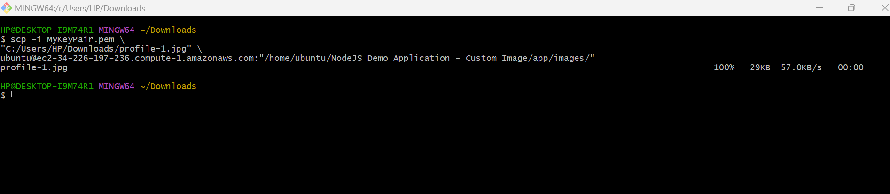

### Step 29: Verify Image Upload  
**Command:** `ls`  


### Step 30: Return to `app` Directory  
**Command:** `cd ..`  


### Step 31: Create `index.html` (Frontend)  
**Command:** `nano index.html`  


### Step 32: Create `server.js` (Express Backend) 
**Command:** `nano server.js` 


### Step 33: Initialize npm Project  
**Command:** `npm init -y`  
.png)

### Step 34: Install Dependencies  
**Command:** `npm install express body-parser mongodb dotenv`  


### Step 35: Verify Installed Packages  
**Commands:** `ls && cat package.json`  
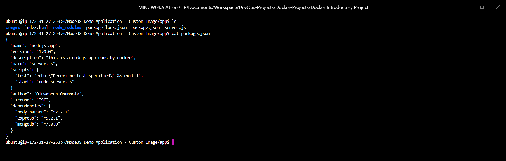

### Step 36: Return to Project Root  
**Command:** `cd ..`  


### Step 37: Create `.env` File  
Secure storage of MongoDB credentials.  


### Step 38: Create `.gitignore`  
**Content:** `node_modules/`, `.env`  


### Step 39: Create `Dockerfile`  
Multi-stage build for Node.js application.  


### Step 40: Build Custom Image  
**Command:** `docker build -t node-app:1.0 .`  
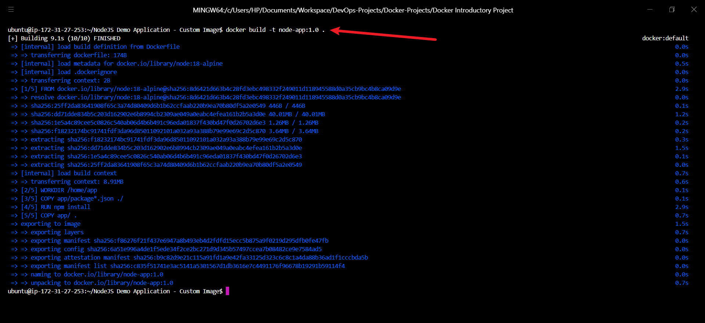

### Step 41: Verify Custom Image  
**Command:** `docker images`  
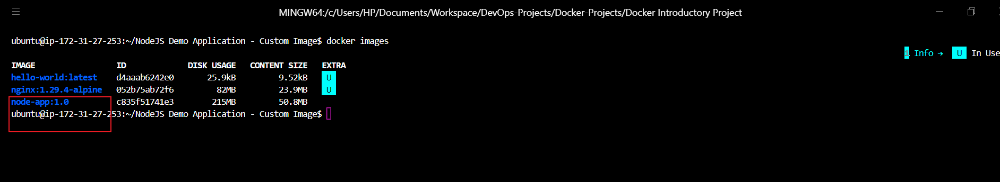

### Step 42: Create `docker-compose.yml`  
Orchestrates `my-app`, `mongodb`, and `mongo-express` services with volumes and networks.  
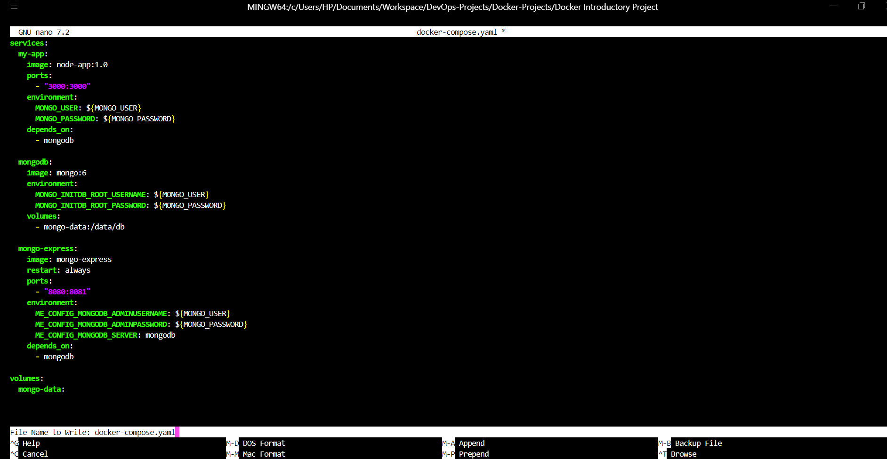

### Step 43: Start Application Stack  
**Command:** `docker compose --env-file .env up -d`  


### Step 44: Verify Running Containers  
**Command:** `docker ps`  


### Step 45: Check Application Logs  
**Command:** `docker logs <container-name>`  
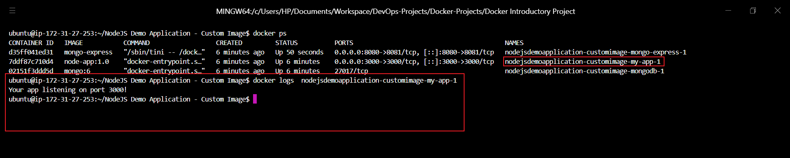

### Step 46: Configure EC2 Security Group  
Open ports 3000 and 8080.  
  
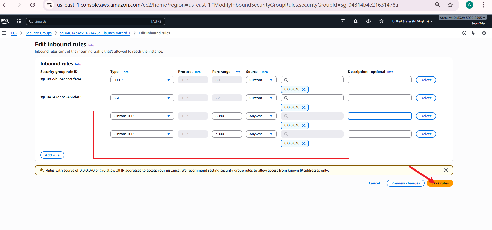

### Step 48: Access Mongo Express Admin UI  
`http://<ec2-public-ip>:8080`  
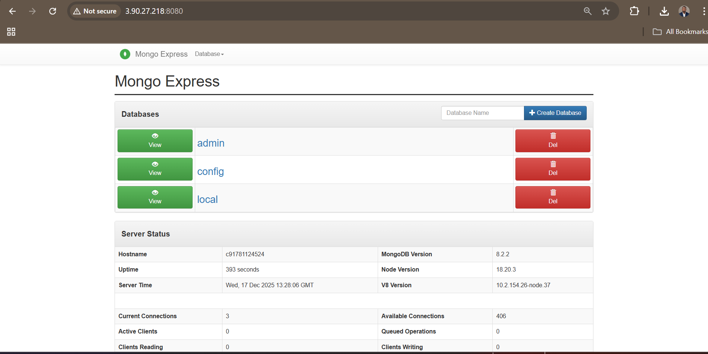

### Step 49: Create Database `my-db`  
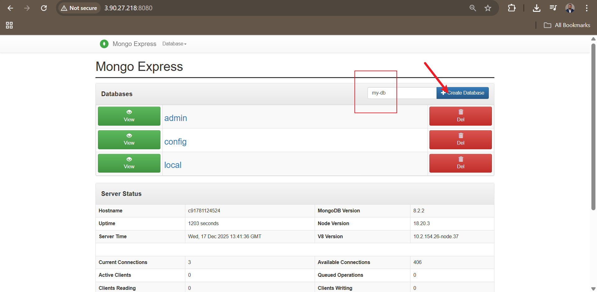

### Step 50: Create `users` Collection  


### Step 51: Access Profile Editor Application  
`http://<ec2-public-ip>:3000`  


### Step 52: Test Data Persistence  
Edit profile → Save → Reload → Changes persist via MongoDB  


---

## 4. Key Learning Outcomes

- Complete mastery of Docker container lifecycle and management commands
- Ability to build optimized, versioned custom images using Dockerfile
- Proficiency in orchestrating multi-container applications with Docker Compose
- Secure handling of environment variables and secrets
- Implementation of persistent storage across container restarts
- Real-world deployment and networking configuration in cloud environments
- Full-stack application integration with database persistence

---

## 5. Conclusion

This dual-session Docker Mastery Project successfully bridges foundational container operations with advanced production-grade application development and orchestration.

**Session 1** established strong command-line proficiency and deep understanding of container behavior, persistence, and lifecycle management.  
**Session 2** elevated these skills into a complete DevOps workflow: building custom images, managing dependencies securely, orchestrating interdependent services, and deploying a fully functional, persistent web application in the cloud.

The hands-on execution across 52 documented steps demonstrates professional-level competency in containerization—critical for roles in **DevOps**, **DevSecOps**, and **Cloud Engineering**.

This project serves as a solid portfolio piece showcasing practical expertise in modern container technologies and prepares for advanced topics such as CI/CD pipelines, image security scanning, Kubernetes orchestration, and production monitoring.

**Future Enhancements:**
- Integrate CI/CD with GitHub Actions and Docker Hub
- Add image vulnerability scanning (Trivy/Grype)
- Implement HTTPS with Nginx reverse proxy and Let's Encrypt
- Scale with Docker Swarm or migrate to Kubernetes
- Add authentication and input validation for enhanced security

Mastery of these concepts positions you at the forefront of cloud-native development and infrastructure management.