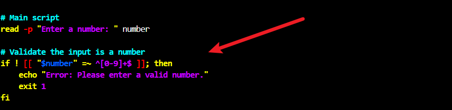
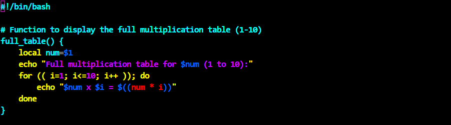
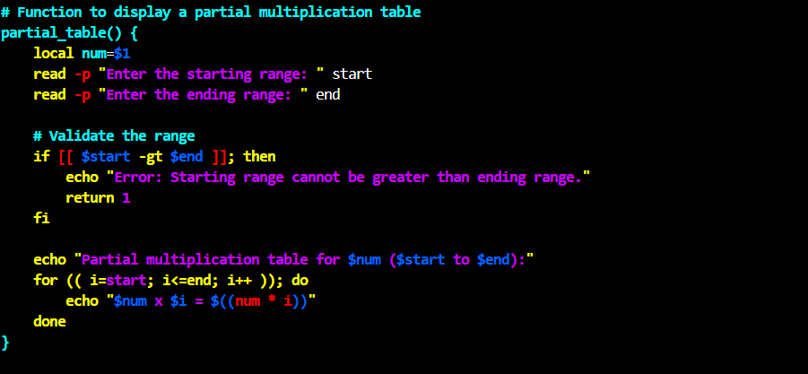
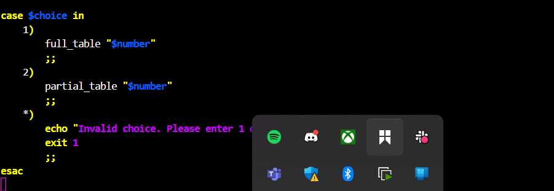

# 📘 Multiplication Table Generator in Bash

### 🔍 Objective:

To create a Bash script that:

* Accepts a number from the user
* Lets the user choose between a full (1-10) or partial multiplication table
* Uses both list-form and C-style loops
* Validates input
* Optionally adds features like **descending order** display and **loop repetition**

---

## 🛠️ Tools Required

* **A Linux terminal** (or WSL/Ubuntu Shell on Windows)
* Bash shell (pre-installed on most Unix systems)
* Any text editor (`nano`, `vim`, or `VS Code`)

---

## 🧱 Script Breakdown

### 📌 Part 1: User Input

```bash
read -p "Enter a number: " number
```

#### ✅ Explanation:

This line prompts the user to enter a number. It stores it in the variable `number`.

---

### 📌 Part 2: User Input Validation

```bash
if ! [[ "$number" =~ ^[0-9]+$ ]]; then
    echo "Error: Please enter a valid number."
    exit 1
fi
```

#### ✅ Explanation:

This ensures only positive integers are accepted using **regex**:

* `^` → start of string
* `[0-9]+` → one or more digits
* `$` → end of string

If invalid, the script exits with an error.

---

### 📌 Part 3: Menu Selection (Range)

```bash
echo "Choose an option:"
echo "1. Full multiplication table (1 to 10)"
echo "2. Partial multiplication table (custom range)"
read -p "Enter your choice (1 or 2): " choice
```

#### ✅ Explanation:

This shows the user two options and stores the selection in the variable `choice`.

---

## 📚 Full vs. Partial Table Functions

---

### 🧩 Full Table Function (using C-style loop)

```bash
full_table() {
    local num=$1
    echo "Full multiplication table for $num (1 to 10):"
    for (( i=1; i<=10; i++ )); do
        echo "$num x $i = $((num * i))"
    done
}
```

#### ✅ Explanation:

* `for (( i=1; i<=10; i++ ))` is a **C-style** `for` loop
* `local num=$1` captures the argument passed to the function
* Output is printed in a structured format


---

### 🧩 Partial Table Function (using C-style loop)

```bash
partial_table() {
    local num=$1
    read -p "Enter the starting range: " start
    read -p "Enter the ending range: " end
    
    # Validate the range
    if [[ $start -gt $end ]]; then
        echo "Invalid range. Showing full table instead."
        full_table "$num"
        return
    fi
    
    echo "Partial multiplication table for $num ($start to $end):"
    for (( i=start; i<=end; i++ )); do
        echo "$num x $i = $((num * i))"
    done
}
```

#### ✅ Explanation:

* Reads start and end range
* Validates that `start <= end`
* If invalid, defaults to `full_table`
* Uses `for (( i=start; i<=end; i++ ))` loop to generate table


---

## 🔄 Case Switch Logic: Running Function based on Choice

```bash
case $choice in
    1)
        full_table "$number"
        ;;
    2)
        partial_table "$number"
        ;;
    *)
        echo "Invalid choice. Please enter 1 or 2."
        exit 1
        ;;
esac
```

#### ✅ Explanation:

Handles user choice using `case` statement and calls the appropriate function.

---

## ✅ Conclusion

This project demonstrated how to effectively build a **Multiplication Table Generator** using Bash scripting. It incorporated key scripting concepts such as **user input handling**, **input validation with regular expressions**, **conditional logic**, and **looping constructs** (both traditional list-form and C-style loops).

By allowing users to choose between a **full (1–10)** or **custom range** multiplication table, and validating inputs for accuracy and security, the script offers both **flexibility** and **robustness**. Additional logic such as **handling invalid ranges** and using a **case-switch** for decision-making further highlights good scripting practices.

This project not only reinforces foundational Bash skills but also encourages the development of **interactive CLI tools** that are user-friendly and efficient. Going forward, enhancements such as displaying the table in **descending order**, **color-coded output**, or **loop repetition** could be added to further elevate its usability and polish.

In summary, this script serves as a practical example of how **shell scripting can automate and simplify tasks**, making it a valuable skill for system administrators, DevOps engineers, and Linux users in general.

 GitHub Repository
🔗[View on GitHub](https://github.com/Oluwaseunoa/DevOps-Projects/tree/main/002.%20Capstone%20Project%20-%20Linux%20Shell%20Scriptinghttps://github.com/Oluwaseunoa/DevOps-Projects/tree/main/002.%20Capstone%20Project%20-%20Linux%20Shell%20Scripting)


