# 🛠️ Shell Scripting Project: Hands-On Demonstration

## Project Introduction  

This project introduces fundamental concepts and practices essential for shell scripting and Linux command-line automation. It focuses on the creation and execution of basic shell scripts to perform system-level tasks efficiently. The key objectives include understanding and demonstrating the following core concepts:

- **Shebang (#!) Usage:** Implemented to specify the script interpreter.

- **Variable Declaration and Usage:** Demonstrated the creation and use of variables within scripts.

- **Script File Creation:** Covered how to write and save executable script files.

- **Granting Execute Permissions:** Explored the use of chmod to make scripts executable.

- **Automated User and Folder Creation:** Used scripting to create system users and directories automatically.

- **Inline Command Execution:** Demonstrated embedding and executing commands within scripts.

## 📁 1. Create Project Folder

**Screenshot:**  
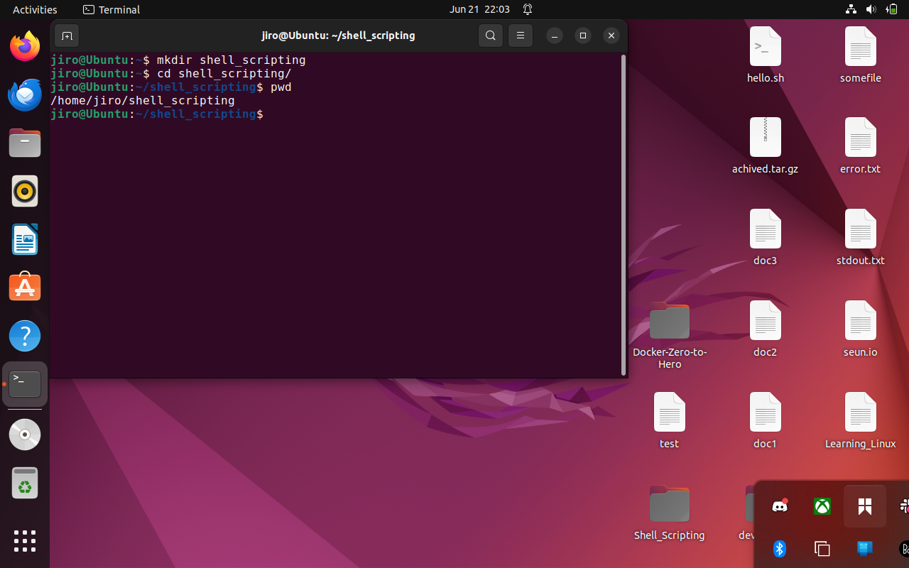


**Description:**  
Created a dedicated directory to organize all shell script files.

```bash
mkdir shell_scripting
````

---

## 📄 2. Create Shell Script File

**Screenshot:**
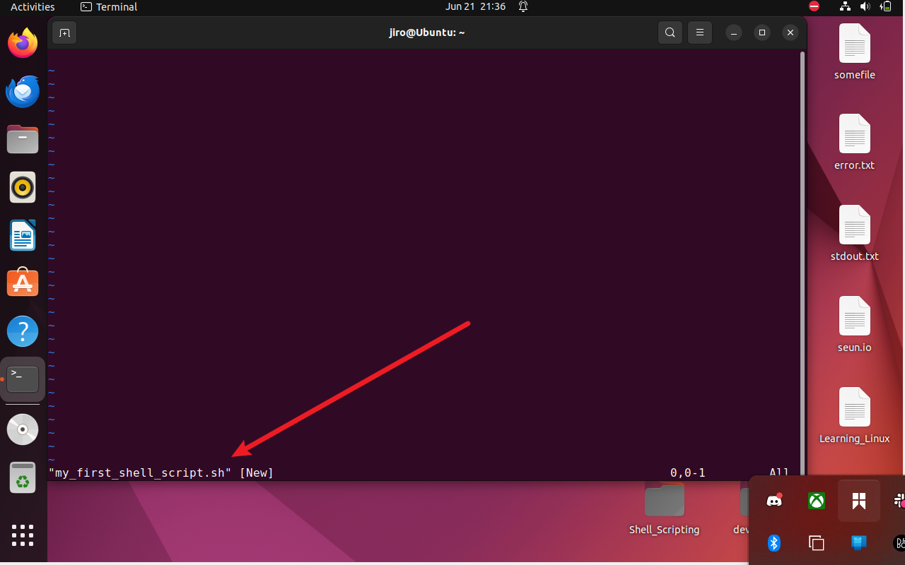

**Command:**

```bash
sudo vim my_first_shell_script.sh
```

Navigated into the project directory and created the script file.

---

## ✍️ 3. Write Script Content

**Screenshot:**
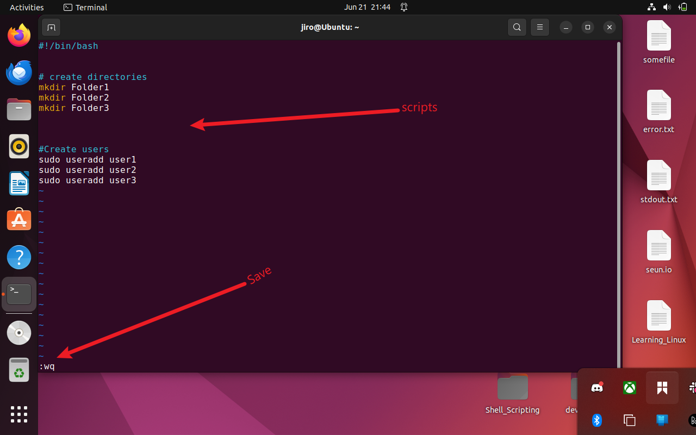

**Concepts Demonstrated:**

* Shebang line
* Variable declaration and initialization
* Creating folders and users via `mkdir` and `useradd`

**Script Sample:**

```bash
#!/bin/bash

#Create directories
mkdir Folder1
mkdir Folder2
mkdir Folder3

#Create users
sudo useradd user1
sudo useradd user2
sudo useradd user3
```

---

## ✅ 4. Confirm Folder Creation

**Screenshot:**
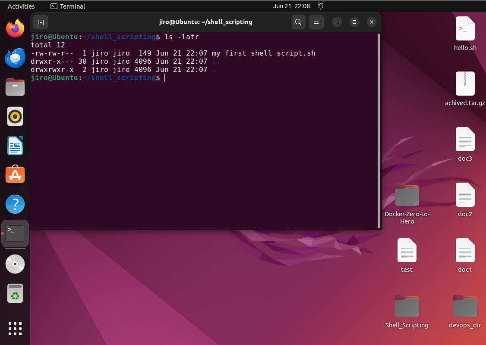

Confirmed that the program file  `/home/jiro/shell_scripting/my_first_shell_script.sh` was created successfully.
```bash
ls -latr /home/jiro/shell_scripting
```
---

## ⚠️ 5. Initial Execution Denied

**Screenshot:**
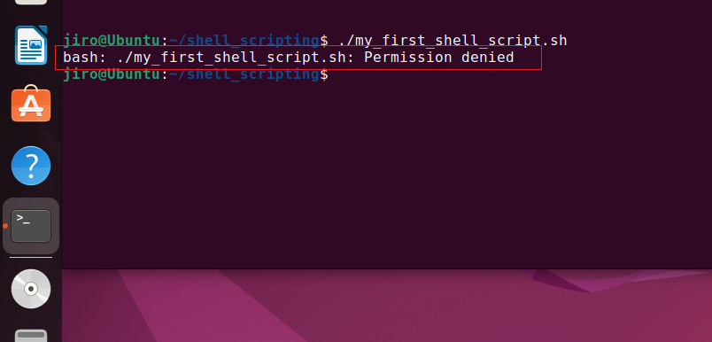

Tried to execute the script without permissions.

```bash
./my_first_shell_script.sh
# Output: Permission denied
```

---

## 🔐 6. Assign Execute Permission

**Screenshot:**


Added permission to execute the file:

```bash
chmod +x my_first_shell_script.sh
```

---

## 🚀 7. Successfully Ran Script

**Screenshot:**
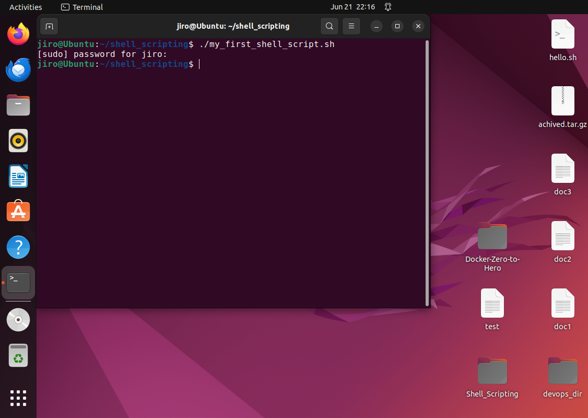

The script executed successfully after permission was granted.
```bash
./my_first_shell_script.sh
```
---

## 🔍 8. Evaluate Folder Creation

**Screenshot:**
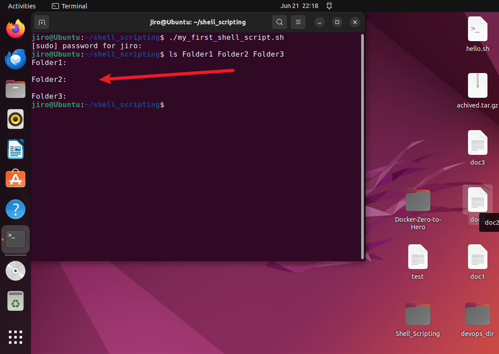

Checked using `ls` or `tree` to ensure the folder was created.

```bash
ls Folder1 Folder2 Folder3
```
---

## 🔍 9. Evaluate User Creation

**Screenshot:**
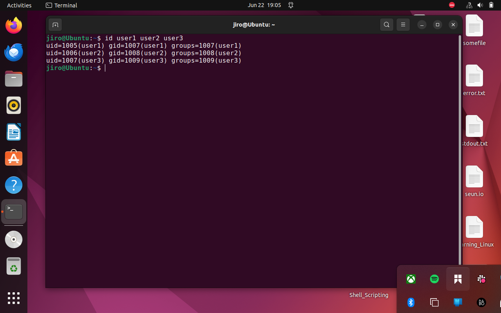

Checked that the user was created using:

```bash
id user1 user2 user3
```

---

## 📌 10. Intro to Shebang

**Screenshot:**
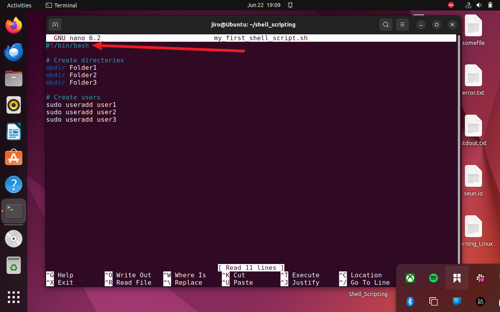

Described the importance of the shebang (`#!/bin/bash`) for interpreter declaration.

---

## 📂 11. `/bin/bash` Exploration

**Screenshot:**
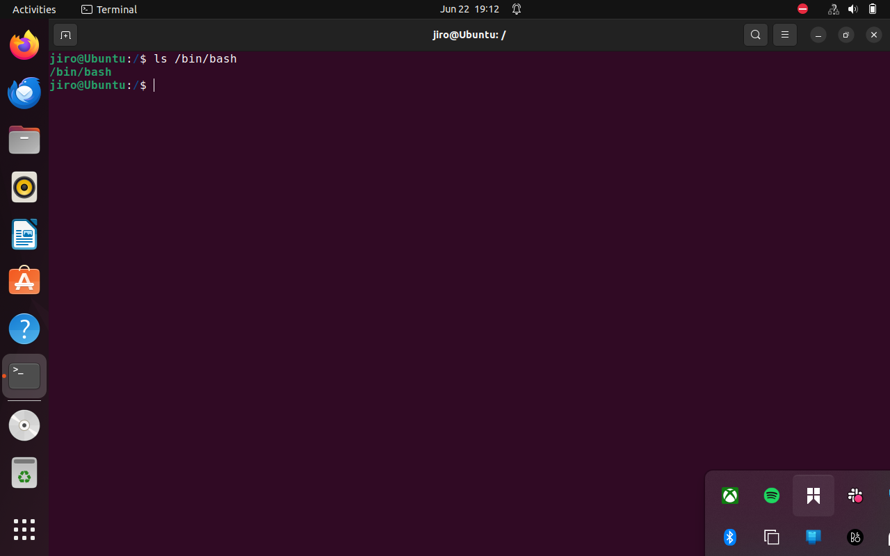

Verified the bash shell path:

```bash
cd
ls /bin/bash
```

---

## 🧮 12. Variable Declaration & Initialization

**Screenshot:**
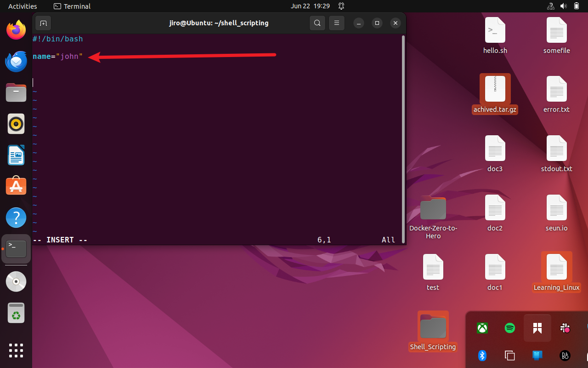

Example:

```bash
name="john"
```

---

## 📞 13. Calling Variables

**Screenshot:**
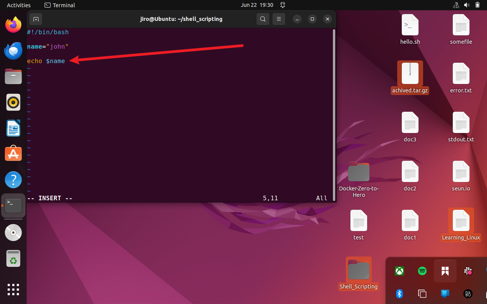

Example usage:

```bash
echo $name
```

---

## 📤 14. Output of the Program

**Screenshot:**
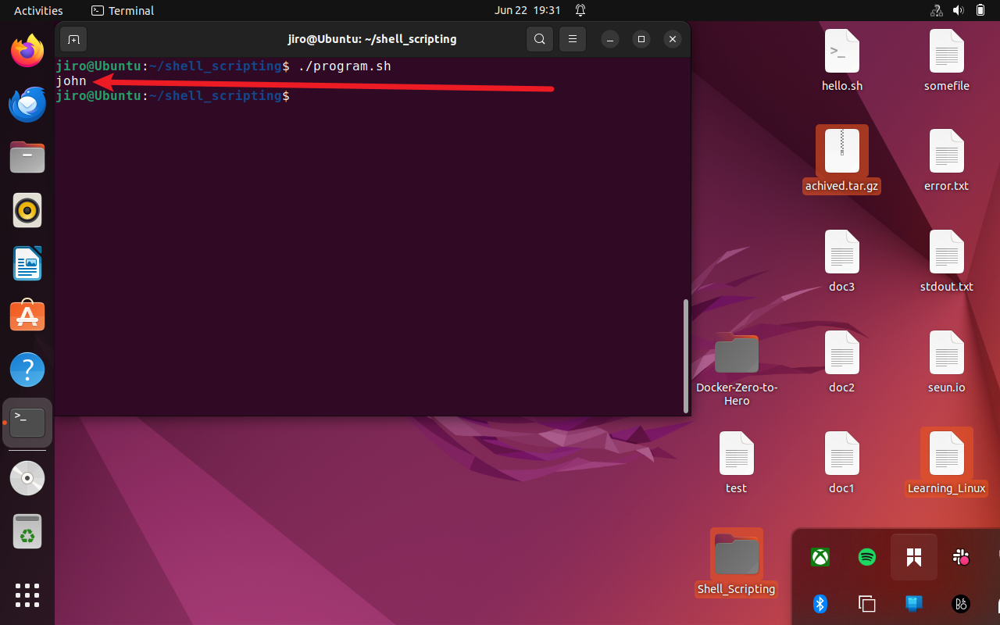

Expected terminal output:

```
john
```

---

## ❓ 15. Running Script Without File

**Screenshot:**
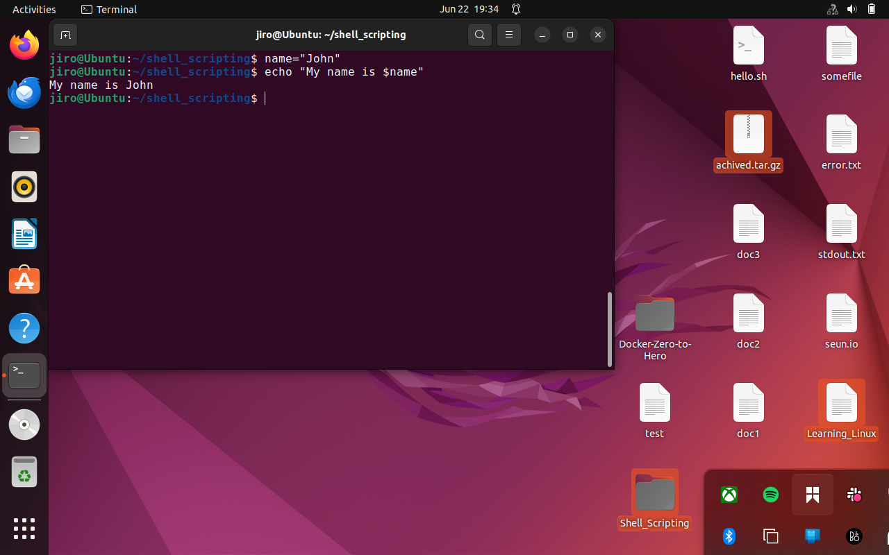

Demonstrated inline script execution directly on terminal:

```bash
name="john"
echo "My name is $name"
```
Expected terminal output:

```
My name is john
```
---

## 🧾 Summary of Key Concepts Covered

| Concept                               | Demonstrated |
| ------------------------------------- | ------------ |
| Shebang (`#!`)                        | ✅            |
| Variable declaration and usage        | ✅            |
| Script file creation                  | ✅            |
| Granting execute permission           | ✅            |
| Creating users and folders via script | ✅            |
| Inline command execution              | ✅            |

```
## 📁 GitHub Repository Validation

🔗 Repository URL: [DevOps Projects GitHub Repo](https://github.com/Oluwaseunoa/DevOps-Projects/tree/main/09.%20Linux%20Shell%20Scripting)