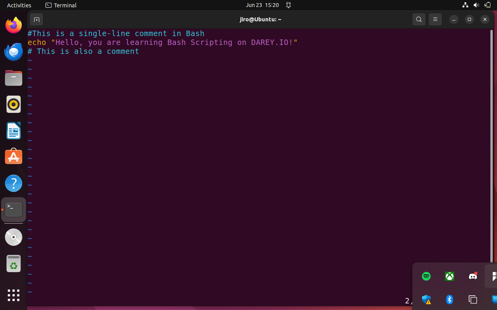
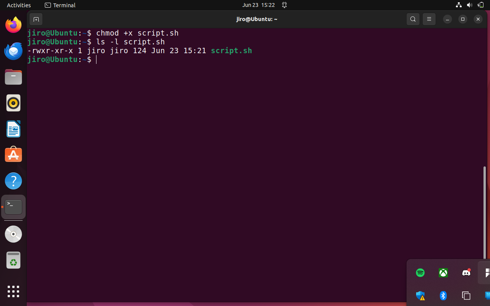
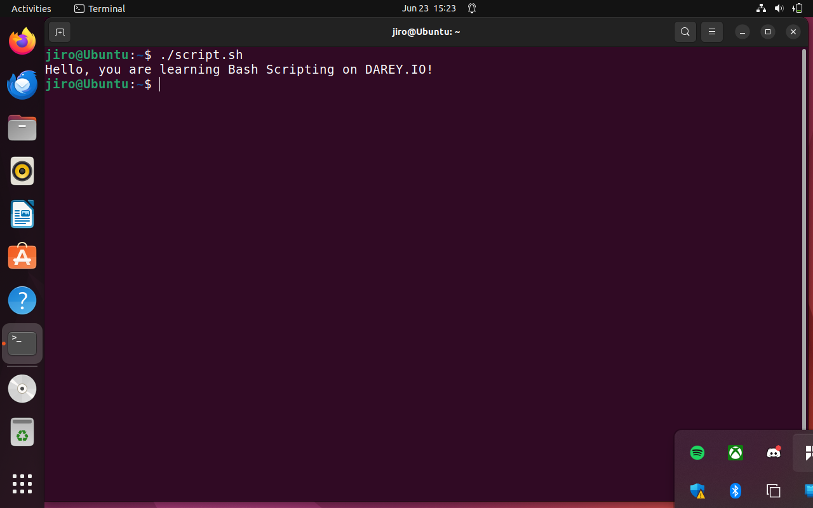
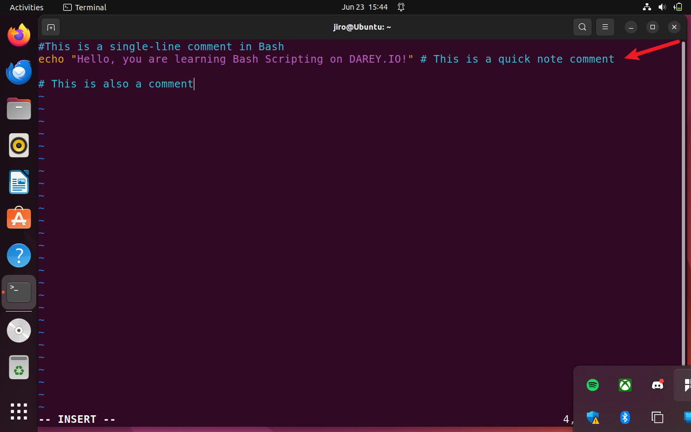
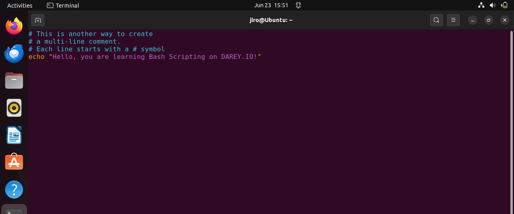
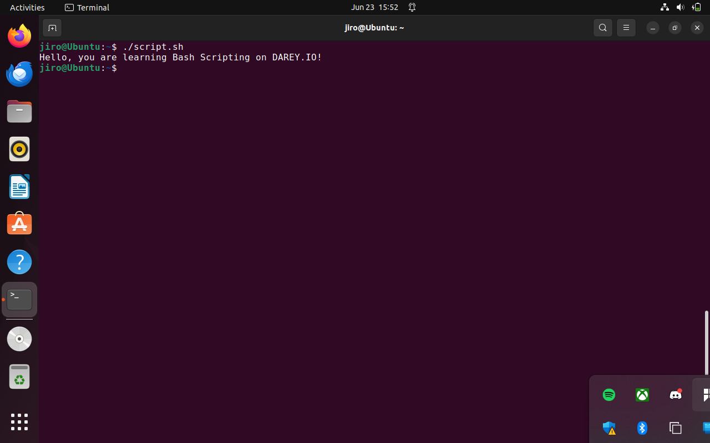

# 🛠️ Bash Scripting Project – Adding Comments

## 🎯 Objective

Learn how to add **comments** in Bash scripts and understand their **purpose**. Comments help **you and others** understand your code. They make your script easier to **read**, **maintain**, and **debug**.

---

## 📌 What Are Comments?

Comments are lines in a script that the Bash interpreter **ignores**. They are **not executed** as part of the script.

You use comments to:

* Explain what your script or a line of code does
* Describe your logic or thought process
* Make the script easier for others (or future you) to understand

---

## 📝 Single-Line Comments

In Bash, a comment starts with the `#` symbol. Everything after `#` on that line is **ignored**.

### ✅ Example:

```bash
# This is a comment
echo "Hello, you are learning Bash Scripting on DAREY.IO!"
```

You can also add a comment at the end of a command:

```bash
echo "This is a test"  # This comment is after the command
```

---

### 📸 Screenshots

#### Created script.sh with single-line comment



#### Gave execute permission to script.sh



#### Ran script.sh to confirm comments are ignored



#### Added comment after a command on the same line



---

## 🗒️ Multi-Line Comments

Bash doesn’t have a special multi-line comment symbol like some other languages.

Instead, just write several single-line comments, one after another.

### ✅ Example:

```bash
# This is a multi-line comment
# You just write several lines
# Each one starts with a #
```

This method is commonly used when explaining large parts of your script.

---

### 📸 Screenshots

#### Added multi-line comment



#### Ran the script and confirmed comments are skipped



---

## 💡 Best Practices for Writing Comments

✔️ **Clarity**: Explain **why** you're doing something, not just what.

✔️ **Keep It Updated**: If the code changes, update your comments.

✔️ **Be Helpful**: Use comments for parts that aren’t obvious.

✔️ **Don’t Overdo It**: No need to comment every line. Let the code speak when it’s clear.

---
 ### Full Bash Script with Proper Commenting
```bash
#!/bin/bash
# This is a simple Bash script to demonstrate comments
# Script Author: Oluwaseun Osunsola
# Date: 06/20/2023
# Purpose: To show how to use single-line, end-of-line, and multi-line comments in a real Bash script.

# Welcome the user
echo "Welcome to my Bash scripting project on DAREY.IO!"  # This prints the welcome message

# Create a new directory
mkdir my_project_folder  # Creates a directory named 'my_project_folder'

# List the contents of the current directory
ls -la  # Lists all files and folders, including hidden ones, in long format

# Multi-line comment explaining next steps
# The following steps will complete the script:
# 1. Print a success message.
# 2. Show the contents of the newly created folder.
# 3. Print a goodbye message.

# Print success message
echo "Directory created successfully!"

# Show the contents of the new directory
ls -la my_project_folder  # It should be empty since we just created it

# Print goodbye message
echo "Goodbye! Script execution completed."  # This signals the end of the script
```


## 🔎 Bash vs Shell

People often use *Bash* and *Shell* to mean the same thing. Technically, Bash (Bourne Again SHell) is one type of shell, and it’s the one most commonly used for scripting.

---

## 🧾 Summary Table

| Topic               | Details                                      |
| ------------------- | -------------------------------------------- |
| Single-Line Comment | Begins with `#`, Bash ignores the line       |
| Multi-Line Comment  | Use multiple `#` lines, one after another    |
| End-of-Line Comment | Add comment after a command on the same line |
| Best Practices      | Be clear, useful, and avoid clutter          |

---

✅ With these basics, you’re ready for real-world Bash scripting. Keep practicing and commenting your scripts properly — it will save you and your team time in the future.

## 📁 GitHub Repository Validation

🔗 Repository URL: [DevOps Projects GitHub Repo](https://github.com/Oluwaseunoa/DevOps-Projects/tree/main/09.%20Linux%20Shell%20Scripting)
