# 📂 **Control Flow in Shell Scripting**


## 🎯 **Project Objective:**

This project demonstrates how **control flow** in Bash scripting is used to:

* Collect user input.
* Make decisions using `if-else` statements.
* Repeat tasks using `for` loops (list and C-style).
* Manage file permissions.
* Incrementally build and test scripts.

---

## 📚 **Introduction to Control Flow in Shell Scripting**

Control flow statements guide the sequence of command execution in a script based on:

* Conditions
* Loops
* User inputs

### In Bash, control flow tools include:

* `if-else` statements
* `for` loops
* `while` loops
* `case` statements

👉 **Focus for this project:**

* `if-else` statements
The entire script is:

```bash
#!/bin/bash

read -p "Enter a number: " num

if [ $num -gt 0 ]; then
    echo "The number is positive."
elif [ $num -lt 0 ]; then
    echo "The number is negative."
else
    echo "The number is zero."
fi

```
* `for` loops (list form and C-style)
- List form:

```bash
#!/bin/bash
for i in {"1..5"}
do
    echo "Counting... $i"
done
```
- C-style form:
```bash
#!/bin/bash
for (( i=0; i<5; i++ )); do
    echo "Number $i"
done
```
---

# 🛠️ **Step-by-Step Implementation with Screenshots**

---

## 🚀 **Step 1: Create the Script File**
```bash
vim control_flow.sh
```
* File name: `control_flow.sh`

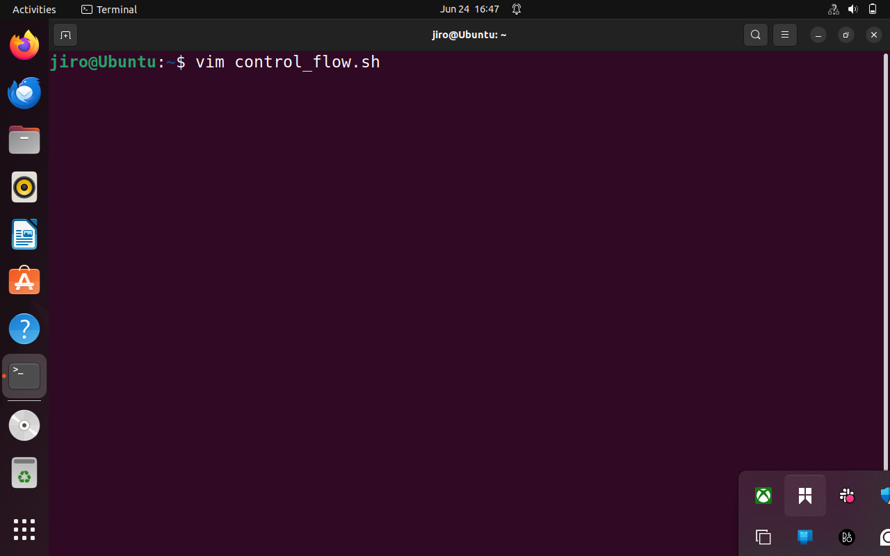

---

## 🚀 **Step 2: Basic Input Without Variable Storage**

```bash
#!/bin/bash
read -p "Enter a number: "
```

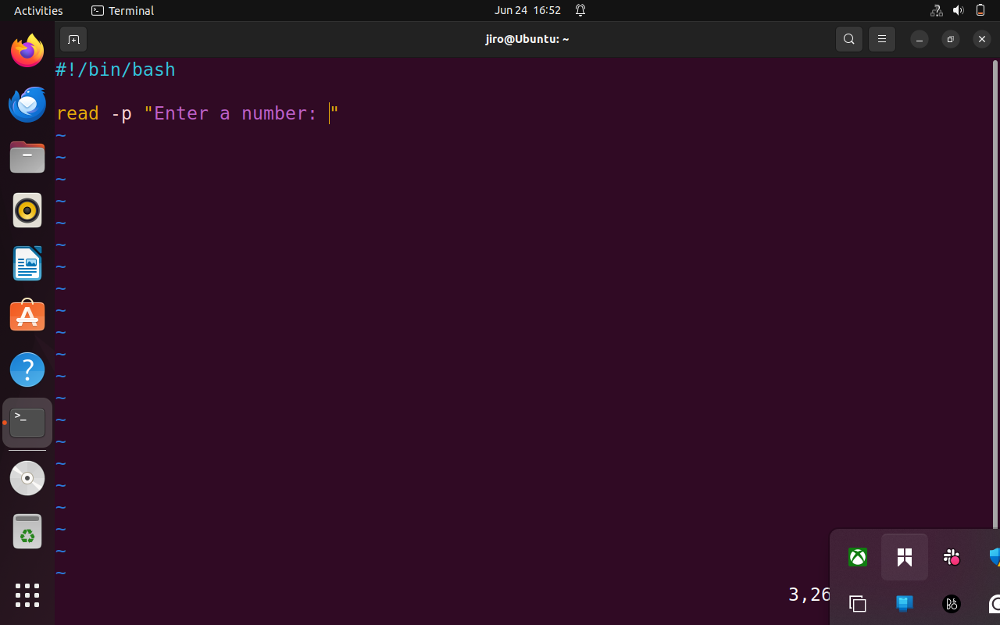

---

## 🚀 **Step 3: Check File Permissions**

```bash
ls -l control_flow.sh
```

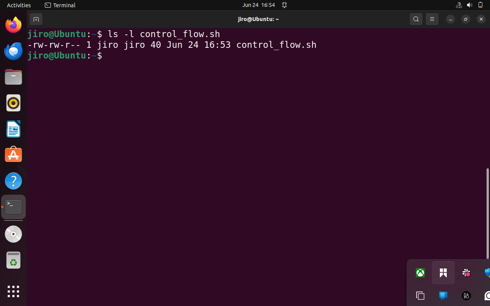

---

## 🚀 **Step 4: Add Execute Permission**

```bash
chmod +x control_flow.sh
```

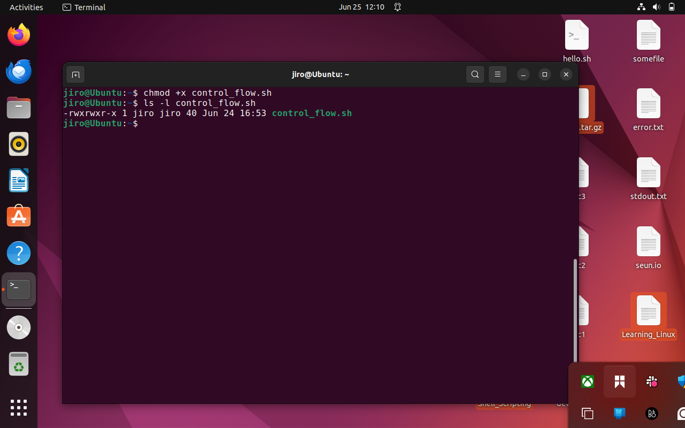

---

## 🚀 **Step 5: Run the Script Without Variable Storage**

```bash
./control_flow.sh
```


Notice that when you execute the script, it just ask you to **Enter a number**:. This number you enter is not stored as a variable.
---

## 🚀 **Step 6: Store User Input in a Variable**

```bash
#!/bin/bash
read -p "Enter a number: " num
```

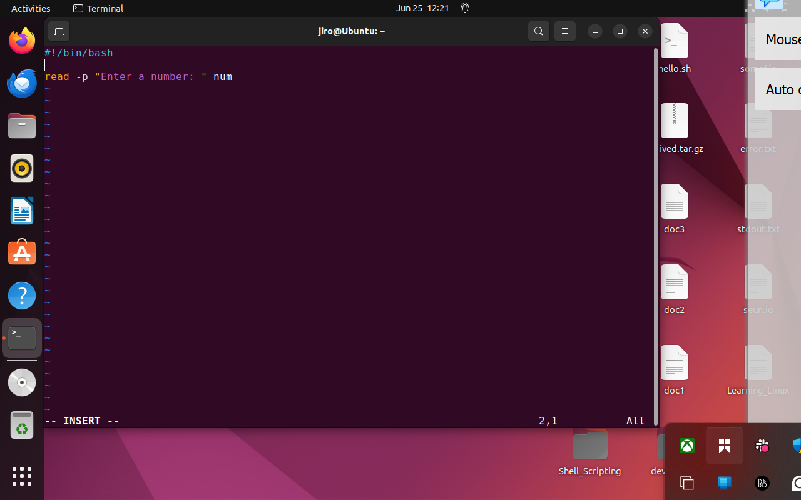

The read command is used to capture user input and store it in a variable. When you use read followed by a variable name (in the case of our script, num). Bash waits for the user to enter something into the command line (stdin). Once the user presses enter, read assigns the input to the variable.
---

## 🚀 **Step 7: Display User Input**
Let's make more sense of the script. Update the code to the below and execute.

```bash
#!/bin/bash
read -p "Enter a number: " num
echo "You have entered the number $num"
```


---

## 🚀 **Step 8: Run the Updated Script**

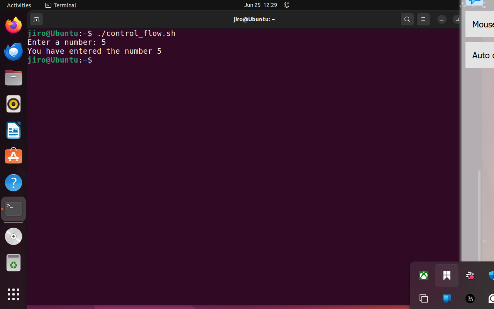

Notice how we have now used echo to return back to the screen (stdout) the value stored in the Snum variable.
Since we now have something stored in the Snurn variable, we can use control flow to determine what the script executes next.
---

## 🚀 **Step 9: Add `if` Statement to Check for Positive Number**

```bash
if [ $num -gt 0 ]; then
    echo "The number is positive."
fi
```
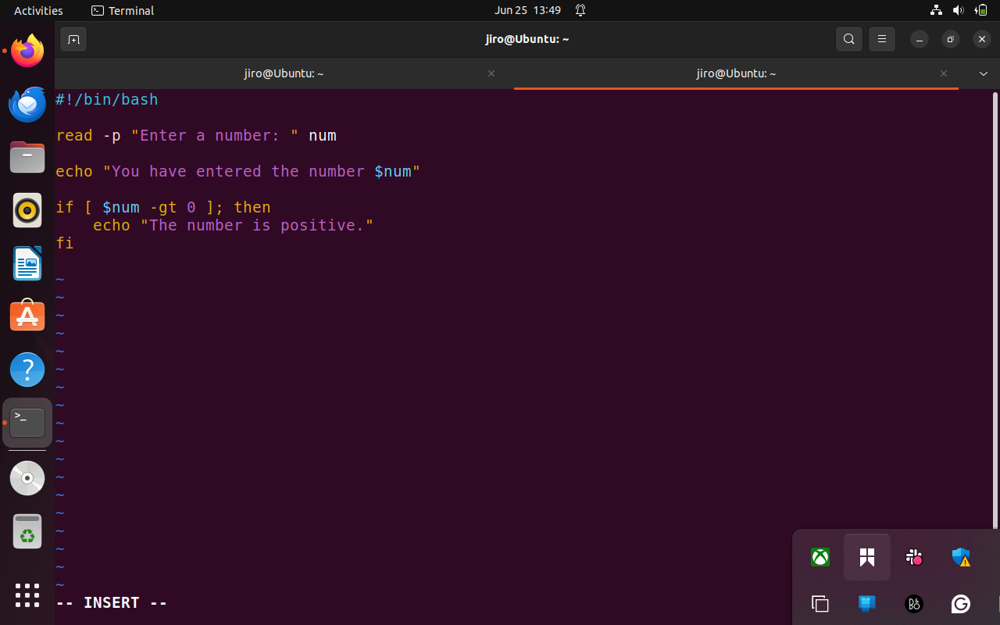

if: This keyword starts the conditional statement.

[ condition ]: The condition to evaluate. Brackets [] are used to enclose the condition being tested.

then: If the condition is true, execute the commards that follow this keyword.

fi: Ends the if statement. It's basically if spelled backward, indicating the conclusion of the conditional block.
---

## 🚀 **Step 10: Test the if Control Flow**
```bash
./control_flow.sh
```


---

## 🚀 **Step 11: Add `elif` and `else` Statements**

```bash
if [ $num -gt 0 ]; then
    echo "The number is positive."
elif [ $num -lt 0 ]; then
    echo "The number is negative."
fi
```

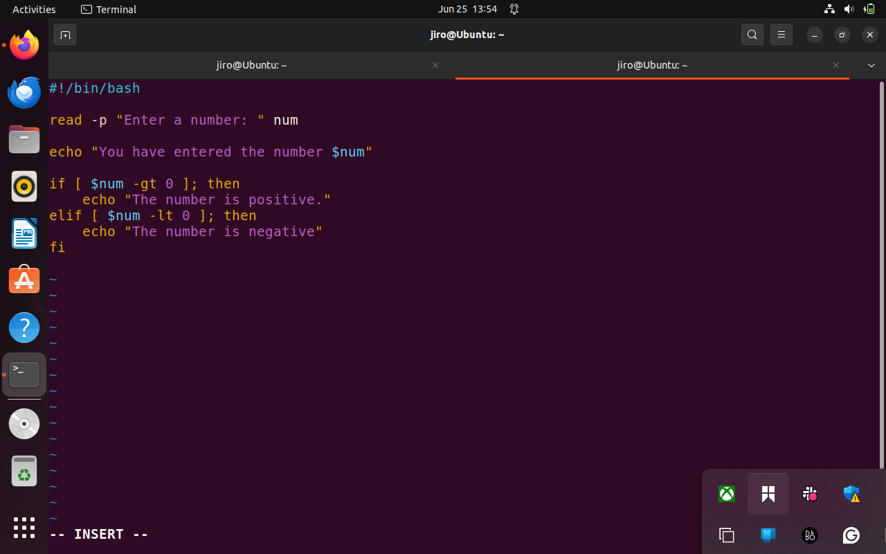

The if [ $num —gt O ]; then part checks if num is greater than O and prints "The number is positive.- if true.
If the first condition isn't met (i.e., the number is not greater than O), the elif [ $num -It 0 ]; then checks if num is less than O. If this condition is true, it prints "The number is negative."
This way, tyre script can differentiate between positive and negative numbers, providing specific feedback based on the value of num.
Notice the -It "less than" operator in the elif section.
---

## 🚀 **Step 12: Run the Final Version of control\_flow\.sh**

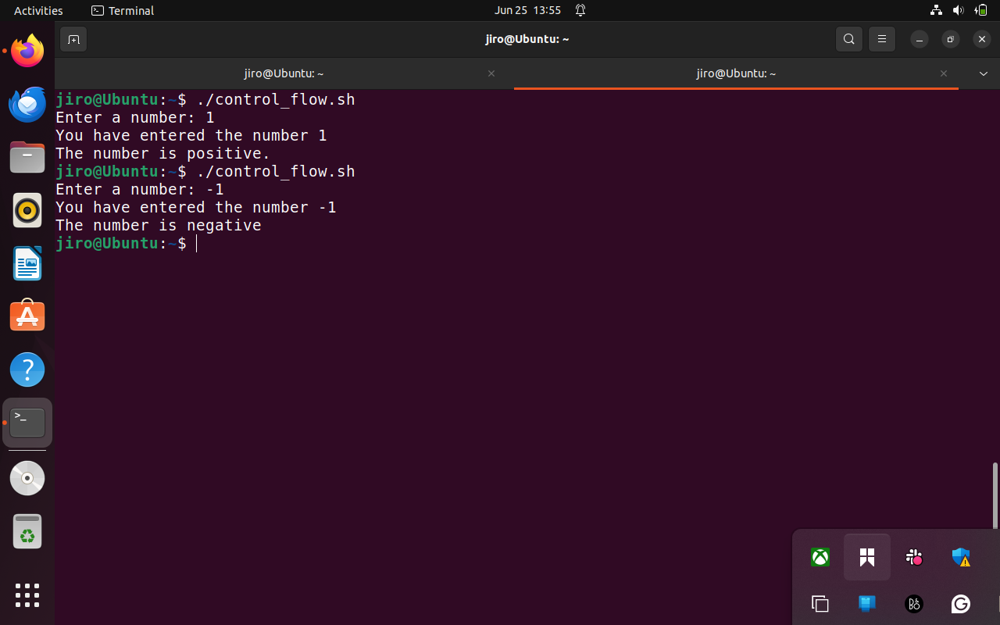

---

# 🔁 **Working with Loops**
Loops empower us to automate and repeat tasks without writing the same code over and ovel again. Imagine having to perform a task, like sending a greeting message to each of your friends by norne- Without loops, you d have to write a separate command for e och friend, which is not only
tedious but also inefficient. Loops streamline this process by allowing you to write a single set of instructions that can be executed as many times as needed, making your script both cleaner and more powerful.
Some real world scenarios where loops are inevitable are;
Batch Processing: Suppose you have a folder full of photos you want to resize or edit in some way. Instead of editing each photo individually, a loop can automate this task, applying the same code to each photo in the folder.
Data Analysis: If you're analyzing data, you might need to perform the same calculations on numerous data sets. A loop can iterate through each data set, apply the same code to do calculations, and collect the results.
Automated Testing: In software development, loops are invaluable for running through numerous test cases. You can use a loop to automatically test different inputs for your program and verify that it behaves as expected using the same code.
In Bash scripting, there are three primary types of loops that are commonly used to repeat a set of commands multiple times based on certain conditions.
I. For
2. While S
3. Until
Lets go through each with examples.
For Loop
The for loop is used to iterate over a list of •valUes or a range of numbers. It is particularly useful when you know in advance how many times you need to execute the loop body.
The for loop has two main forms:
1. List Form: Iterates over a list of items:
Here is a basic syntax:

```bash
for item in item1 item2 item3; do
    echo $item
done

```
for: This keyword initiates the bop, signaling the start of a block of code that will repeat.

item: This is a variable that temporarily holds the value of each item in the list as the loop iterates. For each iteration of the loop, item takes on the value of the next item in the list, allowing the cornrnands inside the loop to octon this value. (If this is confusing, don't worry. You will see it in action
soon)  

in: The in keyword is followed a list of items that the loop will iterate over. This list can be a series of values, an array, or the output of a command. The loop executes once for each item in this list.
A semicolon is used here to separate the list of items from the do keyword that follows. If you place the do keyword on the next line, the semicolon is optional.  

do: This keyword precedes the block of cornrnands that will be executed for each item in the list. The block can contain one or multiple commands, and it can perform a wide range of actions, frorn simple echoes to complex conditional logic  

done: This keyword marks the end of the loop. It signifies that all commands in the loop have been executed for each item in the list, and the loop is complete.

Lets examine a real example:


---

## 🚀 **Step 13: Create the Loop Script File**

* File name: `loop.sh`
```bash
vim loop.sh
```

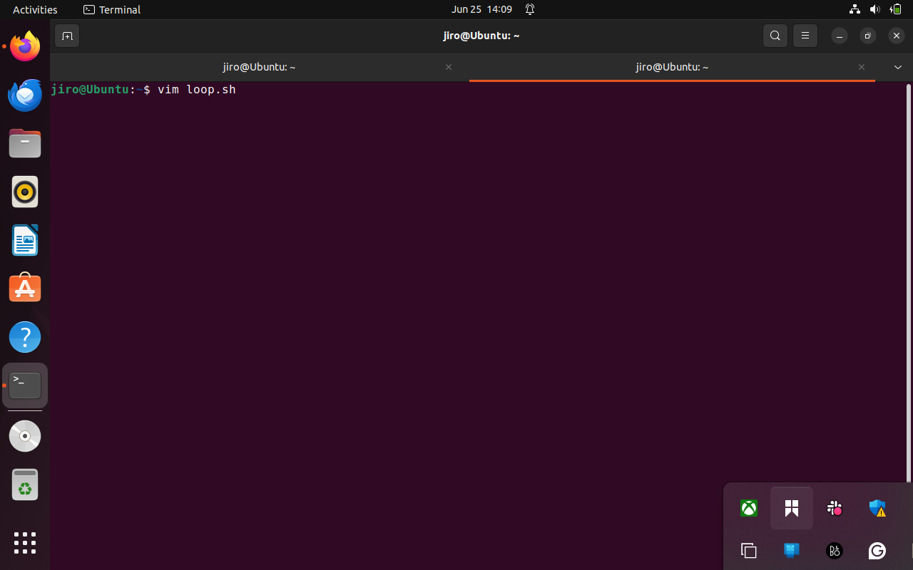

---

## 🚀 **Step 14: Add `for` Loop (List Form)**

```bash
#!/bin/bash
for i in 1 2 3 4 5
do
    echo "Hello, World! This is message $i"
done
```

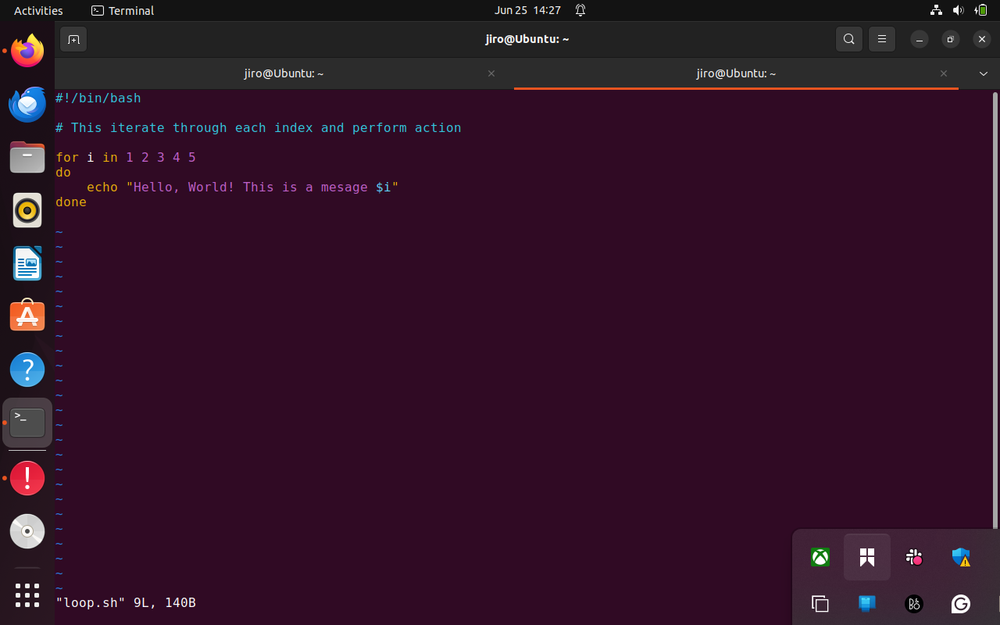

In this example:
The loop starts with for i in 12 3 4 5, meaning the variable i will take each value in the list (1, 2, 3, 4, S) in turn.
For each value of i, the loop executes the comrnands between do and done.
The command echo "Hello, World! This is message Si- prints a greeting along with the current value of i. Once i has taken each value in the list, the loop ends.
The same code can also be re-written using a range syntax

```bash
for i in {"1..5"}
do
    echo "Counting... $i"
done

```
---

## 🚀 **Step 15: Check loop.sh File Permissions**

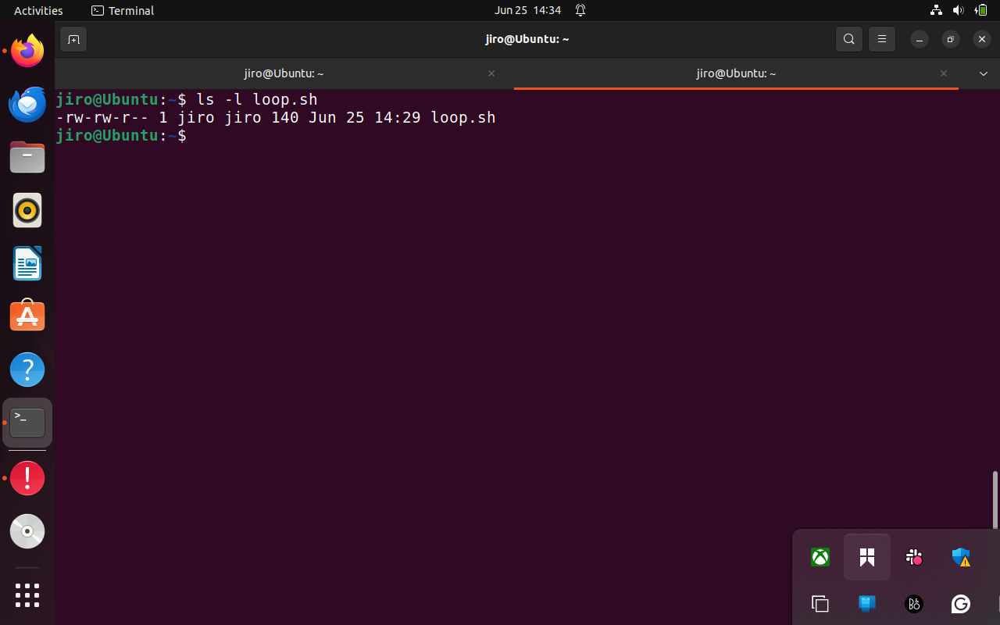

---

## 🚀 **Step 16: Add Execute Permission to loop.sh**

```bash
chmod +x loop.sh
```

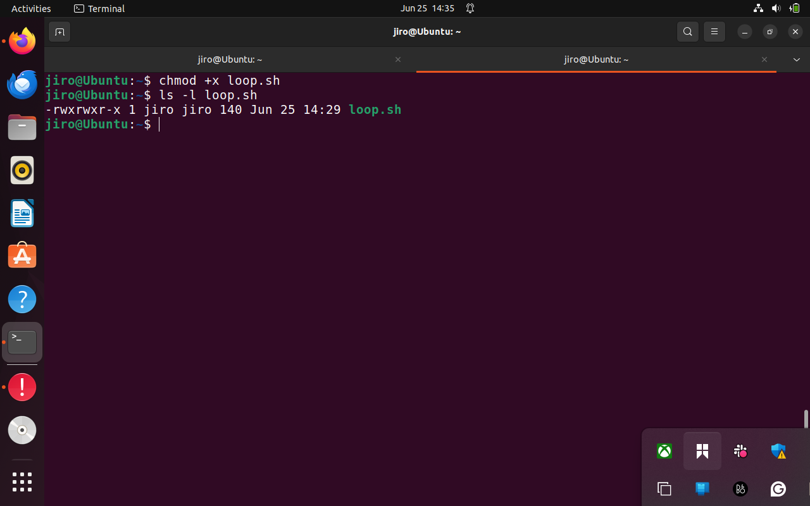

---

## 🚀 **Step 17: Execute loop.sh**

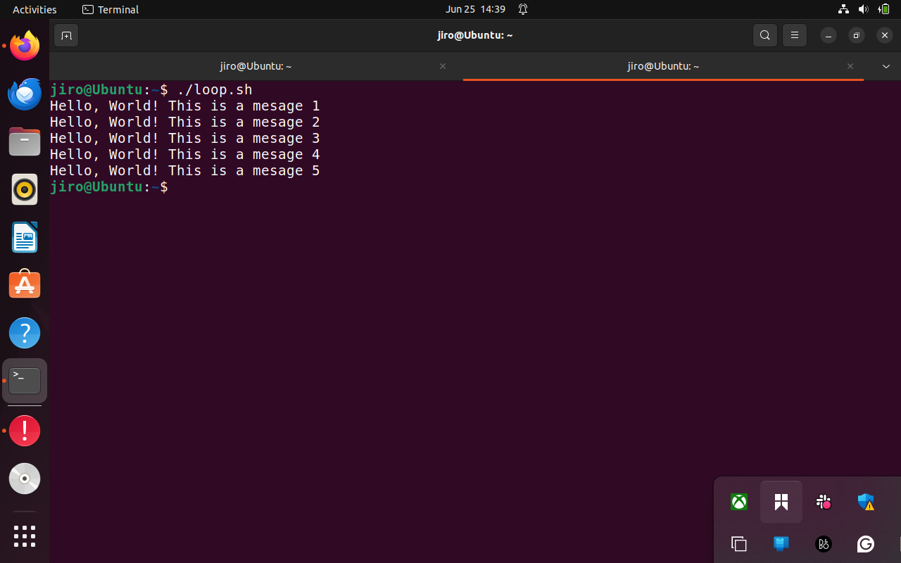

---

## 🚀 **Step 18: Alternative Syntax Using Range**

```bash
for i in {1..5}
do
    echo "Counting... $i"
done
```

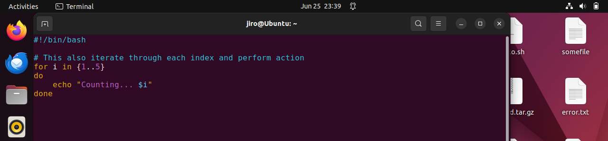

---

## 🚀 **Step 19: Execute the Range-Based loop.sh**

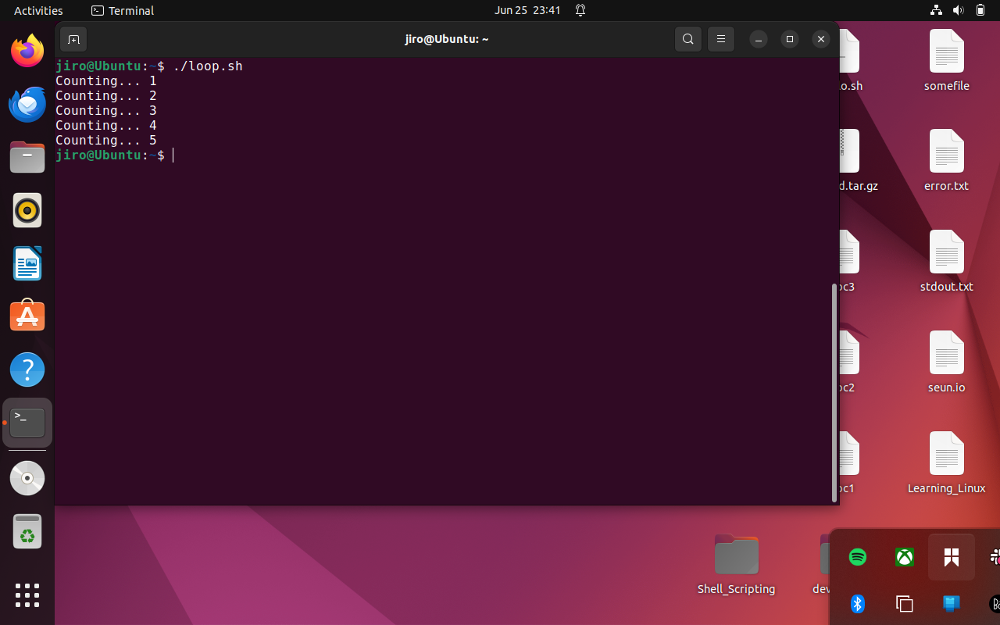

---

# 🔂 **C-Style `for` Loop**

---

## 🚀 **Step 20: Add C-Style for Loop**

```bash
#!/bin/bash
for (( i=0; i<5; i++ )); do
    echo "Number $i"
done
```

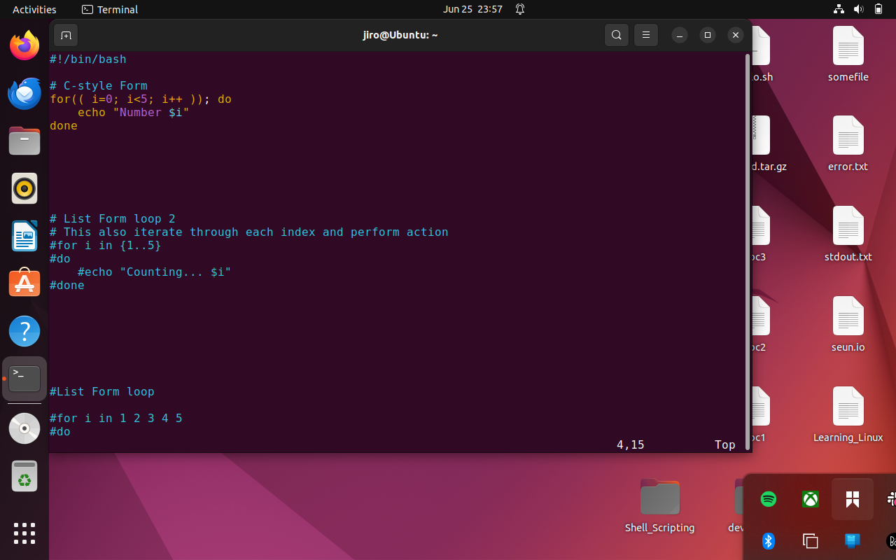

Lets break down the syntax:
```
- "for (( ... ));": This is the syntax that starts a C-style for loop in Bash. It's distinguished from the list form by the double parentheses "(( ... ))", which enclose the three parts of the loop: "initialization, condition, and increment/decrement".

- "i=0": This is the initialization part. Before the loop starts, "i" is set to "0". This typically sets up a counter variable to start from a certain value. In this case, i starts from 0.

- "i<5": This is the condition for the loop to continue running. After each iteration of the loop, Bash checks this condition. If it's true, the loop continues; if it's false, the loop ends. Here, the loop will continue as long as **i** is less than "5".

- "i++": This is the increment expression. It's executed at the end of each loop iteration. i++ is shorthand for incrementing i by 1 (i = i + 1). This step ensures that the loop will eventually end by changing the value of i so that the condition i<5 will not always be true.

- "do ... done": Encloses the commands to be executed in each iteration of the loop. Here, the command inside the loop is **echo "Number $i"**, which prints the current value of "i" to the console.

```
---
How It Works:

## 🚀 **Step 21: Execute the C-Style for Loop Script**

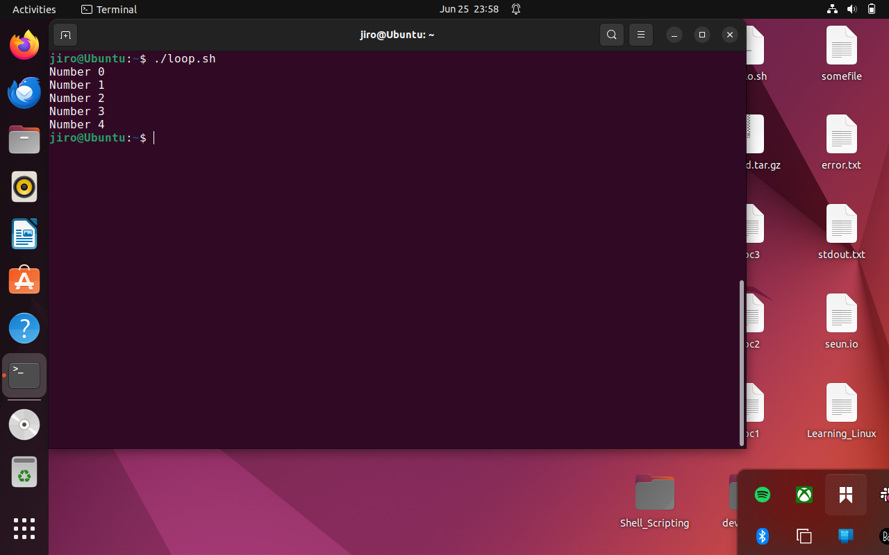

How it works:
```
- Initialization: Before the first iteration, "i" is set to "0".
- Condition Check: Before each iteration, including the first, Bash checks if i is less than 5.
    - If the condition is true, Bash executes the commands inside the loop.
    - If the condition is false, Bash exits the loop.

- Execute Commands: The command(s) inside the "do ... done" block are executed. In this case, it prints the current value of "i".
- "Increment:" After executing the commands, "i" is incremented by "1" using the syntax "(i++)".
- **Repeat:** Steps 2 through 4 are repeated until the condition in step 2 is false.

**Lets take a Walkthrough to further expand on your understanding**

- "First Iteration:" i=0, condition 0<5 is true, prints "Number 0", increments i to 1.
- "Second Iteration:" i=1, condition 1<5 is true, prints "Number 1", increments i to 2.
- "Continues iteration" ...
- "Fifth Iteration:" i=4, condition 4<5 is true, prints "Number 4", increments i to 5.
- "Sixth Check:" i=5, condition 5<5 is false, loop ends.
```
---

# ✅ **Summary Checklist**

| Task                                                 | Status |
| ---------------------------------------------------- | ------ |
| Create control\_flow\.sh file                        | ✅      |
| Collect user input                                   | ✅      |
| Display user input                                   | ✅      |
| Implement if control flow                            | ✅      |
| Implement elif and else control flow                 | ✅      |
| Create loop.sh for list form loop                    | ✅      |
| Implement for loop using range                       | ✅      |
| Implement for loop using C-style                     | ✅      |
| Set and verify file permissions                      | ✅      |
| Run and validate all scripts                         | ✅      |
| Take and attach all required screenshots from ./img/ | ✅      |

---

# 🎓 **Conclusion**

This project covers:

* How to accept and process user input in Bash.
* How to use `if`, `elif`, and `else` control flow for decision-making.
* How to write and run `for` loops in both list and C-style forms.
* Proper script file permission management.
* Step-by-step project execution with detailed evidence using screenshots stored in (./img/`.)

## 📁 GitHub Repository Validation

🔗 Repository URL: [DevOps Projects GitHub Repo](https://github.com/Oluwaseunoa/DevOps-Projects/tree/main/11.%20Control%20Flow)
