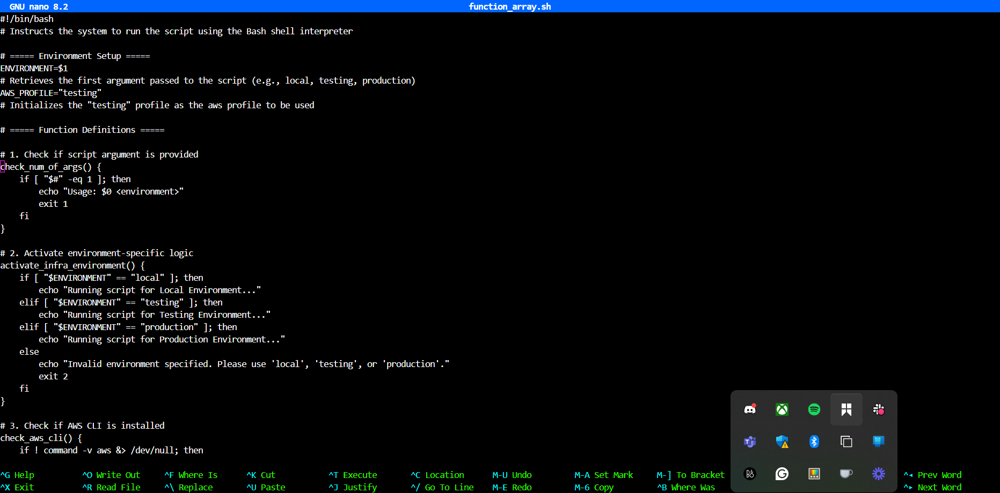
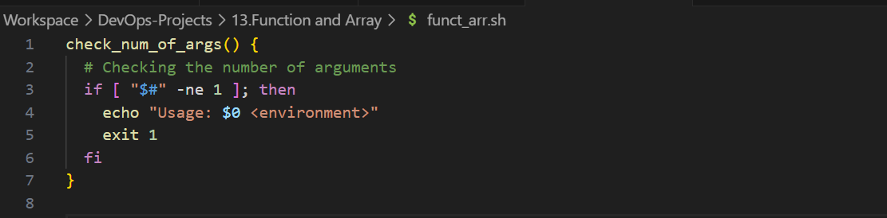
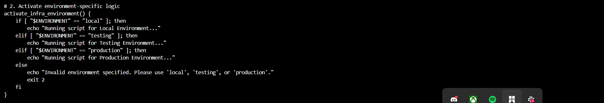
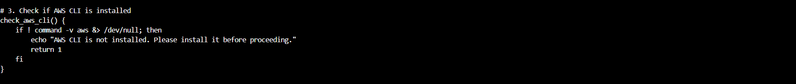
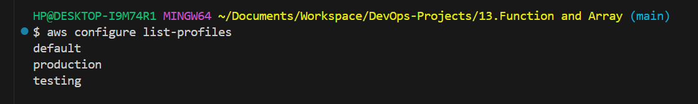
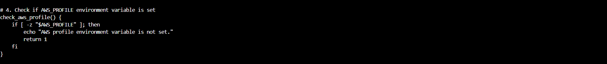
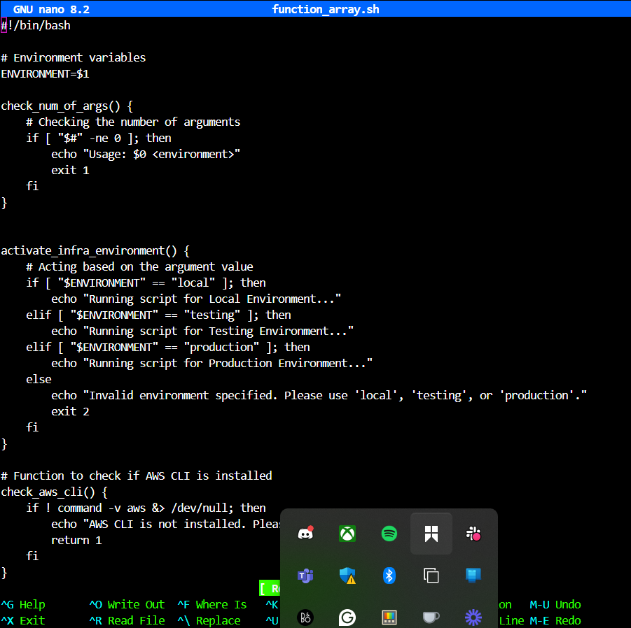
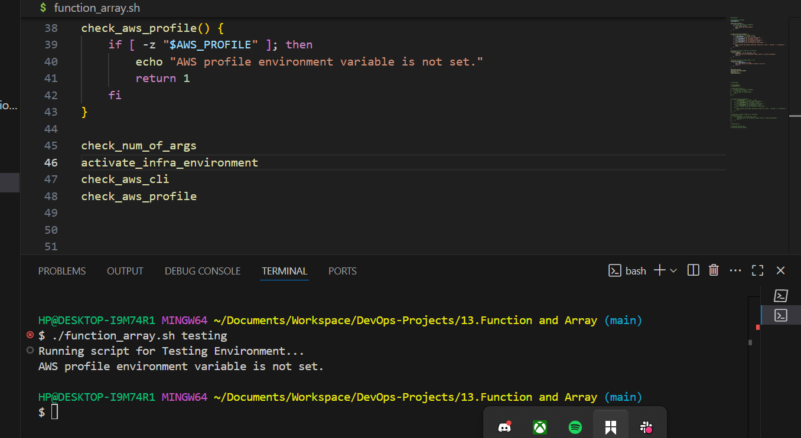
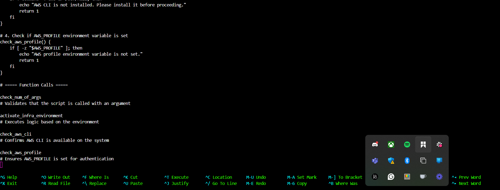
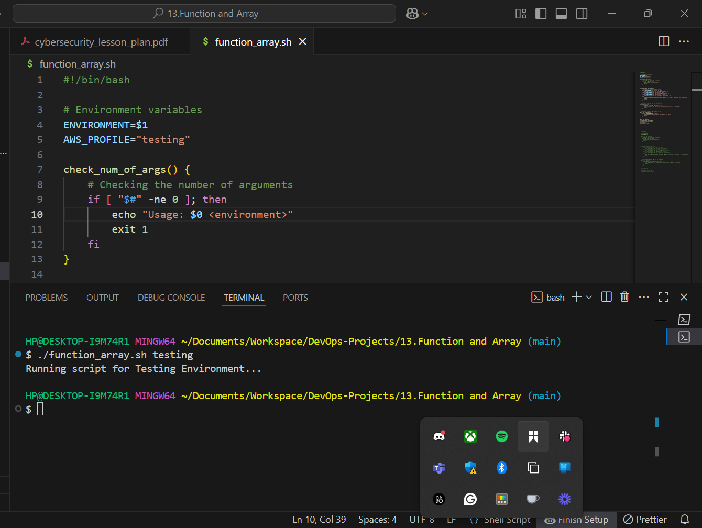

# **Mini Project – Working with Functions**

### 📁 *Client: DataWise Solutions*

**Objective**: In order to achieve the goal of automating the creation of AWS EC2 and S3 resources using a shell script for DataWise Solutions, this script must use **functions** to structure logic cleanly and check:

1. Argument input
2. AWS CLI installation
3. Environment validity
4. AWS profile configuration

---

## Full Script Overview
 

```bash
#!/bin/bash
# Instructs the system to run the script using the Bash shell interpreter

# ===== Environment Setup =====
ENVIRONMENT=$1
# Retrieves the first argument passed to the script (e.g., local, testing, production)

# ===== Function Definitions =====

# 1. Check if script argument is provided
check_num_of_args() {
    if [ "$#" -eq 0 ]; then
        echo "Usage: $0 <environment>"
        exit 1
    fi
}

# 2. Activate environment-specific logic
activate_infra_environment() {
    if [ "$ENVIRONMENT" == "local" ]; then
        echo "Running script for Local Environment..."
    elif [ "$ENVIRONMENT" == "testing" ]; then
        echo "Running script for Testing Environment..."
    elif [ "$ENVIRONMENT" == "production" ]; then
        echo "Running script for Production Environment..."
    else
        echo "Invalid environment specified. Please use 'local', 'testing', or 'production'."
        exit 2
    fi
}

# 3. Check if AWS CLI is installed
check_aws_cli() {
    if ! command -v aws &> /dev/null; then
        echo "AWS CLI is not installed. Please install it before proceeding."
        return 1
    fi
}

# 4. Check if AWS_PROFILE environment variable is set
check_aws_profile() {
    if [ -z "$AWS_PROFILE" ]; then
        echo "AWS profile environment variable is not set."
        return 1
    fi
}

# ===== Function Calls =====

check_num_of_args "$@"
# Validates that the script is called with an argument

activate_infra_environment
# Executes logic based on the environment

check_aws_cli
# Confirms AWS CLI is available on the system

check_aws_profile
# Ensures AWS_PROFILE is set for authentication
```

---

## **Function for Checking Number of Argument** 


### ✅ Function: `check_num_of_args()`

```bash
check_num_of_args() {
    if [ "$#" -eq 0 ]; then
        echo "Usage: $0 <environment>"
        exit 1
    fi
}
```

**Explanation**:

* `$#` represents the number of arguments passed to the script.
* If it's `0`, the function prints usage instructions and exits with error `1`.

---

## Calling check_num_of_args Function 
**

### ✅ Function Call: `check_num_of_args 

```bash
check_num_of_args
```

**Explanation**:


* Ensures the user runs the script with one argument (`local`, `testing`, or `production`).

---

## **Create and call activate infrastructure environment function**


### ✅ Function: `activate_infra_environment()`

```bash
activate_infra_environment() {
    if [ "$ENVIRONMENT" == "local" ]; then
        echo "Running script for Local Environment..."
    elif [ "$ENVIRONMENT" == "testing" ]; then
        echo "Running script for Testing Environment..."
    elif [ "$ENVIRONMENT" == "production" ]; then
        echo "Running script for Production Environment..."
    else
        echo "Invalid environment specified. Please use 'local', 'testing', or 'production'."
        exit 2
    fi
}
```

**Explanation**:

* Checks the value of `$ENVIRONMENT` and echoes which environment the script is setting up.
* Invalid inputs trigger an error and exit.

---

## Function for checking 'aws cli'

### ✅ Function: `check_aws_cli()`

```bash
check_aws_cli() {
    if ! command -v aws &> /dev/null; then
        echo "AWS CLI is not installed. Please install it before proceeding."
        return 1
    fi
}
```

**Explanation**:

* `command -v aws`: Checks if `aws` command is available.
* `!` negates the check (i.e., if not found).
* `&> /dev/null`: Suppresses output.
* Returns error if AWS CLI is missing.

---

## Function for viewing all aws


### ✅ Command: View Available AWS Profiles

```bash
aws configure list-profiles
```

**Expected Output Example**:

```
default
testing
production
```

**Explanation**:

* Lists all configured AWS CLI profiles from `~/.aws/config`.

---

## **Checking AWS profile set**

### ✅ Function: `check_aws_profile()`

```bash
check_aws_profile() {
    if [ -z "$AWS_PROFILE" ]; then
        echo "AWS profile environment variable is not set."
        return 1
    fi
}
```

**Explanation**:

* `-z` checks if `$AWS_PROFILE` is empty.
* If not set, the script warns the user and returns error.

---

## **Running script without setting profile** 



### 🧪 Test Case: Run Script Without AWS\_PROFILE

```bash
./script.sh testing
```

**Expected Output**:

```
Running script for Testing Environment...
AWS profile environment variable is not set.
```

**Explanation**:

* AWS CLI is available.
* But `$AWS_PROFILE` was never exported, so the script flags it.

---

## **Run AWS CLI Without Setting Profile**

### 🧪 Run AWS CLI Without Setting Profile

```bash
aws s3 ls
```

**Expected Output**:

```
Unable to locate credentials. You can configure credentials by running "aws configure".
```

**Explanation**:

* AWS CLI fails because no credentials/profile are available.

---

## **Set Profile in the script**



### ✅ Fix: Set AWS Profile

```bash
#!/bin/bash
# Instructs the system to run the script using the Bash shell interpreter

# ===== Environment Setup =====
ENVIRONMENT=$1
# Retrieves the first argument passed to the script (e.g., local, testing, production)
AWS_PROFILE="testing"
# Initializes the "testing" profile as the aws profile to be used

```

## **Run script with profile set in the script**



**Expected Output**:

```
Running script for Testing Environment...
AWS CLI is installed.
```

**Explanation**:

* The profile `testing` is set in the script.
* Script successfully uses the credentials from `~/.aws/credentials`.

---

## **Run AWS CLI script**

### ✅ Run AWS CLI With Profile Set

```bash
aws s3 ls
```

**Expected Output**:

```
2025-07-28  my-testing-bucket
2025-07-29  another-bucket
```

**Explanation**:

* AWS CLI is now authenticated using the `testing` profile.
* Access to S3 buckets is successful.

---

## ✅ **Final Summary**

In this project, I developed a modular and professional shell script that automates AWS setup for EC2 and S3 resources using **structured functions**. I created individual functions to:

* Check if script arguments are passed
* Validate the AWS CLI installation
* Activate the right environment based on user input
* Ensure AWS profile authentication is correctly configured

I tested the script in multiple scenarios, such as with and without AWS\_PROFILE, verifying its robustness. Each function isolates logic clearly, which aligns with industry practices for writing maintainable DevOps automation scripts. This project not only improved my shell scripting skills but also strengthened my understanding of AWS CLI environments and real-world cloud setup workflows.

