## 🔐 Advanced Linux Commands: File Permissions and Access Rights


### 🧠 **Project Objective**

To demonstrate a practical understanding of Linux file permissions and user access control through the application of essential commands such as `ls`, `chmod`, `chown`, `adduser`, and `usermod`. This knowledge is vital for system administrators and DevOps engineers to secure file access on Linux systems.

---

### 📁 **1. Understanding File Permissions in Linux**

Linux uses **symbolic** and **numeric** methods to represent file permissions.
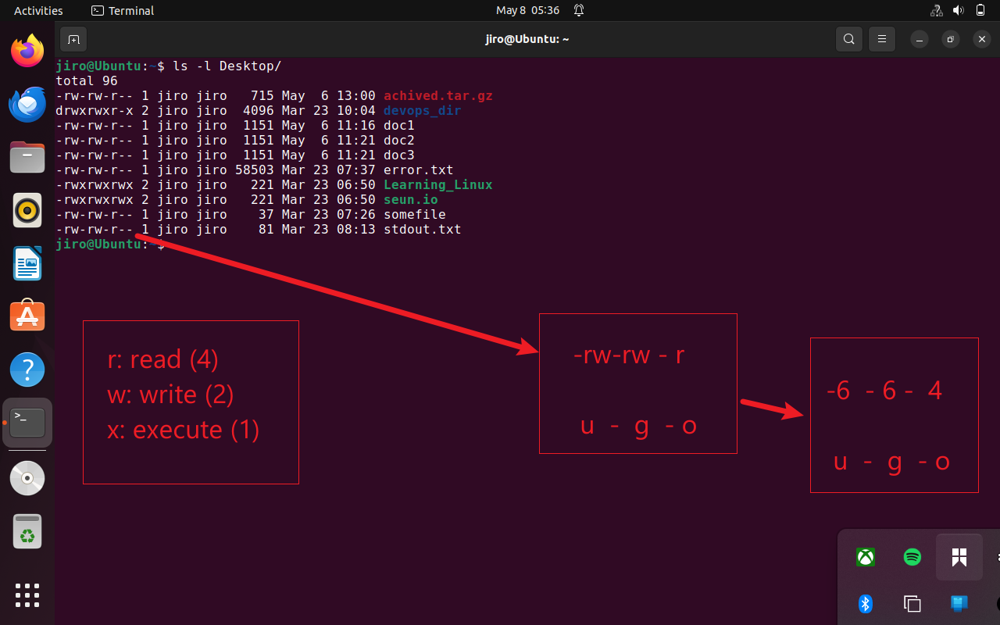

#### 📌 Key Concepts

* **User Classes**:

  * **User (u)** – The file owner
  * **Group (g)** – Users who share group ownership
  * **Others (o)** – Everyone else

* **Permission Types**:

  * Read (r) = 4
  * Write (w) = 2
  * Execute (x) = 1

* **Examples**:

  * `rwx` = 7
  * `rw-` = 6
  * `r--` = 4

---

### 🧪 **2. Practical Demonstration of Permission Types**

#### 🔧 Step 1: Create a New File

```bash
touch script.sh
ls -latr script.sh
```
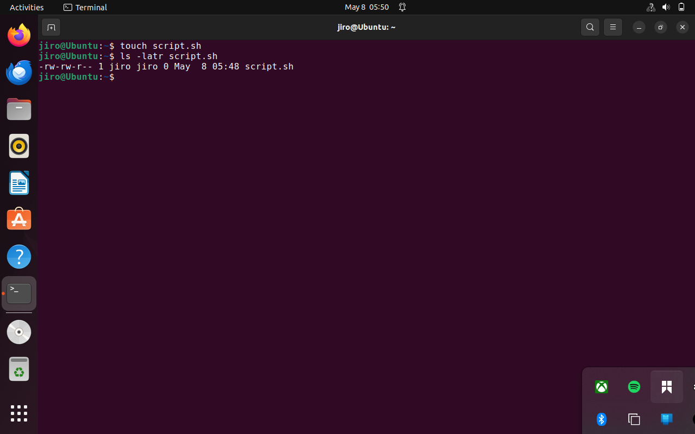
---

#### 🔧 Step 2: Add Execute Permission to All Users

```bash
chmod +x script.sh
ls -latr script.sh
```
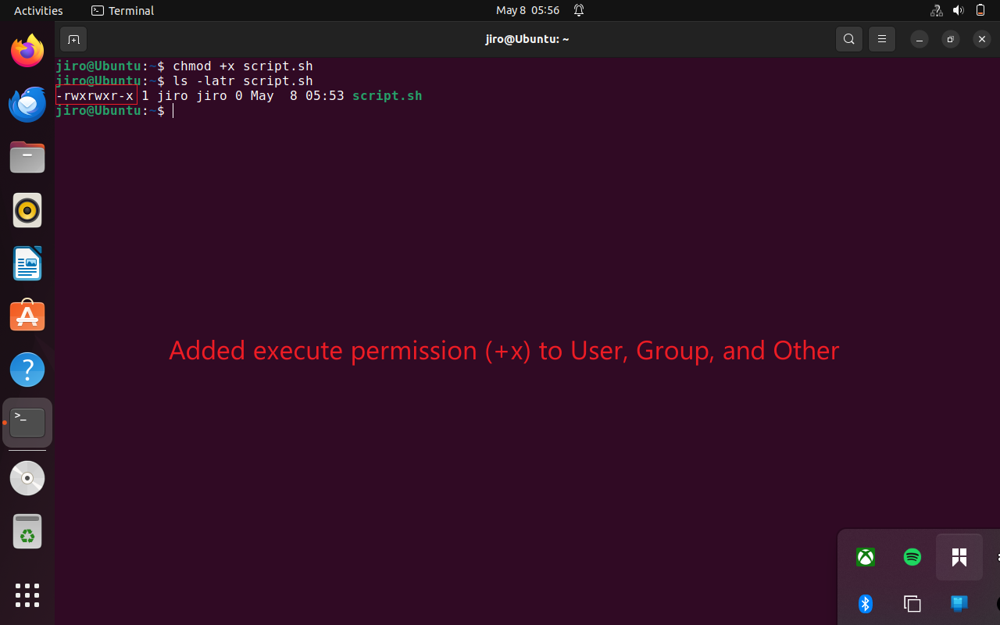

---

#### 🔧 Step 3: Set Permissions Using Numeric Notation

```bash
chmod 755 script.sh
ls -latr script.sh
```
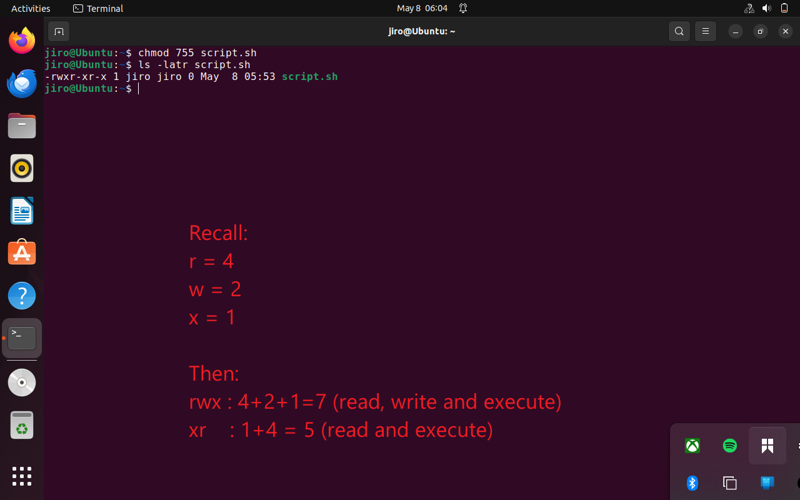
---

#### 🔧 Step 4: Give Full Permissions to All Users (777)

```bash
chmod 777 note.txt
ls -latr note.txt
```
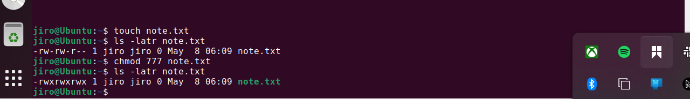

---

### 👥 **3. Changing File Ownership**

#### 🔧 Step 5: Create a File and Change Ownership


Let's create group `developer` to use :

```bash
sudo groupadd developer
cat /etc/group
```
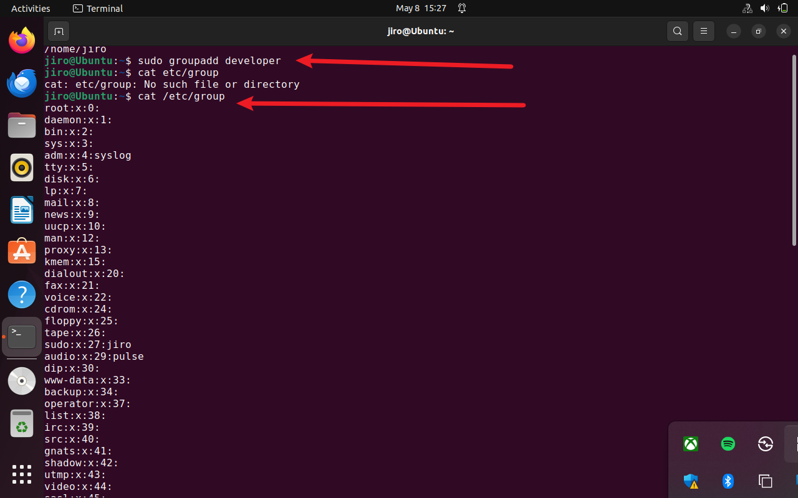
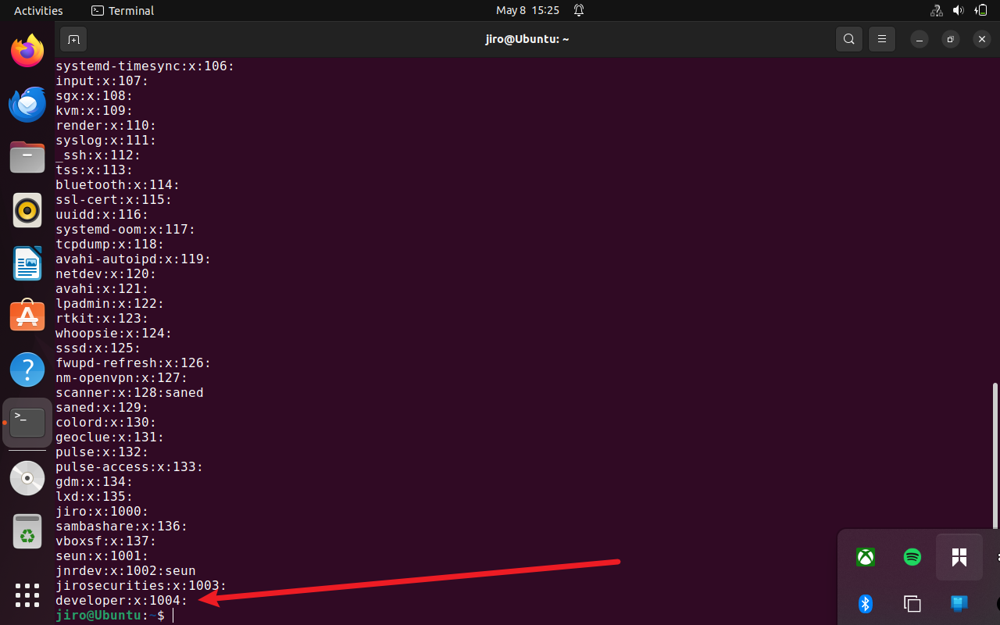

Let's create user `John` with `useradd` and assign him to `developer` group:

```bash
sudo useradd -c John -g developer john
cat /etc/passwd
```
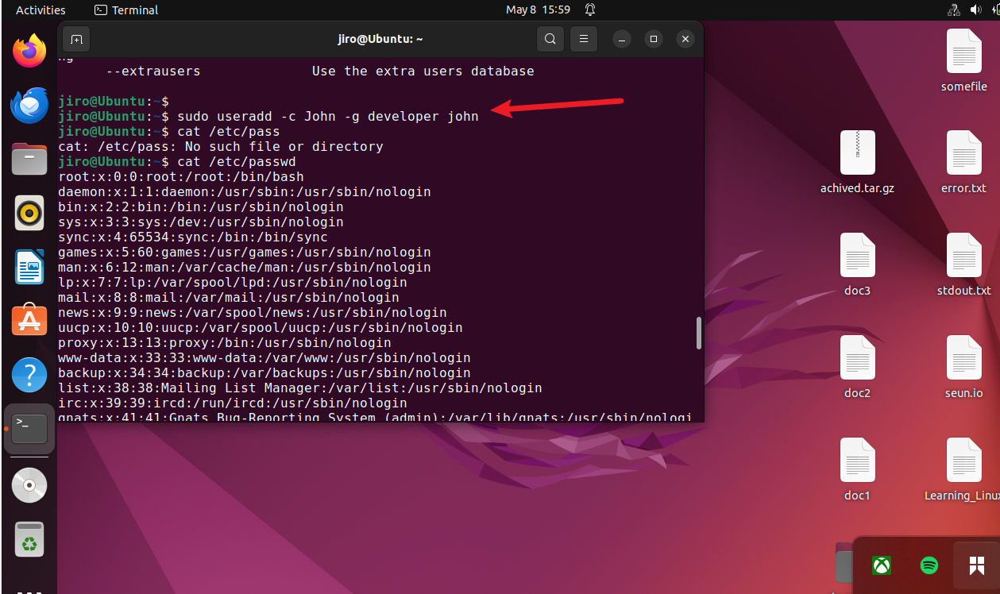
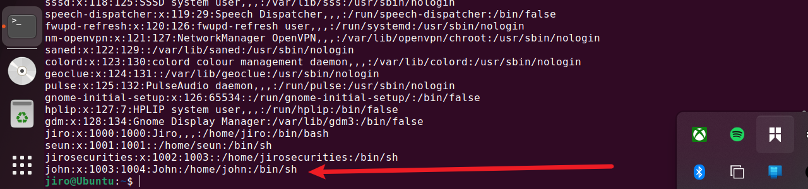

Create a test file:

```bash
touch filename.txt
```
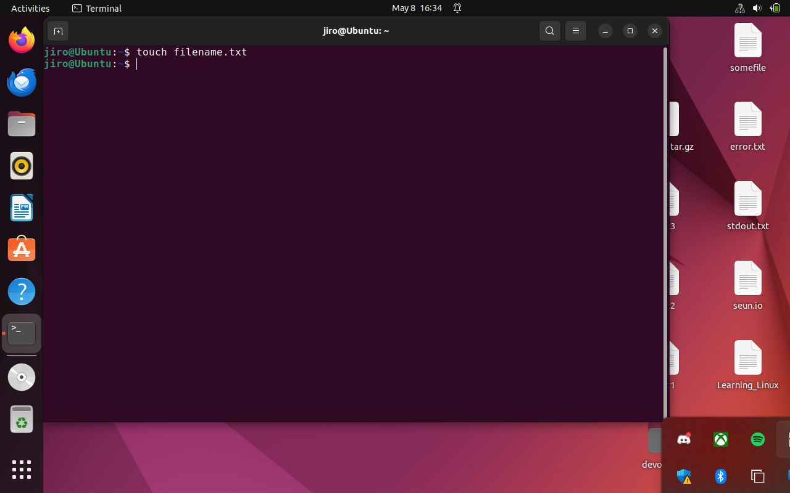

Assign the file to John
```bash
sudo chown john:developer filename.txt
ls -latr filename.txt
```
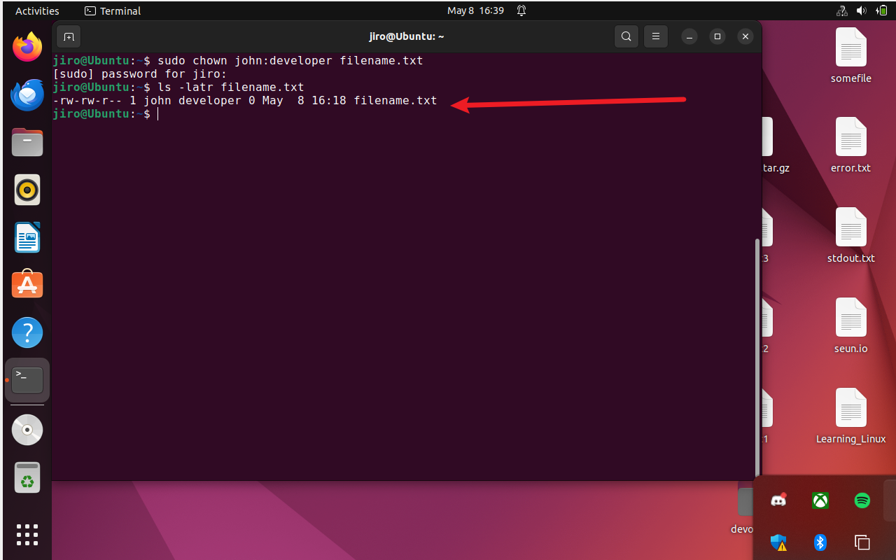
---

### 🔐 **4. Using `sudo` and Switching to Root**

#### 🔧 Step 6: Become Superuser Temporarily

```bash
sudo -i
```
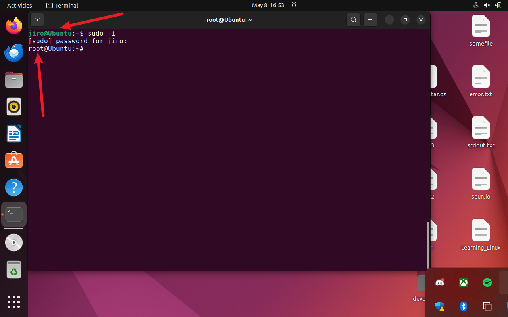

Exit root shell:

```bash
exit
```

---

### 👨‍💻 **5. User and Group Management in Linux**

#### 🔧 Step 7: Create a New User

```bash
sudo adduser testuser1
```

Follow the prompts to enter:

* Password
* Full name
* Room number
* Phone numbers
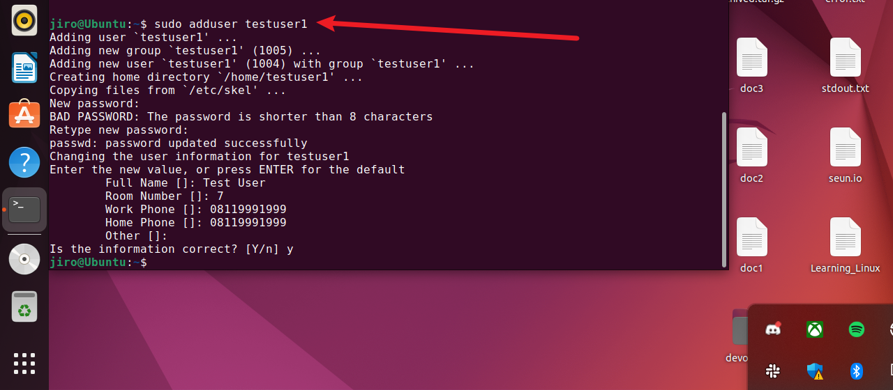
_Note: In this step we use adduser, not useradd_

---

#### 🔧 Step 8: Verify the Home Directory Creation

```bash
ls -ld /home/testuser1
```
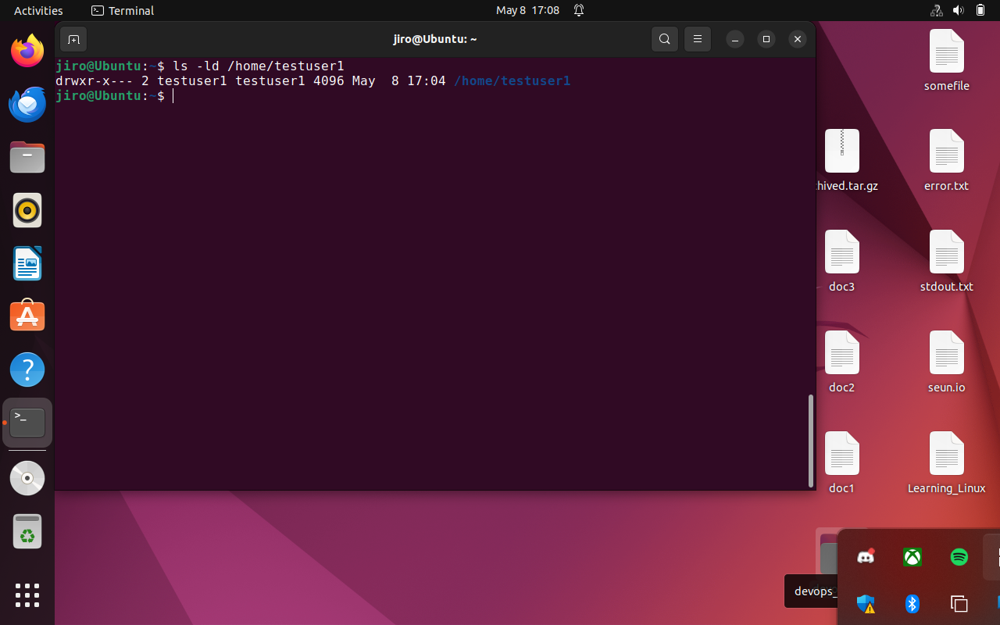

---

#### 🔧 Step 9: Grant Sudo Privileges

```bash
sudo usermod -aG sudo testuser1
```
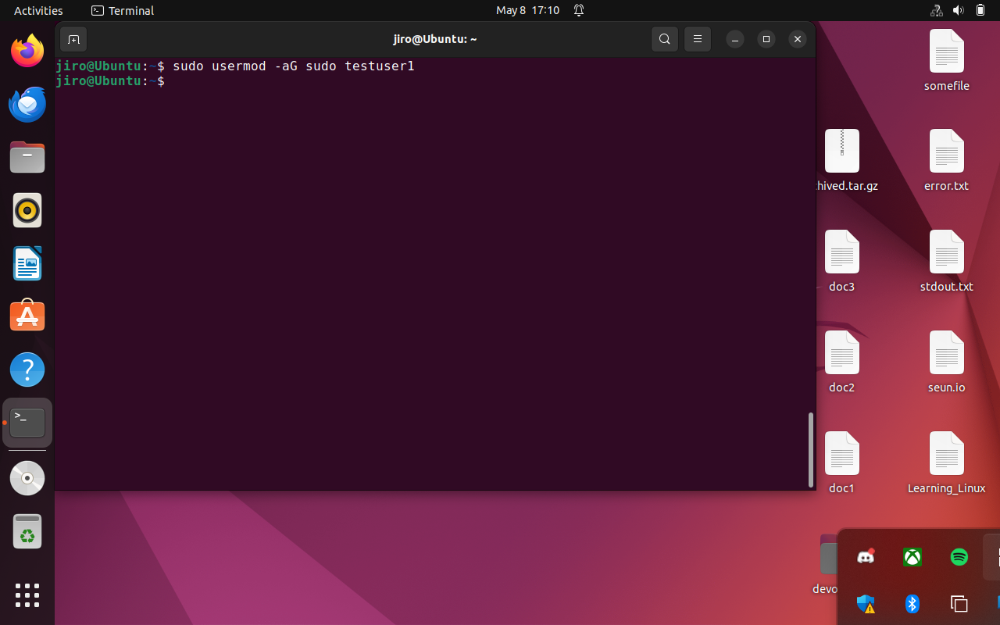

checking:

```bash
groups testuser1
```
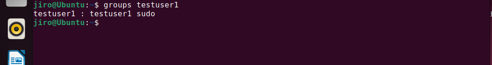
---

### 📚 **6. Bonus: File Type Recognition**

When listing files with `ls -latr`, note the first character in the output:

* `-` for regular file
* `d` for directory
* `l` for symbolic link


```bash
ls -latr
```


Explain a few entries and what their permissions imply.

---

### ✅ **Summary Checklist**

| Step | Task                                      | Screenshot Required? |
| ---- | ----------------------------------------- | -------------------- |
| 1    | Create file and check default permissions | ✅                    |
| 2    | Grant execute permission with `chmod +x`  | ✅                    |
| 3    | Use numeric `chmod 755`                   | ✅                    |
| 4    | Apply full permissions `chmod 777`        | ✅                    |
| 5    | Change ownership with `chown`             | ✅                    |
| 6    | Become superuser with `sudo -i`           | ✅                    |
| 7    | Add a new user with `adduser`             | ✅                    |
| 8    | Confirm home directory creation           | ✅                    |
| 9    | Grant sudo privileges                     | ✅                    |
| 10   | `ls -latr` explanation                    | ✅                    |


## 📁 GitHub Repository Validation

🔗 Repository URL: [DevOps Projects GitHub Repo](https://github.com/Oluwaseunoa/DevOps-Projects/tree/main/08.%20Advanced%20Linux%20Commands)
