# 📁 **Advanced Linux File Operations Project**

## 🎯 **Goal**

Learn and demonstrate advanced file management in Linux using real-world tools like `wget`, `tar`, `gzip`, `bzip2`, and, `zip`.

---

## ✅ **Project Summary**

This project simulates a real DevOps or sysadmin task:

> **“Download a configuration file, create backups, compress them, archive them, and later restore them.”**

You’ll walk through:

* Fetching a remote file
* Creating backups
* Archiving files (`tar`)
* Compressing files (`gzip`, `bzip2`, `zip`)
* Restoring archives

---

## 🧩 **Step-by-Step Breakdown**

---

### 🔹 **Step 1: Fetch a Remote Configuration File**

```bash
wget https://raw.githubusercontent.com/darey-io/globomantics-ansible/refs/heads/master/group_vars/all/vars.yml
```

* **Why?** Simulates pulling configs from GitHub for automation tools like Ansible.
* **Result:** A `vars.yml` file is saved in your current directory.

📁 *Confirm that this file is saved in the present working directory*

📸 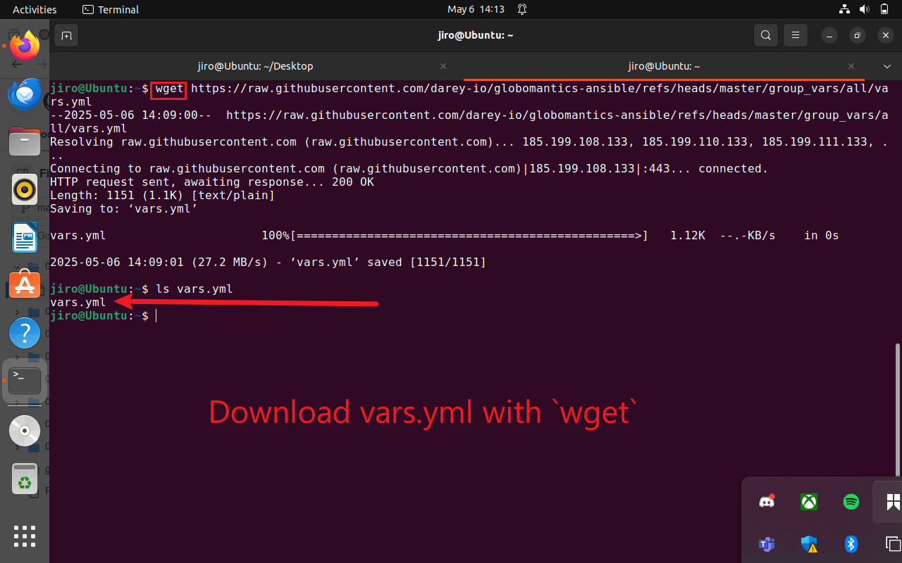

---

### 🔹 **Step 2: Move vars.yml to Devops folder or any folder you choose**

```bash
mv vars.yml Devops/
```
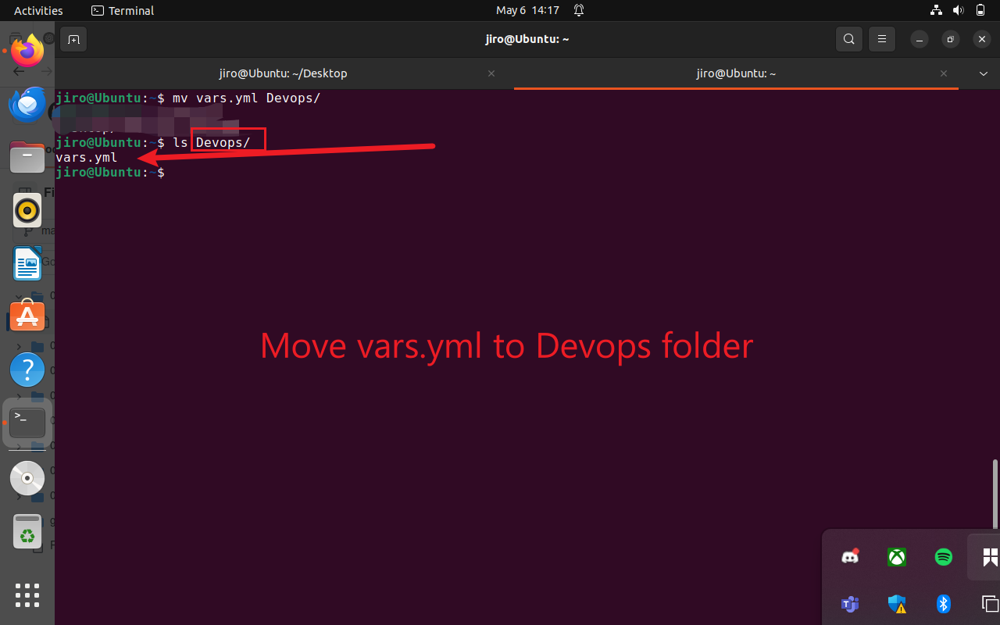

### 🔹 **Step 3: Navigate into the folder where you now have vars.yml**

cd Devops/

### 🔹 **Step 4: Check the size of vars.yml**

```bash
du -h vars.yml 
```
### 🔹 **Step 5: Rename 'vars.yml' to 'doc1'**

```bash
mv vars.yml doc1
```
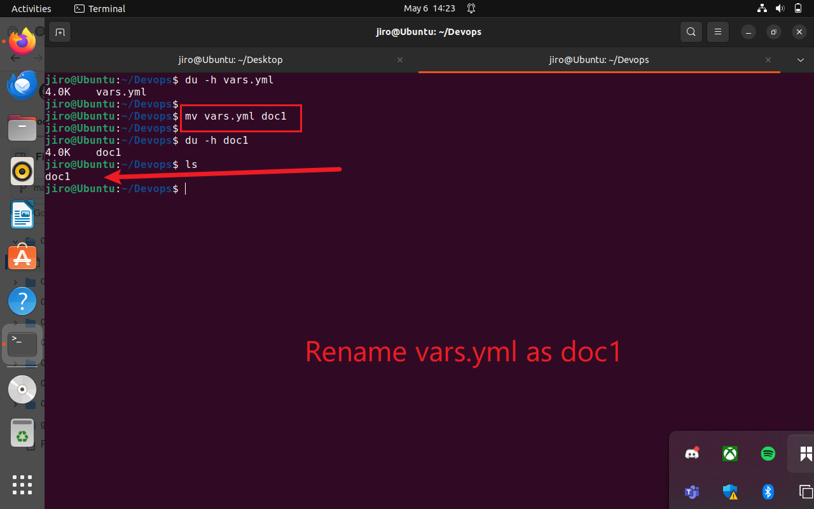

### 🔹 **Step 6: Create 2 backup copies of doc1 (doc2 and doc3)**

```bash
cp doc1 doc2
cp doc1 doc3
```
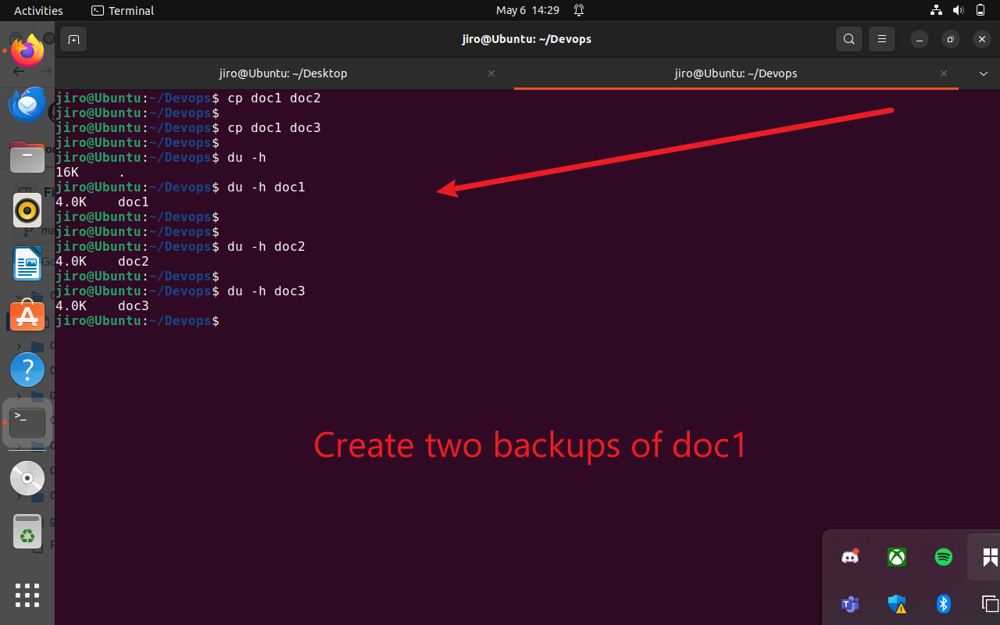


* **Why?** You’re simulating creation of backup copies (`doc1`, `doc2`, `doc3`).

📁 *You now have 3 files ready for packaging.*


### 🔹 **Step 7: Archive the Files (doc1,doc2, and doc3) Using `tar`**

```bash
tar -cvf archived.tar doc1 doc2 doc3
```
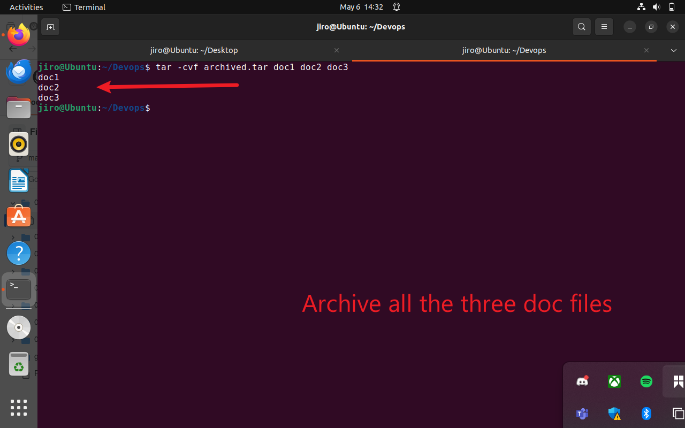

* **Why?** `tar` is used to package multiple files into a single archive.

**Step 8: Check Contents of the archived.tar:**

```bash
tar -tvf archived.tar
```
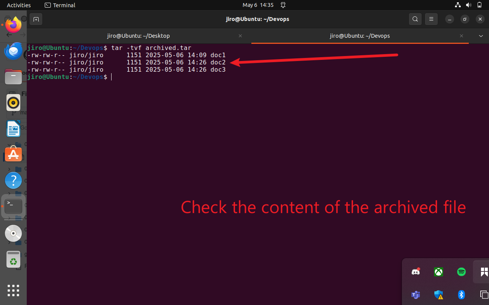

---
### 🔹 **Step 9: Check the size of archived.tar and zip (compress) it with bzip2**

```bash
du -h archived.tar 
bzip2 archived.tar
```
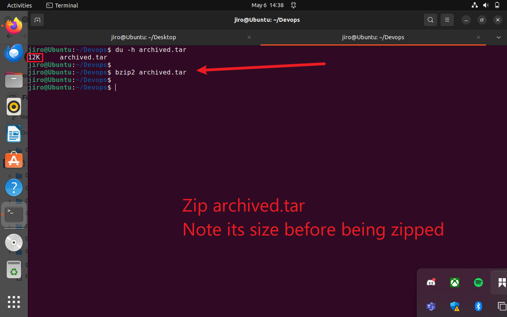

### 🔹 **Step 10: Compare the size of archived.tar.bz2 with archived.tar**

```bash
du -h archived.tar.bz2
```
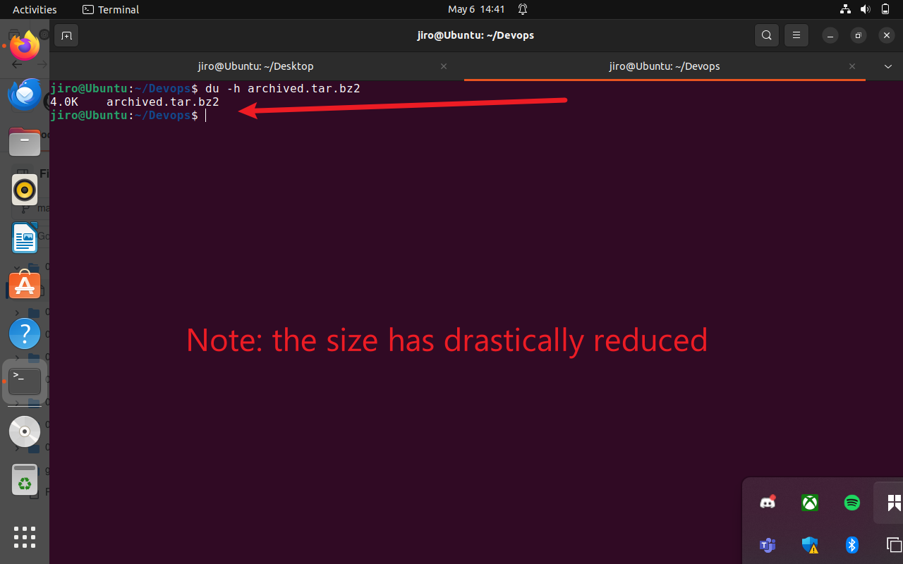

### 🔹 **Step 11: Decompress archibed.tar.bz2 bunzip2**

```bash
bunzip2 archived.tar.bz2
```
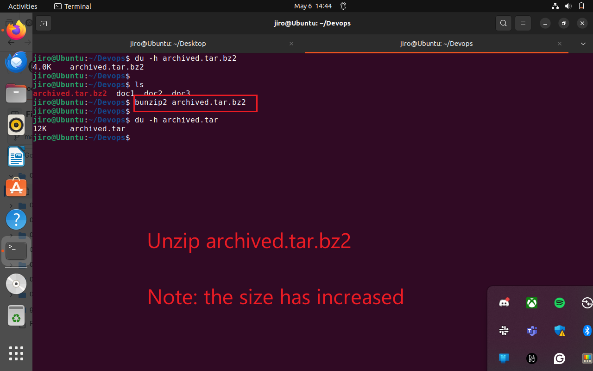

### 🔹 **Step 12: Compress archived.tar using gzip**

```bash
gzip archived.tar
```
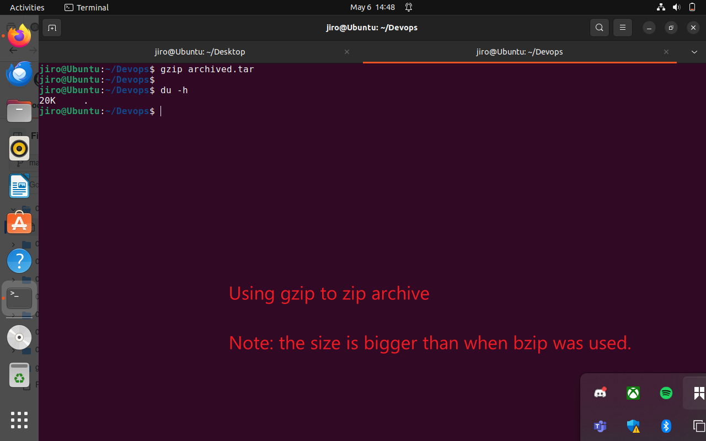
To decompress:

### 🔹 **Step 13: Decompress archived.tar.gz using gunzip**
```bash
gunzip archived.tar.gz
```

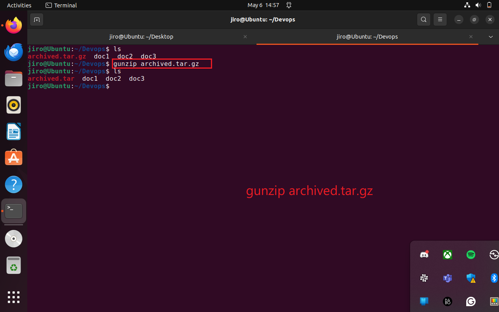


### 🔹 **Step 14: Compress archived.tar using zip**


```bash
zip archived.tar.zip archived.tar
```
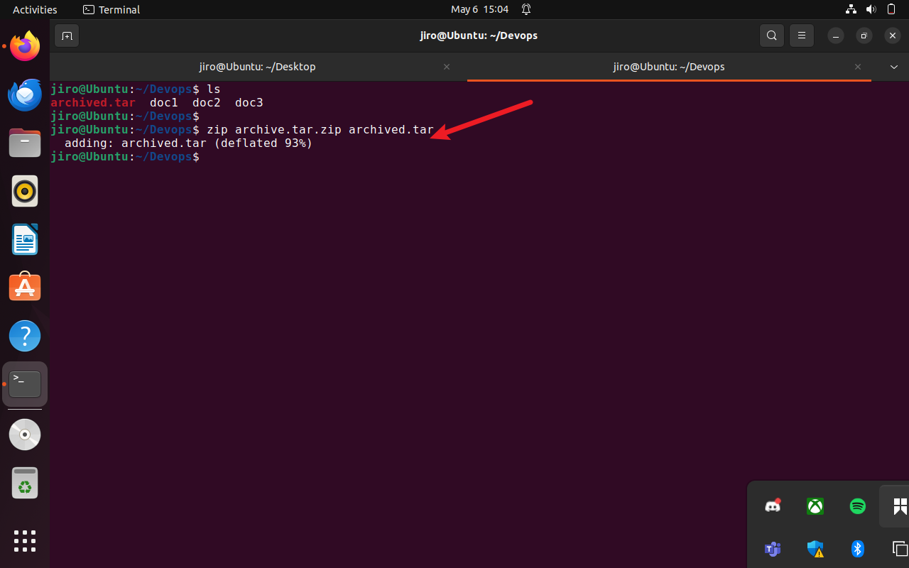


### 🔹 **Step 15: Decompress archived.tar.zip using unzip**

```bash
unzip archived.tar.zip
```
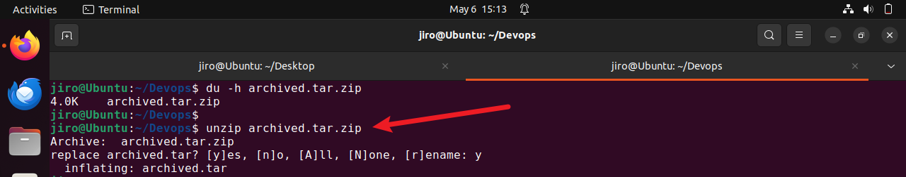

### 🔹 **Step 16: Compare the size of archived.tar.zip to archive.tar**
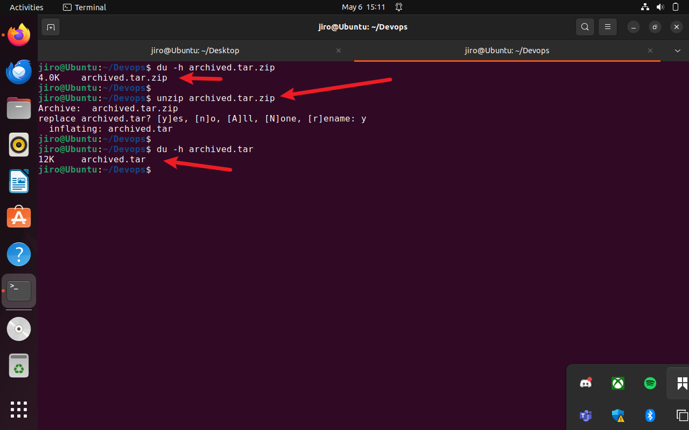

---

### 🔹 **Step 17: Remove all contents in Devops folder Except archived.tar**

```bash
rm archived.tar.zip doc1 doc2 doc3
```
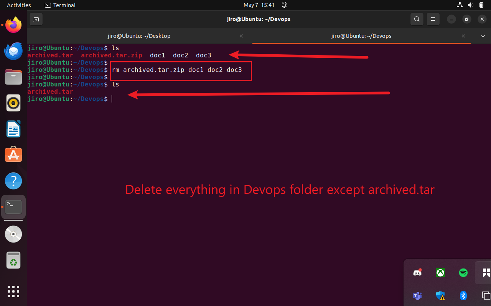

You can also do the same using:
```bash
rm archived.tar.zip doc*
```

### 🔹 **Step 18: Extract and Restore Archived Files**
```bash
tar -xvf archived.tar
```
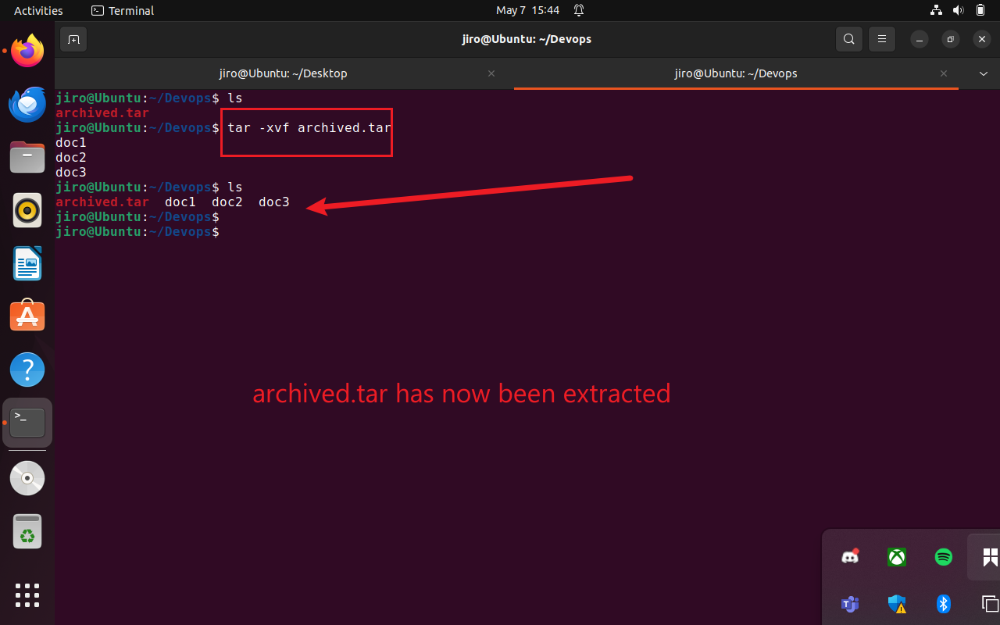

* **Why?** Simulates restoring original files after backup.


## 🧾 **Final Files/Folders Structure**

```
Advanced_File_Operations_Project/
├── config/
│   └── vars.yml
├── Devops/
│   ├── doc1, doc2, doc3
│   ├── archived.tar.gz
├── img/
```

---

## 🧠 **Learning Outcomes**

* Understand file packaging and compression.
* Learn the differences and use-cases of `tar`, `gzip`, `bzip2`, and `zip`.
* Practice cleanup and restoration operations.

## 📁 GitHub Repository Validation

🔗 Repository URL: [DevOps Projects GitHub Repo](https://github.com/Oluwaseunoa/DevOps-Projects/tree/main/00.Personal%20Projects/Advanced%20File%20Operation)
