# 🛠️ Mini Project – Git Branching and Merging

This project demonstrates how multiple developers (Tom and Jerry) can collaborate on a project using Git branching and merging strategies. It outlines the process of creating and reviewing Pull Requests (PRs) before merging into the main branch.

---

## 🔀 Workflow Overview

The project simulates collaboration between two developers, each working on their own branch:

- Tom: update-navigation
- Jerry: edit-contact (formerly add-contact-info)

Both developers push their changes, create Pull Requests, and merge into the main branch.

---

## 📌 Understanding Pull Requests

A Pull Request (PR) is a GitHub feature that enables developers to:

- Propose code changes,
- Request code reviews,
- Collaborate on improvements,
- Merge only approved contributions into shared branches.

---

## 👨‍💻 Developer 1: Tom – update-navigation

### Step-by-Step Workflow

1. Create and switch to feature branch:

```bash
git checkout -b update-navigation
```
!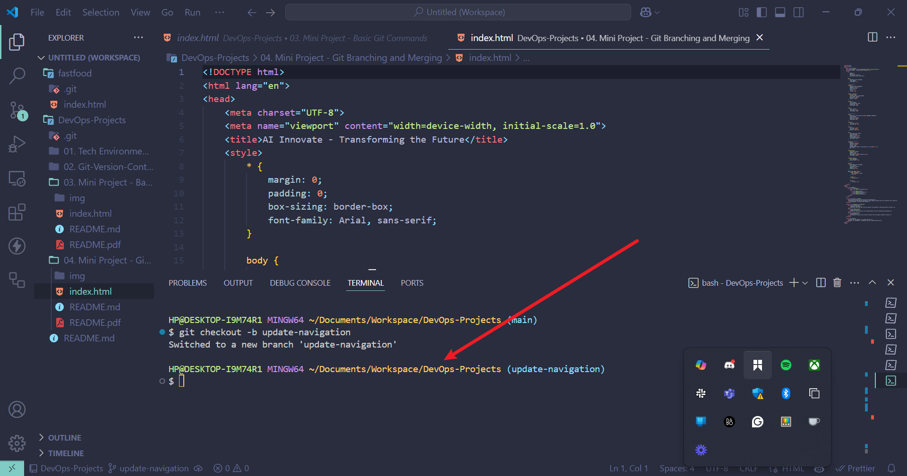
2. Edit navigation content.
!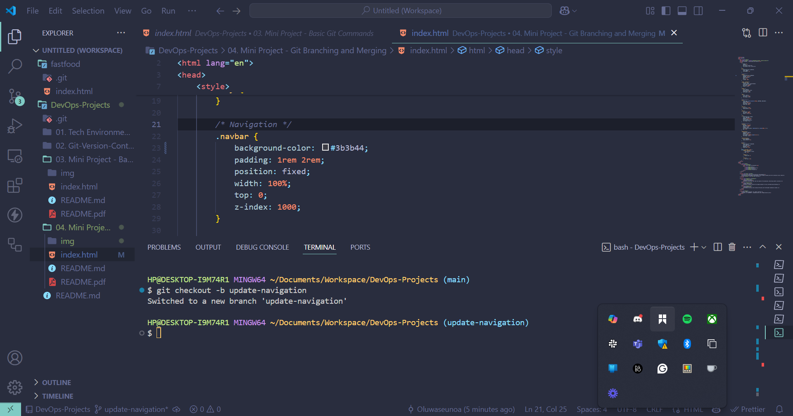
3. Stage and commit changes:

```bash
git add .
git commit -m "Update navigation menu"
```

4. Push the feature branch to GitHub:

```bash
git push origin update-navigation
```

 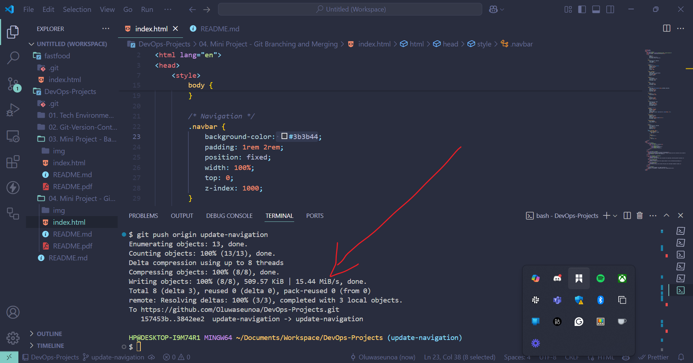

5. Open GitHub Repository and switch to update-navigation branch  
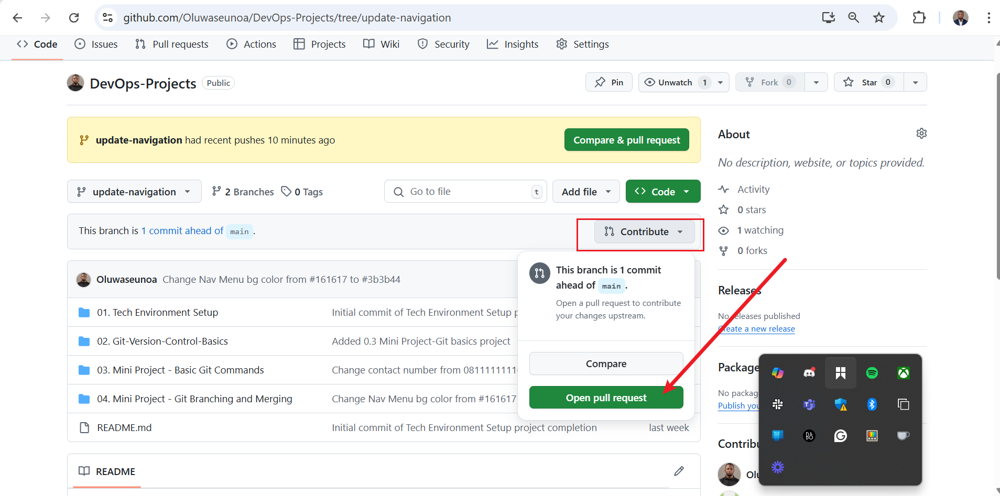

6. Create a Pull Request  
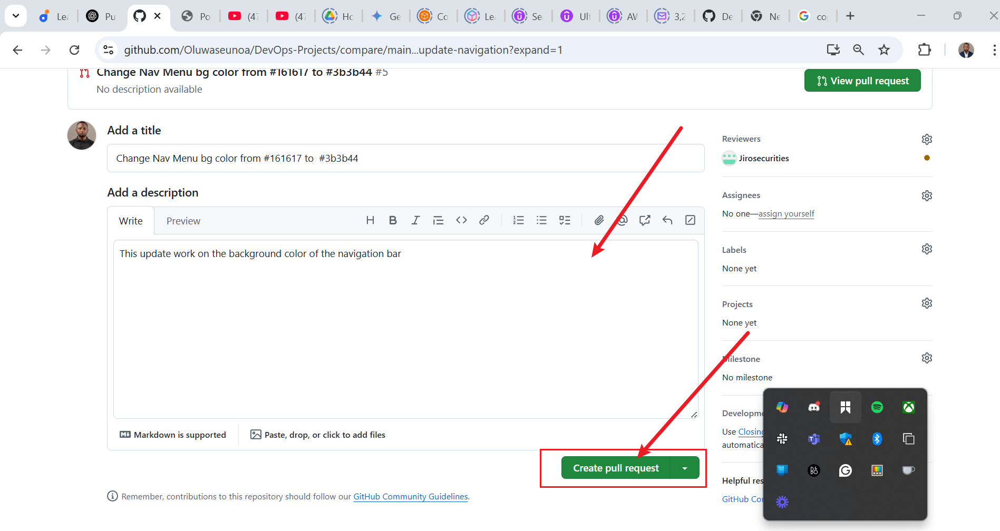
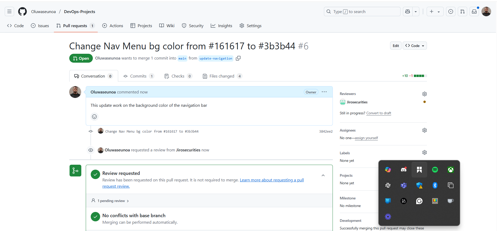

7. Review and approve the PR  
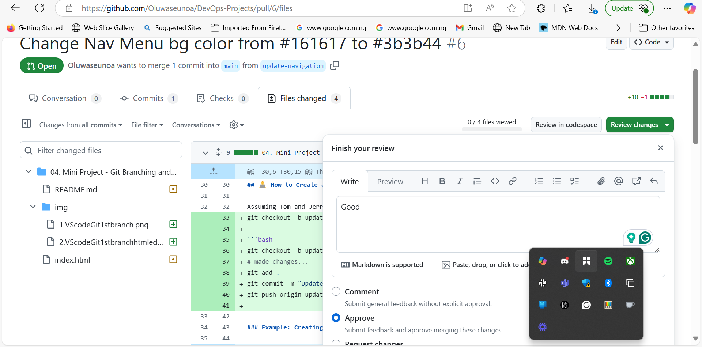

8. Merge the PR into main  
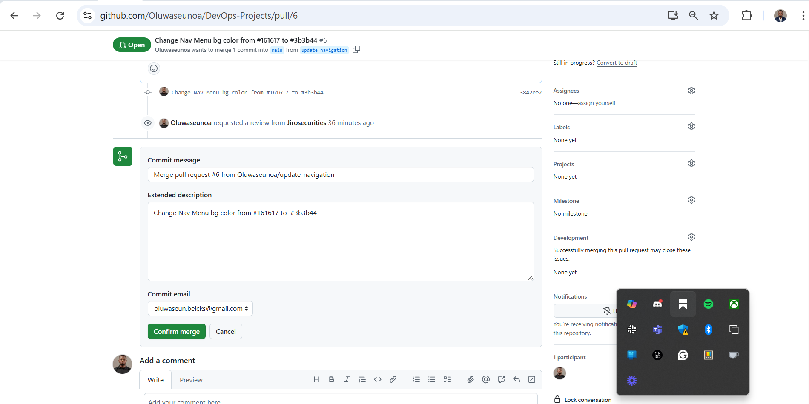

9. Confirm merge success  
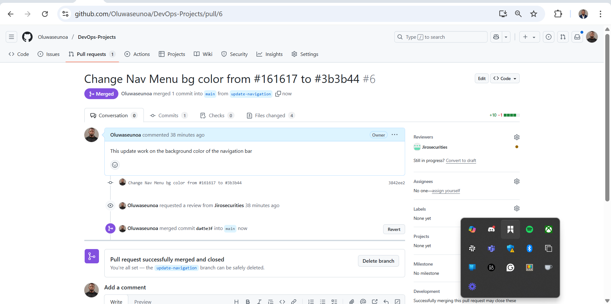

✅ Status: update-navigation successfully merged into main

---

## 👨‍💻 Developer 2: Jerry – edit-contact

### Step-by-Step Workflow

1. Create and switch to new feature branch:

```bash
git checkout -b edit-contact
```
!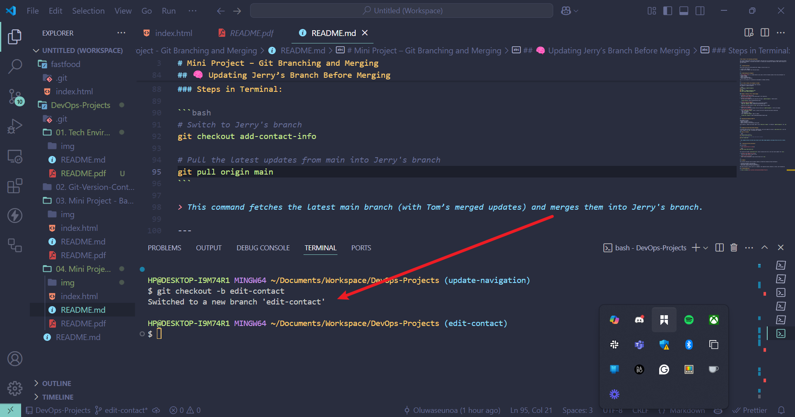
2. Pull the latest updates from main:

```bash
git pull origin main
```

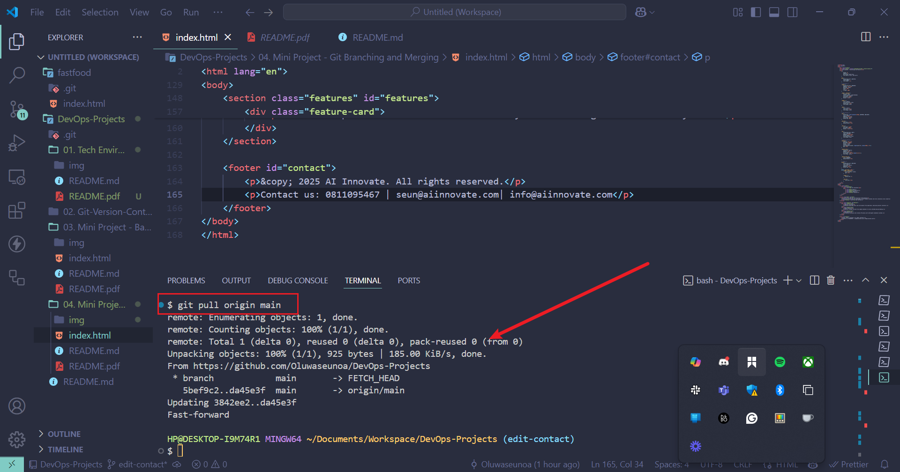

3. Confirm branch status:

```bash
git status
```
!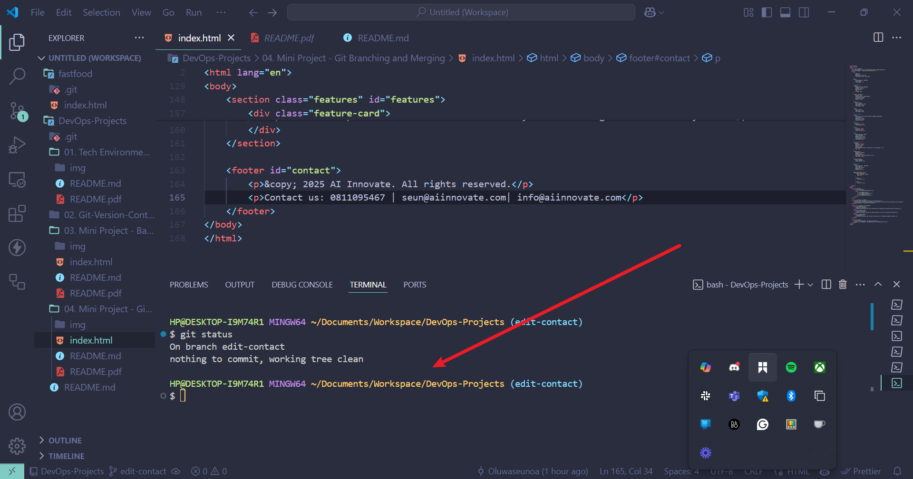

4. Push updated branch to GitHub:

```bash
git push origin edit-contact
```

!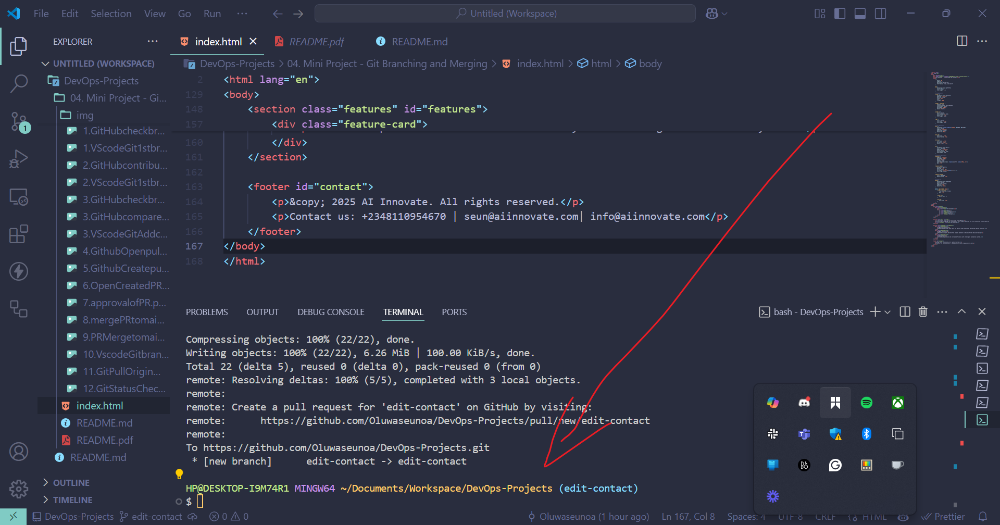
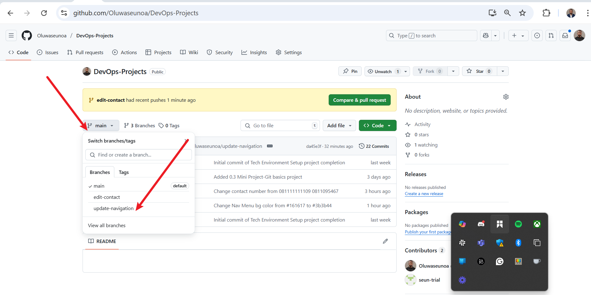
5. Open a Pull Request on GitHub  
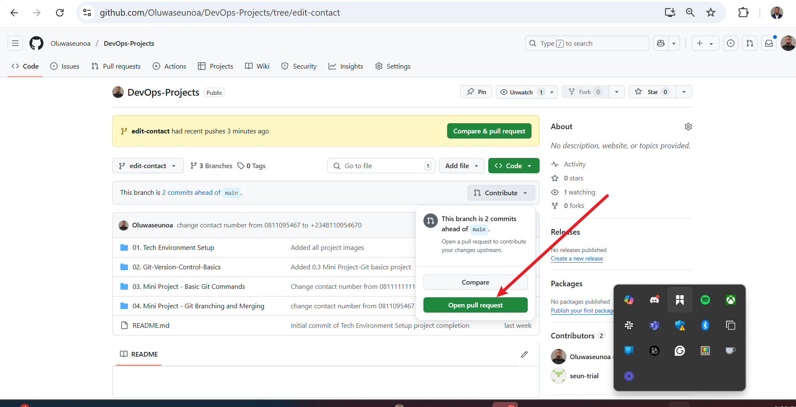
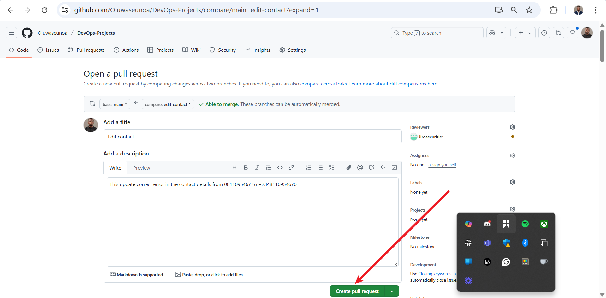


6. Review changes and approve  
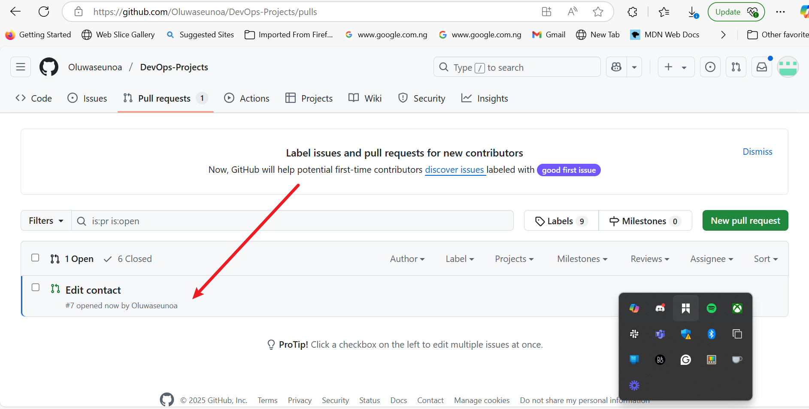  

7. Merge the PR into main  
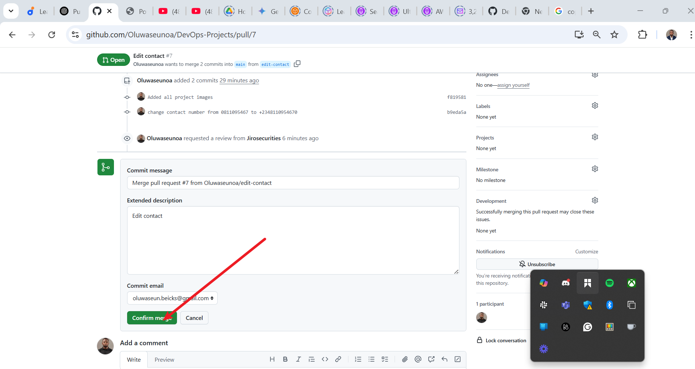

8. Confirm successful merge  
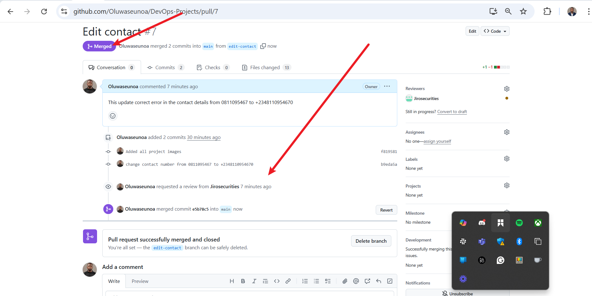

✅ Status: edit-contact successfully merged into main

---

## 📁 GitHub Repository Validation

🔗 Repository URL: [DevOps Projects GitHub Repo](https://github.com/Oluwaseunoa/DevOps-Projects)


---

## 📚 Summary

This Git collaboration workflow demonstrates:

- Feature isolation through branching.
- Controlled integration with Pull Requests.
- Conflict prevention via branch synchronization.
- Traceable contributions through commits, screenshots, and PR history.

It highlights DevOps best practices for collaborative software development using Git and GitHub.

---
